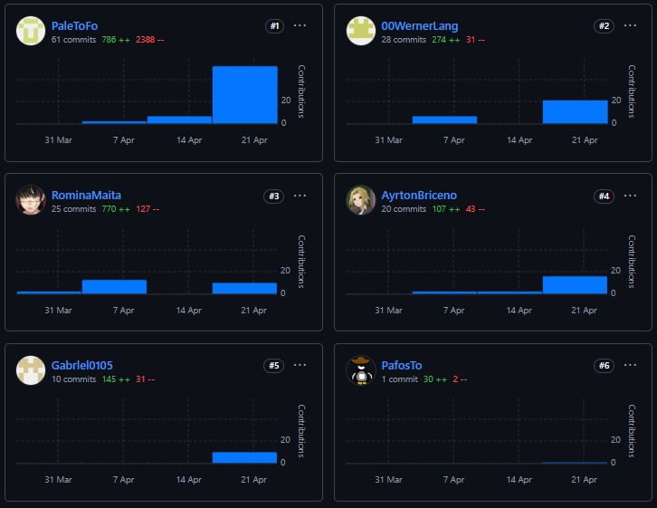
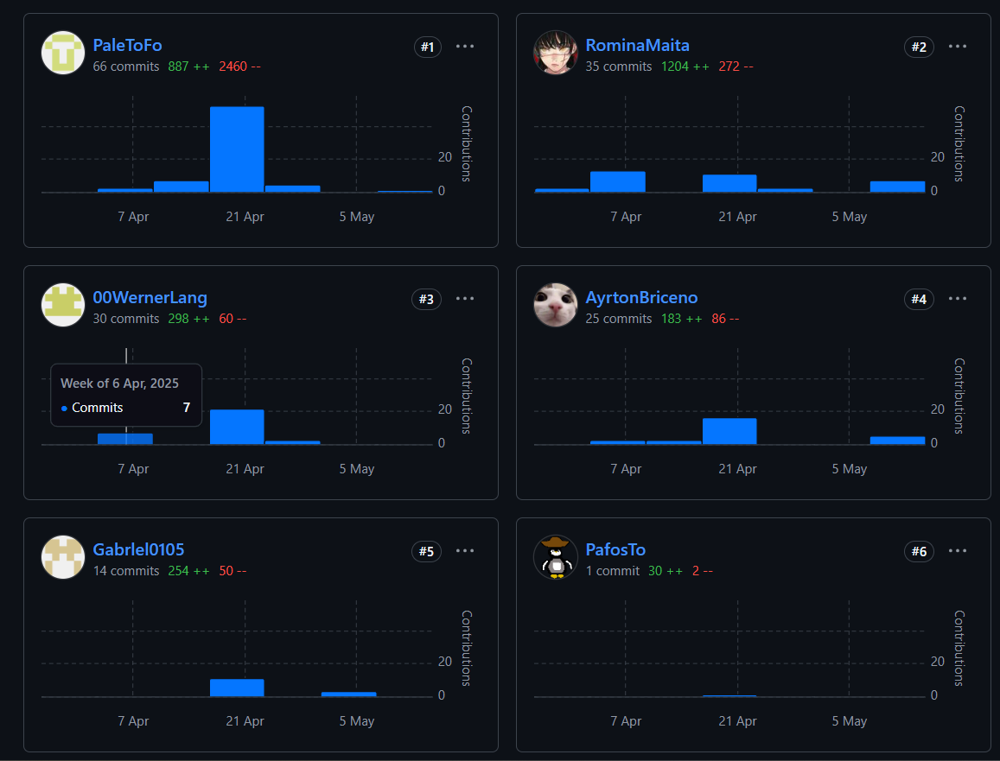

# UNIVERSIDAD PERUANA DE CIENCIAS APLICADAS

## Carrera: Ingeniería de Software
## Desarrollo de Aplicaciones Open Source - Presencial 
## PROFESOR: Ángel Augusto
## Sección: 1ASI0729
## INFORME TB1
## START UP: BIBLIOTECA DE SOFTWARE
## PRODUCTO: KeepItFresh

### INTEGRANTES:
<table>
  <thead>
    <tr>
      <th style="background-color: #333; color: #fff;">Apellidos y Nombres</th>
      <th style="background-color: #333; color: #fff;">Código de Alumno</th>
    </tr>
  </thead>
  <tbody>
    <tr>
      <td>Briceño Llanos, Ayrton Omar</td>
      <td>U202311077</td>
    </tr>
    <tr>
      <td>Lang Nassi, Werner Khalil</td>
      <td>U202310003</td>
    </tr>
    <tr>
      <td>Mamani Marca, Gabriel Cristian</td>
      <td>U202220659</td>
    </tr>
    <tr>
      <td>Torres Flores, Paolo Alessandro</td>
      <td>U20221F613</td>
    </tr>
    <tr>
      <td>Maita Falckenheiner, Romina Guadalupe</td>
      <td>U202213765</td>
    </tr>
  </tbody>
</table>

--- 

Ciclo 2025-01

# Registro de versiones del informe
| Versión | Fecha      | Autor                                 | Descripción de modificación                                                                                                                 |
|---------|------------|---------------------------------------|---------------------------------------------------------------------------------------------------------------------------------------------|
| 1.0     | 7/04/2025  | Maita Falckenheiner, Romina Guadalupe | Creación del documento de trabajo en formato markdown.                                                                                      |
| 1.1     | 9/04/2025  | Lang Nassi, Werner Khalil             | Redacción del startup profile y solution profile, delimitación de segmentos objetivo, redacción de preguntas para el diseño de entrevistas. |
| 1.2     | 12/04/2025 | Briceño Llanos, Ayrton Omar           | Elaboración y registro de entrevistas a segmentos objetivo, análisis de entrevistas.                                                        |
| 1.3     | 15/04/2025 | Torres Flores, Paolo Alessandro       | Elaboración de user personas, impact mapping, as-is y to-be, redacción de conclusiones, biblografía y anexos.                               |
| 1.4     | 16/04/2025 | Lang Nassi, Werner Khalil             | Elaboración de user stories, epics y technical stories.                                                                                     |
| 1.5     | 17/04/2025 | Mamani Marca, Gabriel Cristian        | Elaboración de diagramas de contenedores, diagramas de contexto, diagramas de componentes.                                                  |
| 1.6     | 19/04/2025 | Maita Falckenheiner, Romina Guadalupe | Registro de evidencias del Sprint 1.                                                                                                        |
| 1.7     | 21/04/2025 | Briceño Llanos, Ayrton Omar           | Rediseño de mockups. Elaboración de wireflows y user-flows.                                                                                 |
| 1.8     | 24/04/2025 | Mamani Marca, Gabriel Cristian        | Elaboración de diagrama de base de datos,diagrama de clases, diccionario de clases.                                                         |
| 2.0     | 28/04/2025 | Maita Falckenheiner, Romina Guadalupe | Elaboración de Sprint 2, Sprint Planning 2, Sprint Backlog 2 y el deployement de la Aplicación Web.                                         |
| 2.1     | 29/04/2025 | Torres Flores, Paolo Alessandro       | Elaboración de Services Documentation Evidence for Sprint Review.                                                                           |
| 2.2     | 31/04/2025 | Briceño Llanos, Ayrton Omar           | Elaboración de Software Deployment Evidence for Sprint Review.                                                                              |
| 2.3     | 02/04/2025 | Lang Nassi, Werner Khalil             | Elaboración de Team Collaboration Insights during Sprint.                                                                                   |
| 2.4     | 05/04/2025 | Torres Flores, Paolo Alessandro       | Elaboración de bounded context e implementación en el frontend.                                                                             |
# Project Report Collaboration Insights

#### Repositorio del informe del proyecto
El informe del proyecto se encuentra alojado en el siguiente repositorio de la organización de GitHub del equipo:

🔗 Enlace del repositorio: https://github.com/Biblioteca-de-Software/final-report

A continuación, se detallan las actividades realizadas en cada entrega, la participación de los miembros del equipo, y las evidencias correspondientes.

#### Desarrollo del informe
Para la primera entrega (TB1) se trabajó en la estructura inicial del informe, definiendo el índice y distribuyendo las secciones entre los miembros.

##### Evidencia de colaboración

Para la segunda entrega (TP) se realizó las correcciones respectivas con respecto a la retroalimentación del primer entregable. A cada integrante de le asigno la supervición de cada capítulo.

- **Paolo Torres**: Correcciones del capítulo 1
- **Ayrton Briseño**: Correcciones del capítulo 2
- **Gabriel Mamamani**: Correcciones del capítulo 3
- **Werner Lang**: Correcciones del capítulo 4
- **Romina Maita**: Correcciones del capítulo 5

- 

# Contenido

## Tabla de Contenidos
### [Registro de versiones del informe](#registro-de-versiones-del-informe)
### [Project Report Collaboration Insights](#project-report-collaboration-insights)
### [Contenido](#contenido)
### [Student Outcome](#student-outcome-1)
### [Capítulo I: Introducción](#capc3adtulo-i-introduccic3b3n-1)
- [1.1. Startup Profile](#11-startup-profile)
    - [1.1.1. Descripción de la Startup](#111-description-de-la-startup)
    - [1.1.2. Perfiles de integrantes del equipo](#112-perfiles-de-integrantes-del-equipo)
- [1.2. Solution Profile](#12-solution-profile)
    - [1.2.1 Antecedentes y problemática](#121-antecedentes-y-problemática)
    - [1.2.2 Lean UX Process](#122-lean-ux-process)
        - [1.2.2.1. Lean UX Problem Statements](#1221-lean-ux-problem-statements)
        - [1.2.2.2. Lean UX Assumptions](#1222-lean-ux-assumptions)
        - [1.2.2.3. Lean UX Hypothesis Statements](#1223-lean-ux-hypothesis-statements)
        - [1.2.2.4. Lean UX Canvas](#1224-lean-ux-canvas)
- [1.3. Segmentos objetivo](#13-segmentos-objetivo)

### [Capítulo II: Requirements Elicitation & Analysis](#capc3adtulo-ii-requirements-elicitation--analysis-1)
- [2.1. Competidores](#21-competidores)
    - [2.1.1. Análisis competitivo](#211-análisis-competitivo)
    - [2.1.2. Estrategias y tácticas frente a competidores](#212-estrategias-y-tácticas-frente-a-competidores)
- [2.2. Entrevistas](#22-entrevistas)
    - [2.2.1. Diseño de entrevistas](#221-diseño-de-entrevistas)
    - [2.2.2. Registro de entrevistas](#222-registro-de-entrevistas)
    - [2.2.3. Análisis de entrevistas](#223-análisis-de-entrevistas)
- [2.3. Needfinding](#23-needfinding)
    - [2.3.1. User Personas](#231-user-personas)
    - [2.3.2. User Task Matrix](#232-user-task-matrix)
    - [2.3.3. User Journey Mapping](#233-user-journey-mapping)
    - [2.3.4. Empathy Mapping](#234-empathy-mapping)
    - [2.3.5. As-is Scenario Mapping](#235-as-is-scenario-mapping)
    - [2.4. Ubiquitous Language](#24-Ubiquitous-language)
### [Capítulo III: Requirements Specification](#capc3adtulo-iii-requirements-specification-1)
- [3.1. To-Be Scenario Mapping](#31-to-be-scenario-mapping)
- [3.2. User Stories](#32-user-stories)
- [3.3. Impact Mapping](#33-impact-mapping)
- [3.4. Product Backlog](#34-product-backlog)

### [Capítulo IV: Product Design](#capc3adtulo-iv-product-design-1)
- [4.1. Style Guidelines](#41-style-guidelines)
    - [4.1.1. General Style Guidelines](#411-general-style-guidelines)
    - [4.1.2. Web Style Guidelines](#412-web-style-guidelines)
- [4.2. Information Architecture](#42-information-architecture)
    - [4.2.1. Organization Systems](#421-organization-systems)
    - [4.2.2. Labeling Systems](#422-labeling-systems)
    - [4.2.3. SEO Tags and Meta Tags](#423-seo-tags-and-meta-tags)
    - [4.2.4. Searching Systems](#424-searching-systems)
    - [4.2.5. Navigation Systems](#425-navigation-systems)
- [4.3. Landing Page UI Design](#43-landing-page-ui-design)
    - [4.3.1. Landing Page Wireframe](#431-landing-page-wireframe)
    - [4.3.2. Landing Page Mock-up](#432-landing-page-mock-up)
- [4.4. Web Applications UX/UI Design](#44-web-applications-uxui-design)
    - [4.4.1. Web Applications Wireframes](#441-web-applications-wireframes)
    - [4.4.2. Web Applications Wireflow Diagrams](#442-web-applications-wireflow-diagrams)
    - [4.4.3. Web Applications Mock-ups](#443-web-applications-mock-ups)
    - [4.4.4. Web Applications User Flow Diagrams](#444-web-applications-user-flow-diagrams)
- [4.5. Web Applications Prototyping](#45-web-applications-prototyping)
- [4.6. Domain-Driven Software Architecture](#46-domain-driven-software-architecture)
    - [4.6.1. Software Architecture Context Diagram](#461-software-architecture-context-diagram)
    - [4.6.2. Software Architecture Container Diagrams](#462-software-architecture-container-diagrams)
    - [4.6.3. Software Architecture Components Diagrams](#463-software-architecture-components-diagrams)
- [4.7. Software Object-Oriented Design](#47-software-object-oriented-design)
    - [4.7.1. Class Diagrams](#471-class-diagrams)
    - [4.7.2. Class Dictionary](#472-class-dictionary)
- [4.8. Database Design](#48-database-design)
    - [4.8.1. Database Diagram](#481-database-diagram)

### [Capítulo V: Product Implementation, Validation & Deployment](#capc3adtulo-v-product-implementation-validation--deployment-1)
- [5.1. Software Configuration Management](#51-software-configuration-management)
    - [5.1.1. Software Development Environment Configuration](#511-software-development-environment-configuration)
    - [5.1.2. Source Code Management](#512-source-code-management)
    - [5.1.3. Source Code Style Guide & Conventions](#513-source-code-style-guide--conventions)
    - [5.1.4. Software Deployment Configuration](#514-software-deployment-configuration)
- [5.2. Landing Page, Services & Applications Implementation](#52-landing-page-services--applications-implementation)
    - [5.2.1. Sprint 1](#521-sprint-1)
        - [5.2.1.1. Sprint Planning 1](#5211-sprint-planning-1)
        - [5.2.1.2. Sprint Backlog 1](#5212-sprint-backlog-1)
        - [5.2.1.3. Development Evidence for Sprint Review](#5213-development-evidence-for-sprint-review)
        - [5.2.1.4. Testing Suite Evidence for Sprint Review](#5214-testing-suite-evidence-for-sprint-review)
        - [5.2.1.5. Execution Evidence for Sprint Review](#5215-execution-evidence-for-sprint-review)
        - [5.2.1.6. Services Documentation Evidence for Sprint Review](#5216-services-documentation-evidence-for-sprint-review)
        - [5.2.1.7. Software Deployment Evidence for Sprint Review](#5217-software-deployment-evidence-for-sprint-review)
        - [5.2.1.8. Team Collaboration Insights during Sprint](#5218-team-collaboration-insights-during-sprint)

### [Conclusiones](#conclusiones-1)
- [Conclusiones y recomendaciones](#conclusiones-y-recomendaciones)

### [Bibliografía](#bibliografc3ada-1)
### [Anexos](#anexos-1)

# Student Outcome

ABET – EAC - Student Outcome 3

Se refiere a la capacidad de comunicarse efectivamente con un rango de audiencias.
En el siguiente cuadro se describe las acciones realizadas y enunciados de
conclusiones por parte del grupo, que permiten sustentar el haber alcanzado el logro
del ABET – EAC - Student Outcome 3.

| Criterio específico                                                   | Acciones realizadas                                                                                                                                                                                                                                                                                                                                                                                                                                                                                                                                                                                                                                                                                                                                                                                                                                                                                                                                                                                                                                                                                                                                                                                                                                                                                                                                                                                                                                                                                                                                                                                                                                                                                                                                                                                                                                                                                                                                                                                                                                                                                                                                                                                                                                                                                                                                                                                                                                                                                                                                                                                                                                                                                                                                                                                                                                                                                                                                                                                                                                                                                                                                                                                                                                                                                                                                                                                                                                                                                                                                                                                                                                                                                                                                                                                                                                                                                                                                                                                                                                                                                                                                                                                                                                                                                                                                                                                                                                                                                                                                                                                                                                                                                                                                                                                                                                                                                                                                                                                                                                                                                                                                                                                                                                                                                                                                                                                                                                                                                                                                                                                                                                                                                                                                                                                                                                                                                                                                                                                                                                                                                    | Conclusiones                                                                                                                                                                                                                                                                                                                                                                                                                                                                                                                                                                                                                 |
|-----------------------------------------------------------------------|--------------------------------------------------------------------------------------------------------------------------------------------------------------------------------------------------------------------------------------------------------------------------------------------------------------------------------------------------------------------------------------------------------------------------------------------------------------------------------------------------------------------------------------------------------------------------------------------------------------------------------------------------------------------------------------------------------------------------------------------------------------------------------------------------------------------------------------------------------------------------------------------------------------------------------------------------------------------------------------------------------------------------------------------------------------------------------------------------------------------------------------------------------------------------------------------------------------------------------------------------------------------------------------------------------------------------------------------------------------------------------------------------------------------------------------------------------------------------------------------------------------------------------------------------------------------------------------------------------------------------------------------------------------------------------------------------------------------------------------------------------------------------------------------------------------------------------------------------------------------------------------------------------------------------------------------------------------------------------------------------------------------------------------------------------------------------------------------------------------------------------------------------------------------------------------------------------------------------------------------------------------------------------------------------------------------------------------------------------------------------------------------------------------------------------------------------------------------------------------------------------------------------------------------------------------------------------------------------------------------------------------------------------------------------------------------------------------------------------------------------------------------------------------------------------------------------------------------------------------------------------------------------------------------------------------------------------------------------------------------------------------------------------------------------------------------------------------------------------------------------------------------------------------------------------------------------------------------------------------------------------------------------------------------------------------------------------------------------------------------------------------------------------------------------------------------------------------------------------------------------------------------------------------------------------------------------------------------------------------------------------------------------------------------------------------------------------------------------------------------------------------------------------------------------------------------------------------------------------------------------------------------------------------------------------------------------------------------------------------------------------------------------------------------------------------------------------------------------------------------------------------------------------------------------------------------------------------------------------------------------------------------------------------------------------------------------------------------------------------------------------------------------------------------------------------------------------------------------------------------------------------------------------------------------------------------------------------------------------------------------------------------------------------------------------------------------------------------------------------------------------------------------------------------------------------------------------------------------------------------------------------------------------------------------------------------------------------------------------------------------------------------------------------------------------------------------------------------------------------------------------------------------------------------------------------------------------------------------------------------------------------------------------------------------------------------------------------------------------------------------------------------------------------------------------------------------------------------------------------------------------------------------------------------------------------------------------------------------------------------------------------------------------------------------------------------------------------------------------------------------------------------------------------------------------------------------------------------------------------------------------------------------------------------------------------------------------------------------------------------------------------------------------------------------------------------------------------------------------|------------------------------------------------------------------------------------------------------------------------------------------------------------------------------------------------------------------------------------------------------------------------------------------------------------------------------------------------------------------------------------------------------------------------------------------------------------------------------------------------------------------------------------------------------------------------------------------------------------------------------|
| Comunica oralmente con efectividad a diferentes rangos de audiencia.  | TB1:         **Romina Guadalupe Maita Falckenheiner:** En esta entrega hice uso de mis habilidades de comunicación para poder coordinar y realizar las entrevistas, además que me mantuve al tanto con el equipo para completar las siguientes tareas: Landing Page, Impact Mapping, Carátula, Diagrama de Clases, Diagrama Base de Datos, entrevistas, etc.   **Paolo Alessandro Torres Flores:** Para este entregable, puse en práctica mi efectividad de comunicación oral al momento de coordinar las tareas mediante la repartición de las mismas. Además, por medio del desarrollo de puntos como las entrevistas, su resumen y su análisis respectivo. Por último, pude aplicar la comunicación oral al momento de grabar el video expositivo y comunicando eficazmente a lo que apunta nuestro proyecto. Cabe resaltar, que lo puntos mencionados son donde resalta la comunicación oral más no son los únicos desarrollados por mi persona.  **Werner Khalil Lang Nassi:** En este entregable, di uso de mis habilidades comunicativas de forma oral cuando se cordinaron los tiempos y temas que tomariamos. Asi mismo por medio de la misma, logre desarollar la entrevista a uno de nuestros segmentos objetivos. Al final logre usar mis habilidades orales de forma efectiva en el momento de la grabacion del video sobre la documentacion.   **Ayrton Omar Briceño Llanos**: En esta entrega, apliqué mis habilidades de comunicación oral para coordinar de manera efectiva con mi equipo durante el desarrollo de las entrevistas, la organización del video expositivo y la planificación de tareas clave del proyecto. Participé activamente en reuniones virtuales, donde propuse ideas y ayudé a resolver dudas en tiempo real. Además, colaboré en la presentación oral del proyecto, asegurando que la información se transmita con claridad y coherencia. Estas acciones me permitieron reforzar la colaboración en equipo y asegurar un avance ordenado y eficiente del entregable.   **Gabriel Mamani Marca**:En esta entrega puse a pureba mis habilidades orales.En momentos como cuando se realizo el vido exponiendo el landig page,coordinando con el equipo y brindando ayuda a mi grupo      TP:    Gabriel Mamani:Durante el trabajo parcial, cumplí con los objetivos asignados gracias a la participación constante en las reuniones diarias y semanales del equipo, lo que facilitó un progreso alineado con lo esperado. También contribuí activamente a la integración del frontend, verificando que cada componente operara correctamente. Gracias a una comunicación fluida y continua con los demás integrantes, conseguimos coordinar nuestros aportes y desarrollar una interfaz unificada y accesible para los usuarios finales.     Werner Lang: Durante el trabajo parcial, cumplí con los objetivos designados durante las reuniones, gracias a la organización que tuvimos en las reuniones diarias del equipo, lo cual agilizo el proceso del trabajo.    Ayrton Briceño: Durante el trabajo parcial, participé activamente en la elaboración del informe y en la coordinación general del equipo. Me aseguré de comunicar por escrito de manera clara las ideas, hallazgos y descripciones requeridas en el informe, adaptando el lenguaje para que fuera comprensible tanto para los miembros del equipo como para lectores externos. Además, durante las reuniones virtuales por Discord, compartí observaciones clave sobre las necesidades de los usuarios entrevistados y propuse ajustes en las tareas asignadas, fomentando el consenso mediante una comunicación oral directa y efectiva. Esta experiencia fortaleció mi capacidad para transmitir ideas con claridad y adaptar el mensaje a distintos públicos, tanto en contextos escritos como orales.   Paolo Torres: Durante el desarrollo del trabajo parcial, asumí un rol activo en la redacción del informe y en la organización general del equipo. Me encargué de expresar por escrito las ideas, análisis y descripciones de forma clara y accesible, considerando tanto a mis compañeros como a posibles lectores externos. En nuestras reuniones virtuales realizadas por Discord, aporté observaciones importantes sobre las necesidades detectadas en las entrevistas a usuarios y sugerí modificaciones en las tareas asignadas. Esto ayudó a generar acuerdos y mantener una comunicación oral clara y efectiva. Gracias a esto, pude mejorar mi habilidad para comunicarme con precisión y adecuar el contenido del mensaje según el público.   Romina Maita: Durante el desarrollo de esta entrega utilicé mis capacidades de comunicación oral al conversar e intercambiar ideas con mis compañeros acerca de los avances. Al momento de plantear los sprints, designar tareas y notificar progresos del frontend en las llamadas grupales evidencia lograr el objetivo del outcome.                                                                                                                                                                                                                                                                                                                                                                                                                                                                                                                                                                                                                                                                                                                                                                                                                                                                                                                                                                                                                                                                                                                                         | Adapto mi forma de comunicarme según el perfil de la audiencia, utilizando códigos y recursos adecuados para asegurar la correcta transmisión del mensaje. Empleo medios audiovisuales pertinentes al contenido que deseo presentar, y verifico constantemente que la comunicación haya sido clara y efectiva. Durante la presentación de resultados, oriento mi discurso hacia los objetivos específicos, garantizando la comprensión del mensaje. Además, practico la escucha activa y objetiva antes de emitir juicios, promoviendo siempre el diálogo y la conciliación.                |
| Comunica por escrito con efectividad a diferentes rangos de audiencia | TB1:         **Romina Guadalupe Maita Falckenheiner:** En esta entrega, coordiné con el equipo a través de WhatsApp y Discord. Usé WhatsApp para asignar tareas de manera rápida y efectiva, mientras que en Discord mantuvimos conversaciones más detalladas sobre las entrevistas que estaba realizando. Esta combinación me permitió tener una comunicación fluida y asegurarme de que el equipo tuviera claro el progreso de cada tarea.  **Paolo Alessandro Torres Flores:** Para la presente entrega, pude aplicar mis habilidades comunicativas escritas mediante la coordinación de tareas y toma de posta para el liderazgo del equipo cuando se necesitaba. Repartiendo tareas y delegando las mismas mediante aplicaciones de mensajería como: Whatsapp o Discord. En el desarollo, pude aplicar estas habilidades en el desarrollo de la diapositiva de exposición y el análisis de entrevistas, así como también pude aplicarlo la creación de la landing page.   **Werner Khalil Lang Nassi:** En esta entrega logre usar mis habilidades comunicativas escritas cuando fue requerido coordinar entre el equipo diversas tareas. Asi mismo logre comunicar varias secciones de este entrgable de forma efectiva usando mis capacidades escritas. Considero que el uso de las diferentes aplicacion tales como: Whatssap y Discord ayudaron al equipo a consolidar la comunicacion escrita entre todos, teniando una coordinacion de alto nivel y cumplir con lo coordinado.   **Ayrton Omar Briceño Llanos**: En esta entrega, puse en práctica mis habilidades de comunicación escrita al coordinar eficazmente con mis compañeros mediante plataformas como Discord y WhatsApp. Utilicé Discord para discutir en detalle los avances del proyecto, como el análisis de entrevistas y el mapeo de escenarios, mientras que WhatsApp me permitió realizar asignaciones rápidas y resolver dudas urgentes. Asimismo, contribuí activamente en la elaboración de los documentos compartidos y el resumen de la entrevista, asegurando una redacción clara y coherente. Estas acciones me ayudaron a mantener una comunicación constante con el equipo y a reforzar la organización general del trabajo.  **Gabriel Mamani Marca**: En esta,aplique mis conocimientos en comunicacion escrita al lograr comuinicarme si problema con mi grupo mediante discord y whatsapp.Se uso discord para coordinar el trabajo faltante y corregir errores    Durante el trabajo parcial, me concentré en el desarrollo del frontend relacionado con la funcionalidad de gestion de usuario, implementando la opcion para que se registren, e inicien sesion en la plataforma. A lo largo de este proceso, trabajé en conjunto con el equipo para garantizar que la interfaz fuera clara y sencilla de utilizar. Esta colaboración favoreció una comunicación fluida de ideas y decisiones, lo que facilitó tanto la comprensión por parte de los usuarios como la del equipo sobre cómo navegar por las categorías y generar pedidos de forma eficaz. Esta experiencia también reforzó nuestra capacidad para expresar conceptos técnicos de manera comprensible para diversas audiencias.   TP:   Gabriel Mamani: Durante el trabajo parcial, me concentré en el desarrollo del frontend relacionado con la funcionalidad de gestion de usuario, implementando la opcion para que se registren, e inicien sesion en la plataforma. A lo largo de este proceso, trabajé en conjunto con el equipo para garantizar que la interfaz fuera clara y sencilla de utilizar. Esta colaboración favoreció una comunicación fluida de ideas y decisiones, lo que facilitó tanto la comprensión por parte de los usuarios como la del equipo sobre cómo navegar por las categorías y generar pedidos de forma eficaz. Esta experiencia también reforzó nuestra capacidad para expresar conceptos técnicos de manera comprensible para diversas audiencias.   Werner Lang: Durante el trabajo parcial, concreté lo requerido dando uso de mis habilidades comunicativas escritas cuando fue requerido comunicarse entre el equipo. Haciendo uso de esta para commits comprensibles para los otros participantes para que sea fácil la comprensión de mis aportes en el front end.   Paolo Torres: Durante el desarrollo del trabajo parcial, asumí un rol activo en la redacción del informe y en la organización general del equipo. Me encargué de expresar por escrito las ideas, análisis y descripciones de forma clara y accesible, considerando tanto a mis compañeros como a posibles lectores externos. En nuestras reuniones virtuales realizadas por Discord, aporté observaciones importantes sobre las necesidades detectadas en las entrevistas a usuarios y sugerí modificaciones en las tareas asignadas. Esto ayudó a generar acuerdos y mantener una comunicación oral clara y efectiva. Gracias a esto, pude mejorar mi habilidad para comunicarme con precisión y adecuar el contenido del mensaje según el público.   Ayrton Briceño: Durante el trabajo parcial, participé activamente en la elaboración del informe y en la coordinación general del equipo. Me aseguré de comunicar por escrito de manera clara las ideas, hallazgos y descripciones requeridas en el informe, adaptando el lenguaje para que fuera comprensible tanto para los miembros del equipo como para lectores externos. Además, durante las reuniones virtuales por Discord, compartí observaciones clave sobre las necesidades de los usuarios entrevistados y propuse ajustes en las tareas asignadas, fomentando el consenso mediante una comunicación oral directa y efectiva. Esta experiencia fortaleció mi capacidad para transmitir ideas con claridad y adaptar el mensaje a distintos públicos, tanto en contextos escritos como orales.   Romina Maita: Logre completar el outcome para esta entrega ya que me comuniqué adecuadamente con el grupo de manera escrita por el chat de WhatsApp y Discord para reportar avances y correcciones del trabajo. | Elaboro informes técnicos siguiendo los estándares establecidos para el desarrollo de proyectos de ingeniería, asegurando la calidad del contenido antes de su entrega. Me esfuerzo por transmitir ideas y conceptos clave de forma clara y empática, adaptando el nivel de detalle y el lenguaje escrito a las características del público, independientemente de su especialidad o jerarquía. Selecciono de manera cuidadosa los medios y formatos más adecuados para facilitar la comprensión del mensaje, y verifico sistemáticamente que todos los atributos de calidad estén presentes antes de la presentación final. |