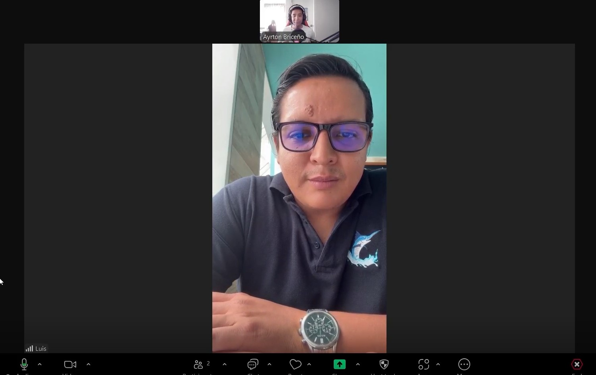
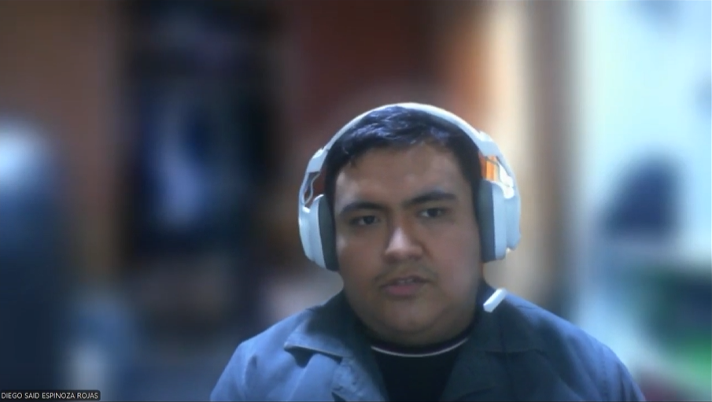
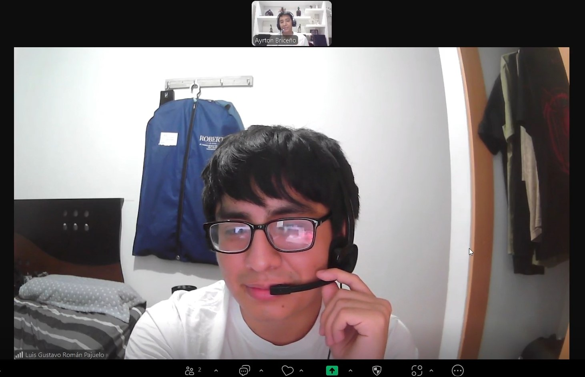
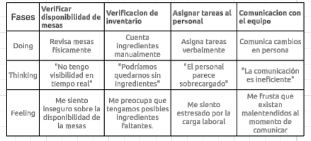
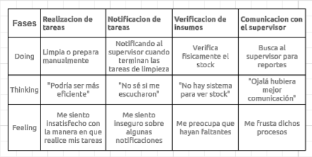

# Capítulo II: Requirements Elicitation & Analysis

## 2.1. Competidores.

En esta sección, se presenta un análisis de los competidores de KeepItFresh y sus respectivas estrategias y tácticas. Se incluye un análisis competitivo, así como una comparación de las fortalezas y debilidades de cada competidor.

### 2.1.1. Análisis competitivo.

<table>
  <tr>
    <th colspan="22">Competitive Analysis Landscape</th>
  </tr>
  <tr>
    <td colspan="1">¿Por qué llevar a cabo el análisis?</td>
    <td colspan="17">Este análisis se lleva a cabo con la finalidad de poder conocer la competencia y cómo “nombre de la empresa” se diferencia ante esta.</td>
  </tr>
  <tr>
    <td colspan="2"></td>
    <td>KeepItFresh </td>
    <td> </td>
    <td> </td>
    <td> </td>
</tr>
  <tr>
    <td rowspan="2">Perfil</td>
    <td>Overview</td>
    <td>KeepItFresh es una aplicación que combina la gestión de inventario, el control de alimentos almacenados, le ofrece recomendaciones de conservación para alimentos al dueño del restaurante y un botón que llama mozos para los clientes.</td>
    <td>MarketMan es una solución de gestión de inventarios y compras basada en la nube que simplifica todas las operaciones internas agilizando  todo, desde el inventario hasta el presupuesto, los informes, la gestión de proveedores y el cálculo del coste de los alimentos.</td>
    <td>OpenTable es una plataforma para restaurantes que ofrece reservaciones, administración de mesas y un inventario a tiempo real en todos los dispositivos.</td>
    <td>CoverManager es una herramienta que ayuda a los restaurantes a controlar su negocio a tiempo real desde cualquier dispositivo, gestiona reservas y pagos en una sóla plataforma y fideliza clientes sin compartir datos a competencias.</td>
</tr>
  <tr>
  <td>Ventaja competitiva ¿Qué valor ofrece a los clientes?</td>
    <td>KeepItFresh ofrece un software inteligente para gestionar el inventario de tu negocio. Brinda un control completo del estado de los productos almacenados, recomienda las mejores condiciones de conservación para los alimentos y, además, incluye un botón para llamar a los mozos de forma rápida y eficiente.</td>
    <td>MarketMan ayuda a restaurantes y negocios de hostelería a gestionar eficientemente su inventario, controlar costos, reducir desperdicio, y optimizar las compras y recetas. El valor clave es el ahorro de tiempo, reducción de errores, mejora en la rentabilidad y toma de decisiones basadas en datos reales.</td>
    <td>OpenTable proporciona a los restaurantes una plataforma integral para gestionar reservaciones, optimizar la ocupación de mesas, mejorar la visibilidad en línea y fortalecer las relaciones con los comensales.</td>
    <td>CoverManager proporciona a los restaurantes y negocios de hostelería una solución integral para gestionar reservas, optimizar la ocupación de mesas, reducir ausencias (no-shows) y mejorar la experiencia del cliente.</td>
    </tr>
<tr>
    <td rowspan="2">Perfil de Marketing</td>
    <td>Mercado Objetivo</td>
    <td>Enfocado en restaurantes criollos, cevicherías y pollerías.</td>
    <td>Restaurantes individuales o cadenas (pequeñas, medianas o grandes).

Hoteles, bares, cafeterías, y servicios de catering.

Empresas del sector hospitality que requieran control de inventario alimentario.

Especialmente enfocado a negocios con alto volumen de ingredientes y múltiples proveedores.
</td>
    <td>Restaurantes de todos los tamaños.

Bares, bodegas y hoteles

Otros negocios: Empresas que requieren gestión de reservaciones y optimización de espacios. ​
</td>
    <td>Restaurantes.

Negocios de ocio nocturno.

Grupos y eventos

Beach clubs y hoteles.
</td>
  </tr>
  <tr>
  <td>Estrategias de Marketing</td>
    <td>Publicidad, posicionamiento de landing page, redes sociales y entrevistas.</td>
    <td>Posicionamiento SEO, Google Ads, y presencia activa en redes sociales.</td>
    <td>Campañas de promoción y resultados promocionados para aumentar la visibilidad y atraer más reservaciones.</td>
    <td>Ofrece herramientas para que los restaurantes integren sistemas de reservas en sus propios sitios web y redes sociales, potenciando las reservas directas sin comisiones.</td>
    </tr>
<tr>
    <td rowspan="3">Perfil de Producto</td>
    <td>Productos y Servicios</td>
    <td>Software de manejo de inventario para restaurantes y analisis de datos de los productos alojados.</td>
    <td>Software de gestión de inventario.
Cálculo de coste de recetas y menú.
</td>
    <td>Software de reservaciones, Gestión de mesas y Lista de espera.</td>
    <td>Gestión de reservas.

Pedidos de delivery y takeaway.
</td>
  </tr>
  <tr>
  <td>Precios y Costos</td>
    <td>Suscripción de cada IOT para los restaurantes</td>
    <td>Modelo SaaS (software como servicio) con planes mensuales o anuales.
Ofrecen prueba gratuita.
</td>
    <td>OpenTable ofrece diferentes planes según las necesidades del restaurante, incluyendo funciones básicas y avanzadas.</td>
    <td>Plan estándar: Incluye gestión centralizada de reservas, integración con canales propios, usuarios y dispositivos ilimitados, y funcionalidades como pedido y pago desde el móvil. </td>
    </tr>
<td>Canales de distribución (Web y/o Móvil)</td>
    <td>Plataforma Web y aplicación movil</td>
    <td>Plataforma web 

Aplicación móvil para Android y iOS .

Distribución directa desde su sitio web.

Integraciones con plataformas aliadas.
</td>
    <td>Plataforma web: Accesible desde navegadores para la gestión completa de las operaciones del restaurante.​

Aplicación móvil: App para propietarios que permite gestionar reservaciones y operaciones desde dispositivos móviles.
</td>
    <td>Plataforma web: Accesible desde navegadores para la gestión completa de las operaciones del negocio.</td>
<tr>
    <td rowspan="4">Análisis SWOT</td>
    <td>Fortalezas</td>
    <td>Ofrecer tecnología IOT de sensores y una interfaz intuitiva para todo público</td>
    <td>Plataforma muy especializada en el sector HORECA.</td>
    <td>Acceso a una amplia base de usuarios que utilizan OpenTable para realizar reservaciones.</td>
    <td>Ofrece una amplia gama de herramientas para la gestión de reservas, pedidos y fidelización en una única plataforma.</td>
  </tr>
  <tr>
  <td>Debilidades</td>
    <td>Poca experiencia en el mercado</td>
    <td>Costo elevado para negocios muy pequeños.</td>
    <td>Las tarifas de suscripción y por reservación pueden ser significativas para pequeños restaurantes.</td>
    <td>La implementación de todas las funcionalidades puede requerir tiempo y formación para el personal.</td>
    </tr>
  <tr>
<td>Oportunidades</td>
    <td>El cliente puede ajustar la cantidad de dispositivos IOT que desee alquilar de acuerdo a su presupuesto</td>
    <td>Expansión en mercados emergentes y LATAM.</td>
    <td>Implementación de nuevas tecnologías, como inteligencia artificial, para mejorar la experiencia del usuario y la eficiencia operativa.</td>
    <td>Posibilidad de crecer en mercados donde la digitalización de la gestión de reservas y pedidos aún está en desarrollo</td>
</tr>
  <tr>
<td>Amenazas</td>
    <td>Competencia de empresas con mayor manejo y tiempo en el mercado</td>
    <td>Alta competencia en el software de gestión de restaurantes.</td>
    <td>Tendencias hacia métodos alternativos de reservación o experiencias gastronómicas que no requieren reservaciones tradicionales.</td>
    <td>Presencia de otras soluciones en el mercado que ofrecen servicios similares, lo que puede dificultar la diferenciación.</td>
</tr>
</table>

### 2.1.2. Estrategias y tácticas frente a competidores.

Desarrollar estrategias y tácticas efectivas para enfrentar a nuestros competidores requiere de un enfoque cuidadoso y planificado. A continuación se presentan algunas estrategias y tácticas que podrían ser consideradas para tener una ventaja competitiva frente a otras alternativas:

- Implementación de tecnología IOT: Utilizamos sensores IOT para ofrecer un monitoreo continuo de el estado de los alimentos que hay en el almacenamiento del restaurante y también le damos la oportunidad al cliente de decidir cuántos sensores desea de acuerdo a su presupuesto.
- Enfoque en la experiencia para el usuario: Desarrollar una interfaz simple y fácil de entender para que el usuario no tenga dificultades en entenderlar y pueda usarla sin problemas.
- Mantenimiento y mejoras en la aplicación: Mantener un ritmo constante en las actualizaciones para mejorar y arreglar la aplicación es esencial para que el usuario tenga la mejor experiencia posible y esto lo haremos recopilando información de errores y quejas de los usuarios.

## 2.2. Entrevistas.

### 2.2.1. Diseño de entrevistas.

A continuación, se presentan las preguntas para las entrevistas de cada sección.
A demás, con la finalidad de no extender el tiempo de las entrevistas y facilitar información gráfica. Haciendo uso de la herramienta GoogleForms hemos
recolectado información personal como por ejemplo las marcas de preferencia, dispositivos de uso, etc.

#### Preguntas para el segmento "Dueños de restaurantes"

- ¿Podría contarme un poco cómo funciona el restaurante día a día?
- ¿Cuántas personas trabajan en cocina y cuántas en el salón?
- ¿Tienen alguna herramienta para llevar el control del inventario? ¿Cómo lo hacen?
- ¿Qué tan seguido revisan el stock (cantidad de productos en almacén)? 
- ¿Cómo hacen para saber si un producto está por vencer o si necesita cierta temperatura? 
- ¿Alguna vez han tenido problemas por productos vencidos o mal conservados? ¿Qué consecuencias tuvo? 
- ¿Tiene alguna forma de prever esas situaciones? 
- ¿Qué pasa cuando el restaurante está lleno? 
- ¿Cómo manejan la atención al cliente en esos momentos? 
- ¿Cómo se organiza el equipo para responder rápido ante emergencias? 
- ¿Usan alguna tecnología para mejorar estos procesos? (Apps, sensores, tablets...)
- Si existiera una herramienta que te ayude a automatizar el control de stock y también mejore la experiencia del cliente, ¿cómo la imaginas? 
- ¿Qué características te parecerían más útiles o importantes? 
- ¿Estarías dispuesto a probar algo así en tu restaurante?

#### Preguntas para el segmento "Trabajadores de restaurantes"

- ¿Qué tareas haces normalmente durante tu turno?
- ¿Tenés que ver con el inventario o con revisar productos? ¿Cómo lo hacés? 
- ¿Con qué frecuencia revisas los productos en stock? 
- ¿Cómo se enteran si un producto está por vencerse? 
- ¿Alguna vez tuvieron que tirar algo porque se pasó la fecha o estaba mal conservado? 
- Cuando el restaurante está lleno, ¿cómo te das cuenta si un cliente necesita algo si no te llama directamente? 
- ¿Te pasó alguna vez que un cliente se molestó por no recibir atención a tiempo? 
- ¿Qué es lo más difícil de esos momentos de mucho trabajo?
- ¿Cómo te imaginas que una app o sistema podría ayudarte a hacer tu trabajo más fácil?

### 2.2.2. Registro de entrevistas.

En esta sección se aborda la información recolectada de cada entrevista incluyendo un resumen de las respuestas de los entrevistados.

#### Segmento 1: Dueños de restaurantes.

- _Entrevista 1_

| Nombre               | Richard                                                                                                                                                                                                                                                                                                                     |
|----------------------|-----------------------------------------------------------------------------------------------------------------------------------------------------------------------------------------------------------------------------------------------------------------------------------------------------------------------------|
| Apellido             | Melgarejo                                                                                                                                                                                                                                                                                                                   |
| Edad                 | 52 años                                                                                                                                                                                                                                                                                                                     |
| Distrito             | Lince                                                                                                                                                                                                                                                                                                                       |
| Evidencia            |                                                                                                                                                                                                                                                        |
| Url                  | https://acortar.link/9818Zn |
| Inicio de entrevista | 6:33                                                                                                                                                                                                                                                                                                                        |    
| Fin de entrevista    | 25:26                                                                                                                                                                                                                                                                                                                       |

- Distrito de residencia: Jesús María
- Estado civil: Divorciado
- Ocupación: Dueño de restaurante
- Dispositivo de preferencia: Smartphone
- Canales de interacción digital: Instagram, X

Resumen:
Richard es un emprendedor gastronómico con residencia en Jesús María. Tiene una experiencia consolidada en la administración de su restaurante, pero continúa utilizando métodos manuales como papel y lápiz para el control del inventario y organización interna. Reconoce que esta práctica es ineficiente y ha expresado de forma clara su interés por adoptar soluciones tecnológicas. Usa con frecuencia su smartphone para comunicarse y consumir contenido en redes como Instagram y X, donde también busca tendencias gastronómicas. Tiene una personalidad ordenada, enfocada y con apertura a la innovación si esta le ofrece resultados concretos, como mejorar sus decisiones estratégicas. Está interesado en plataformas que lo ayuden a analizar productos más vendidos y gestionar el inventario con datos confiables y visuales.

➡ Arquetipo base: Administrador Estratégico 
- _Entrevista 2_

| Nombre               | Luis                                                                                                                                                                                                                                                                                                                        |
|----------------------|-----------------------------------------------------------------------------------------------------------------------------------------------------------------------------------------------------------------------------------------------------------------------------------------------------------------------------|
| Apellido             | Agurto                                                                                                                                                                                                                                                                                                                      |
| Edad                 | 34 años                                                                                                                                                                                                                                                                                                                     |
| Distrito             | San Borja                                                                                                                                                                                                                                                                                                                   |
| Evidencia            |                                                                                                                                                                                                                                                                                                                             |
| Url                  | https://acortar.link/9818Zn |
| Inicio de entrevista | 0:00                                                                                                                                                                                                                                                                                                                        |    
| Fin de entrevista    | 6:32                                                                                                                                                                                                                                                                                                                        |

- Distrito de residencia: Santiago de Surco
- Estado civil: Casado
- Ocupación: Dueño de restaurante
- Dispositivo de preferencia: Laptop
- Canales de interacción digital: Facebook, X

Resumen:
Luis reside en Santiago de Surco y es propietario de un restaurante en etapa de consolidación. Aunque posee buena experiencia en la gestión operativa, sus procesos internos siguen siendo manuales o informales, lo cual ha comenzado a representar una carga. Está casado, es reflexivo y valora profundamente la eficiencia operativa. Usa principalmente su laptop para temas de trabajo y se mantiene activo en redes como Facebook y X, desde donde se informa sobre herramientas para emprendedores. Tiene una disposición positiva hacia el uso de tecnologías que mejoren la gestión del inventario y el análisis de ventas. Reconoce que necesita datos para optimizar su carta y mejorar el flujo de atención al cliente.

➡ Arquetipo base: Administrador Estratégico 
- _Entrevista 3_

| Nombre               | Daniel                                                                                                                                                                                                                                                                                                                      |
|----------------------|-----------------------------------------------------------------------------------------------------------------------------------------------------------------------------------------------------------------------------------------------------------------------------------------------------------------------------|
| Apellido             | Céspedes                                                                                                                                                                                                                                                                                                                    |
| Edad                 | 54 años                                                                                                                                                                                                                                                                                                                     |
| Distrito             | Miami                                                                                                                                                                                                                                                                                                                       |
| Evidencia            |                                                                                                                                                                                                                                                                                                                             |
| Url                  |  |
| Inicio de entrevista | 25:27                                                                                                                                                                                                                                                                                                                       |    
| Fin de entrevista    | 39:54                                                                                                                                                                                                                                                                                                                       |

- Distrito de residencia: Miami
- Estado civil: Casado
- Ocupación: Dueño de restaurante
- Dispositivo de preferencia: Computadora de escritorio
- Canales de interacción digital: Messenger, Instagram

Resumen:
Daniel vive en Miami y es un dueño de restaurante que ha dirigido su negocio por varios años con métodos tradicionales. Aunque usa su computadora de escritorio como herramienta principal, su interacción digital también incluye canales como Messenger e Instagram. Su enfoque es práctico y, aunque no tan tecnológico, demuestra interés en automatizar la gestión del inventario, especialmente por las dificultades que enfrenta al controlar la rotación de productos y la reposición. Aprecia mucho la eficiencia, y su actitud hacia la innovación tecnológica es positiva, siempre que esta se adapte a su forma de trabajar y le permita reducir el margen de error. Tiene interés moderado en el análisis de ventas, pero reconoce el valor de las estadísticas visuales para tomar decisiones.

➡ Arquetipo base: Administrador Estratégico 

##### Segmento 2: Trabajadores de restaurantes.

- _Entrevista 1_

| Nombre               | Diego                                                                                                                                                                                                                                                                                                                       |
|----------------------|-----------------------------------------------------------------------------------------------------------------------------------------------------------------------------------------------------------------------------------------------------------------------------------------------------------------------------|
| Apellido             | Espinoza                                                                                                                                                                                                                                                                                                                    |
| Edad                 | 21 años                                                                                                                                                                                                                                                                                                                     |
| Distrito             | Los Olivos                                                                                                                                                                                                                                                                                                                  |
| Evidencia            |                                                                                                                                                                                                                                                                                                                             |
| Url                  | https://acortar.link/9818Zn |
| Inicio de entrevista | 42:56                                                                                                                                                                                                                                                                                                                       |    
| Fin de entrevista    | 47:11                                                                                                                                                                                                                                                                                                                       |

- Distrito de residencia: La Molina
- Estado civil: Soltero
- Ocupación: Mesero
- Dispositivo de preferencia: Smartphone
- Canales de interacción digital: Messenger, Instagram

Resumen:
Diego es parte clave del equipo operativo de un restaurante, desempeñándose como mesero. Utiliza su smartphone de forma intensiva para comunicarse y acceder a redes como Instagram y Messenger. Expresó que la falta de tecnología le genera una carga de trabajo adicional, especialmente al coordinar con cocina o verificar inventario. Mencionó con claridad la necesidad de una herramienta que simplifique sus tareas, automatice pedidos y mejore la coordinación interna. Tiene una personalidad proactiva y digitalmente nativa, con disposición para adaptarse a nuevas herramientas si eso implica hacer su trabajo más ágil. Está muy familiarizado con la dinámica operativa, lo que lo convierte en un usuario ideal para validar soluciones móviles.

➡ Arquetipo base: Operador Multifuncional 
- _Entrevista 2_

| Nombre               | Estephano                                                                                                                                                                                                                                                                                                                  |
|----------------------|----------------------------------------------------------------------------------------------------------------------------------------------------------------------------------------------------------------------------------------------------------------------------------------------------------------------------|
| Apellido             | Moscoso Bejar                                                                                                                                                                                                                                                                                                              |
| Edad                 | 22                                                                                                                                                                                                                                                                                                                         |
| Distrito             | Comas                                                                                                                                                                                                                                                                                                                      |
| Evidencia            |                                                                                                                                                                                                                                                                           |
| Url                  | https://acortar.link/9818Zn |
| Inicio de entrevista | 47:12                                                                                                                                                                                                                                                                                                                      |    
| Fin de entrevista    | 53:50                                                                                                                                                                                                                                                                                                                      |

- Distrito de residencia: La Victoria
- Estado civil: Soltero
- Ocupación: Mesero
- Dispositivo de preferencia: Laptop y computadora de escritorio
- Canales de interacción digital: Facebook, Instagram

Resumen:
Esthephano trabaja como mesero y tiene un rol activo en el inventario del restaurante donde labora. A diferencia de otros operativos, también utiliza laptop y PC para tareas complementarias, lo que lo hace más versátil en el uso de tecnología. Está completamente a favor de soluciones digitales que mejoren la coordinación entre cocina y servicio, reducir errores y ahorrar tiempo. Es una persona organizada y con visión a futuro, lo que lo hace ideal para introducir cambios tecnológicos en el entorno operativo. Suele navegar por Facebook e Instagram, donde sigue páginas de tecnología y gastronomía.

➡ Arquetipo base: Operador Multifuncional 
- _Entrevista 3_

| Nombre               | Luis                                                                                                                                                                                                                                                                                                                       |
|----------------------|----------------------------------------------------------------------------------------------------------------------------------------------------------------------------------------------------------------------------------------------------------------------------------------------------------------------------|
| Apellido             | Roman                                                                                                                                                                                                                                                                                                                      |
| Edad                 | 20 años                                                                                                                                                                                                                                                                                                                    |
| Distrito             | Jesús María                                                                                                                                                                                                                                                                                                                |
| Evidencia            |                                                                                                                                                                                                                                                                                                                            |
| Url                  | https://acortar.link/9818Zn |
| Inicio de entrevista | 39:55                                                                                                                                                                                                                                                                                                                      |    
| Fin de entrevista    | 42:55                                                                                                                                                                                                                                                                                                                      |

- Distrito de residencia: Jesús María
- Estado civil: Soltero
- Ocupación: Mesero
- Dispositivo de preferencia: Smartphone
- Canales de interacción digital: Instagram, Facebook

Resumen:
Luis es un joven mesero que combina atención al cliente con tareas relacionadas al inventario. Durante la entrevista se mostró entusiasta por adoptar herramientas que automaticen tareas repetitivas como el control de stock o la organización de pedidos. Utiliza principalmente su smartphone para revisar redes sociales, donde se expone constantemente a herramientas digitales del rubro gastronómico. Es una persona dinámica, empática y orientada a resolver problemas inmediatos. Su frustración se centra en la falta de sincronización entre cocina y sala, lo que lo hace un claro portavoz del dolor operativo diario. Tiene conocimientos básicos de tecnología y es muy receptivo al uso de apps móviles.

➡ Arquetipo base: Operador Multifuncional 

### 2.2.3. Análisis de entrevistas.

**Segmento 1:**  
**Propietarios y/o fundadores de restaurantes** 
**Entrevistados:** Richard Melgarejo, Luis Agurto, Daniel Céspedes
Cantidad: 3/6 (50%)

**Características objetivas:** 
- Experiencia en gestión de restaurantes: 3/3 (100%)

- Uso de métodos manuales (papel/lápiz o propios): 3/3 (100%)

- Deseo de automatizar la gestión de inventario: 3/3 (100%)

**Características subjetivas:** 
- Valoración de la eficiencia operativa: 3/3 (100%)

- Interés por análisis de datos y ventas: 2/3 (66%)

- Actitud abierta a la innovación tecnológica: 3/3 (100%)

**Segmento 2:** 
**Personal operativo (meseros y operativos de inventario)** 
**Entrevistados:** Diego Espinoza, Luis Roman, Esthephano Moscoso
Cantidad: 3/6 (50%)

**Características objetivas:**
- Participación en gestión de inventario: 3/3 (100%)

- Frecuencia de revisión del inventario durante el día: 2/3 (66%)

- Interacción directa con cocina y atención al cliente: 3/3 (100%)

**Características subjetivas:**
- Deseo de automatización para facilitar el trabajo: 3/3 (100%)

- Necesidad de mejorar la coordinación entre cocina y servicio: 3/3 (100%)

- Percepción de carga de trabajo o estrés por falta de tecnología: 3/3 (100%)

**Análisis global (6 entrevistados)**

| **Característica común**                  | **Frecuencia** | **Porcentaje** |
|-------------------------------------------|----------------|----------------|
| Interés en automatizar inventario         | 6/6            | 100%           |
| Uso actual de métodos manuales o informales | 5/6            | 83%            |
| Valoración de la eficiencia y optimización del tiempo | 6/6 | 100%           |
| Deseo de incorporar tecnología            | 6/6            | 100%           |
| Interés en análisis predictivo o de ventas | 3/6            | 50%            |
| Necesidad de mejorar la coordinación interna | 3/6          | 50%            |

**Conclusiones para construcción de arquetipos** 

**Arquetipo 1:** El Administrador Estratégico.

**Perfil:** Propietario o gerente de restaurante.

**Dolor principal:** Gestión manual del inventario, falta de análisis detallado de ventas.

**Necesidades:** Plataforma que brinde control de inventario, estadísticas de productos más vendidos y sugerencias para optimizar el menú.

**Motivación:** Optimización de recursos y mejora en la toma de decisiones.

**Arquetipo 2:** El Operador Multifuncional.

**Perfil:** Personal operativo (meseros o encargados de inventario).

**Dolor principal:** Carga de trabajo alta, poca visibilidad del estado de pedidos, coordinación deficiente con cocina.

**Necesidades:** Aplicación que automatice el control de stock, indique vigencia de productos, organice pedidos y comunique alertas de cocina.

**Motivación:** Agilizar tareas diarias, reducir errores y evitar desplazamientos innecesarios.

## 2.3. Needfinding.

### 2.3.1. User Personas.

#### Segmento 1: Dueños de restaurantes.

#### Segmento 2: Empleados de restaurantes.

### 2.3.2. User Task Matrix.

En esta sección, se presenta la matriz de tareas de los usuarios, que muestra las actividades realizadas por los dueños y empleados de restaurantes, junto con su frecuencia e importancia. Esta matriz ayuda a identificar las tareas clave y su relevancia para cada tipo de usuario.
Para ello, usamos los user personas creadas en la sección anterior tomando a Daniel, segmento 1: Dueño de restaurante, y a Javier, segmento 2: trabajador de restaurante.  

Segmento Objetivo 1: Daniel(Dueño de restaurante)

| Actividades                  | Frecuencia   | Importancia |
|------------------------------|--------------|-------------|
| Guardar productos            | Rara vez     | Media       |
| Atender clientes             | Rara vez     | Alta        |
| Tomar pedidos                | Rara vez     | Alta        |
| Cobrar cuenta                | Rara vez     | Alta        |
| Manejo financiero            | Siempre      | Alta        |
| Contratacion y supervision      | Con Frecuencia     | Media       |
| Gestion de inventario        | Siempre      | Alta        |
| Limpieza de area             | Rara vez     | Media       |
| Capacitacion de personal     | Con Frecuencia     | Media       |

Segmento Objetivo 2: Javier(Trabajador de restaurante)

| Actividades       | Frecuencia      | Importancia |
|-------------------|-----------------|------------|
| Guardar productos | Con Frecuencia     | Media      |
| Atender clientes  | Siempre         | Alta       |
| Tomar pedidos     | Siempre         | Alta       |
| Cobrar cuenta                | Siempre         | Alta       |
| Manejo financiero            | Rara vez        | Alta       |
| Contratacion y supervision       | Rara vez        | Media      |
| Gestion de inventario        | Rara vez        | Alta       |
| Limpieza de area             | Con Frecuencia  | Media      |
| Capacitacion de personal     | Rara vez        | Media |

### 2.3.3. User Journey Mapping.

### Segmento 1: Dueños de restaurantes.

### Segmento 2: Empleados de restaurantes.

### 2.3.4. Empathy Mapping.

#### Segmento 1: Dueños de restaurantes.

#### Segmento 2: Empleados de restaurantes.

### 2.3.5. As-is Scenario Mapping.

**Segmento 1**

Escenario: El dueño necesita revisar el estado de las mesas, el inventario de ingredientes y asignar tareas al personal.

**Segmento 2**  

## 2.4. Ubiquitous Language.
- Ubiquitous Language es un término que se refiere a un lenguaje común y compartido que se utiliza entre los miembros de un equipo de desarrollo de software, así como con los usuarios finales y otros interesados en el proyecto. Este lenguaje ayuda a asegurar que todos tengan una comprensión clara y coherente de los conceptos, términos y procesos involucrados en el desarrollo del software. A continuación, se presenta la lista de términos que se utilizarán en el desarrollo de la plataforma KeepltFresh, junto con sus definiciones y ejemplos de uso.

- Fecha de caducidad: Día límite en el que un producto debe ser utilizado antes de ser considerado no apto para el consumo.

- Sensor de temperatura: Dispositivo IoT que registra la temperatura de los productos almacenados y genera alertas si esta supera los límites establecidos.

- Sensor de gases: Dispositivo IoT que mide la concentración de gases como etileno y otros indicadores de descomposición o calidad del aire.

- Nivel de descomposición: Indicador del estado de deterioro de un alimento, calculado a partir de sensores de temperatura y gases.

- Botón de llamado: Funcionalidad dentro del sistema que permite a los clientes de una mesa llamar a un trabajador para solicitar atención.

- Optimización del servicio: Resultado de la mejora en la atención al cliente y en la eficiencia del personal, gracias al uso del botón de llamado y a la centralización de alertas.

- Gestión de IoT: Administración de los sensores conectados, su configuración, mantenimiento y visualización de los datos recolectados.
