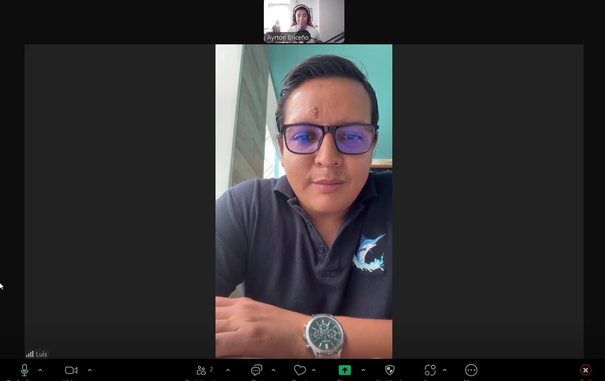
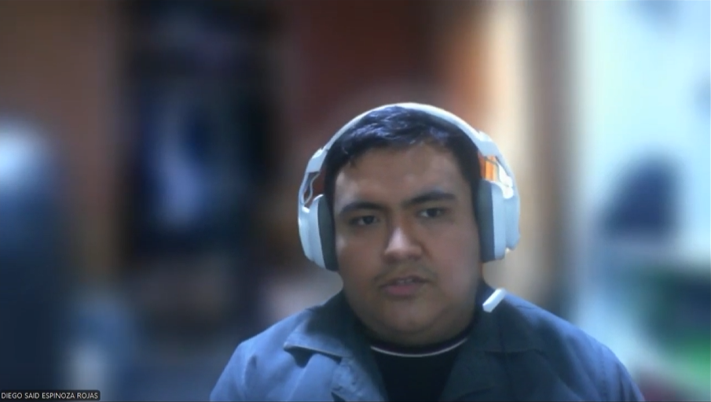
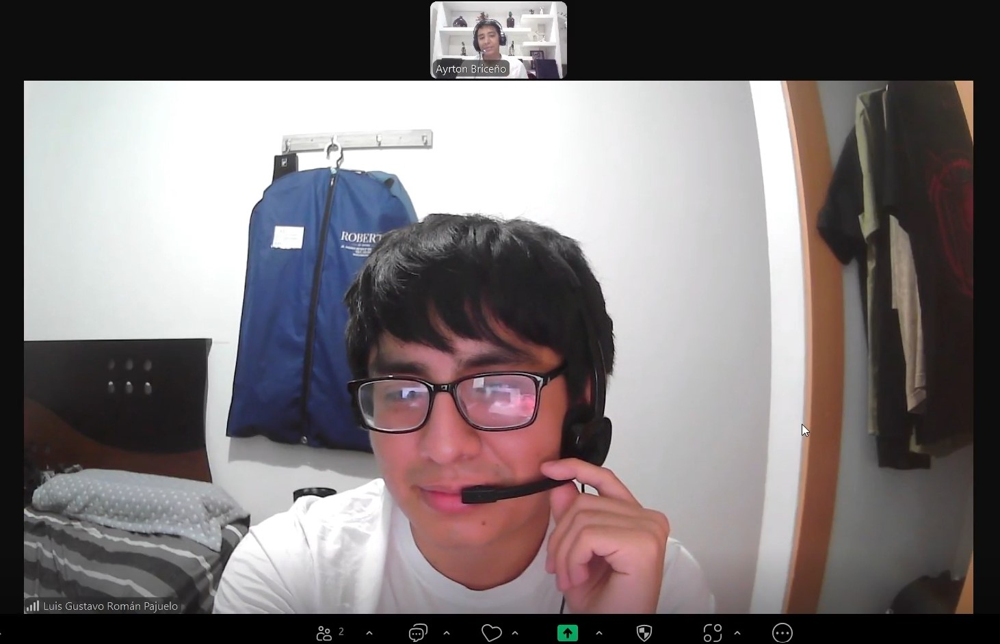
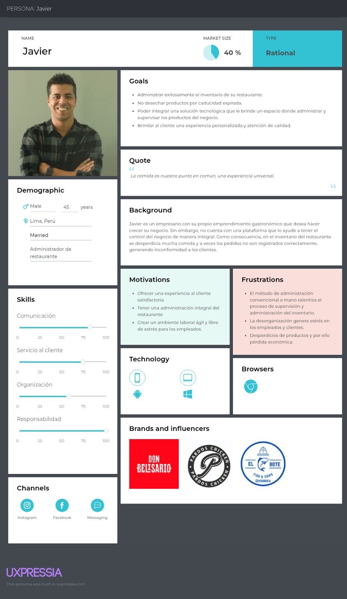
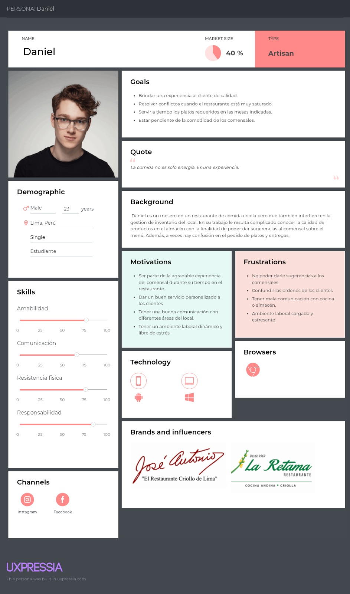
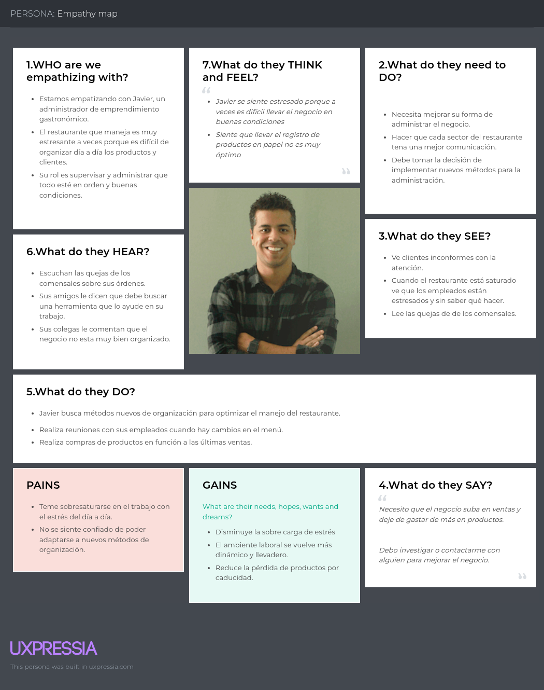
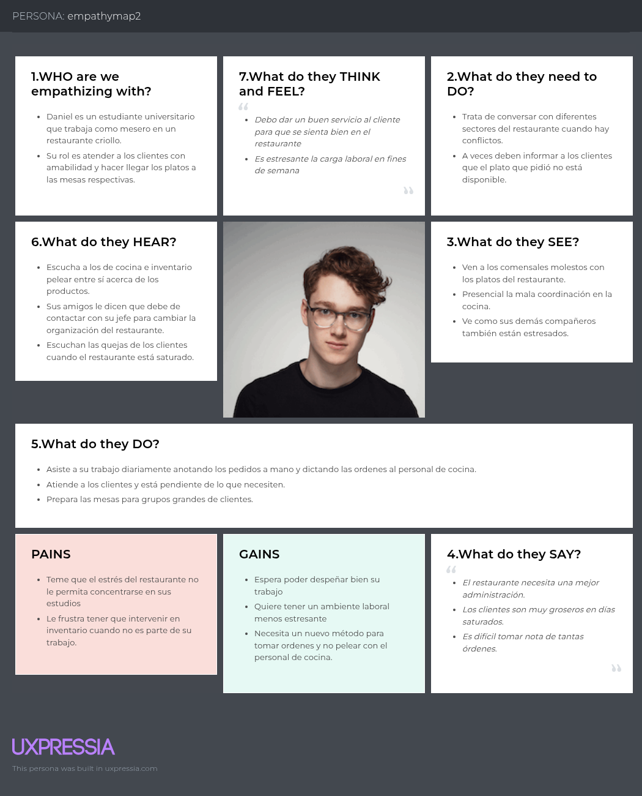
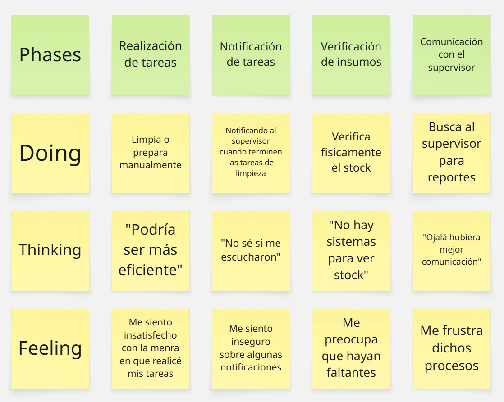
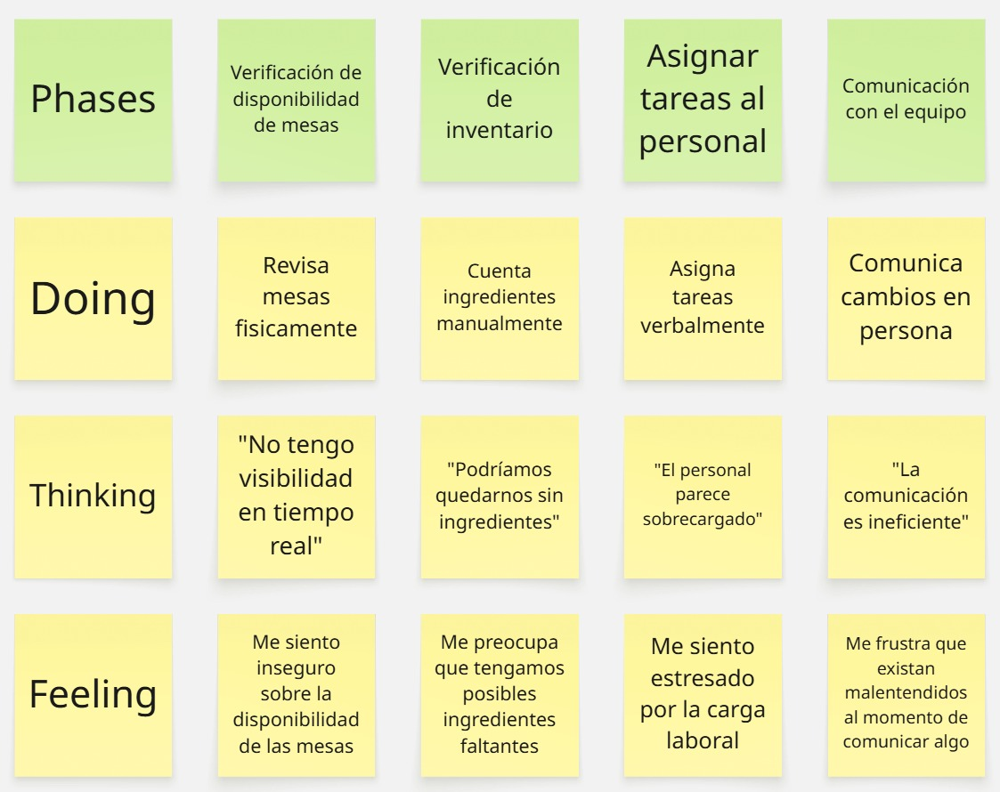

# Capítulo II: Requirements Elicitation & Analysis

## 2.1. Competidores.

En esta sección, se presenta un análisis de los competidores de KeepItFresh y sus respectivas estrategias y tácticas. Se incluye un análisis competitivo, así como una comparación de las fortalezas y debilidades de cada competidor.

### 2.1.1. Análisis competitivo.

<table>
  <tr>
    <th colspan="22">Competitive Analysis Landscape</th>
  </tr>
  <tr>
    <td colspan="1">¿Por qué llevar a cabo el análisis?</td>
    <td colspan="17">Este análisis se lleva a cabo con la finalidad de poder conocer la competencia y cómo “nombre de la empresa” se diferencia ante esta.</td>
  </tr>
  <tr>
    <td colspan="2"></td>
    <td>KeepItFresh </td>
    <td> </td>
    <td> </td>
    <td> </td>
</tr>
  <tr>
    <td rowspan="2">Perfil</td>
    <td>Overview</td>
    <td>KeepItFresh es una aplicación que combina la gestión de inventario, el control de alimentos almacenados, le ofrece recomendaciones de conservación para alimentos al dueño del restaurante y un botón que llama mozos para los clientes.</td>
    <td>MarketMan es una solución de gestión de inventarios y compras basada en la nube que simplifica todas las operaciones internas agilizando  todo, desde el inventario hasta el presupuesto, los informes, la gestión de proveedores y el cálculo del coste de los alimentos.</td>
    <td>OpenTable es una plataforma para restaurantes que ofrece reservaciones, administración de mesas y un inventario a tiempo real en todos los dispositivos.</td>
    <td>CoverManager es una herramienta que ayuda a los restaurantes a controlar su negocio a tiempo real desde cualquier dispositivo, gestiona reservas y pagos en una sóla plataforma y fideliza clientes sin compartir datos a competencias.</td>
</tr>
  <tr>
  <td>Ventaja competitiva ¿Qué valor ofrece a los clientes?</td>
    <td>KeepItFresh ofrece un software inteligente para gestionar el inventario de tu negocio. Brinda un control completo del estado de los productos almacenados, recomienda las mejores condiciones de conservación para los alimentos y, además, incluye un botón para llamar a los mozos de forma rápida y eficiente.</td>
    <td>MarketMan ayuda a restaurantes y negocios de hostelería a gestionar eficientemente su inventario, controlar costos, reducir desperdicio, y optimizar las compras y recetas. El valor clave es el ahorro de tiempo, reducción de errores, mejora en la rentabilidad y toma de decisiones basadas en datos reales.</td>
    <td>OpenTable proporciona a los restaurantes una plataforma integral para gestionar reservaciones, optimizar la ocupación de mesas, mejorar la visibilidad en línea y fortalecer las relaciones con los comensales.</td>
    <td>CoverManager proporciona a los restaurantes y negocios de hostelería una solución integral para gestionar reservas, optimizar la ocupación de mesas, reducir ausencias (no-shows) y mejorar la experiencia del cliente.</td>
    </tr>
<tr>
    <td rowspan="2">Perfil de Marketing</td>
    <td>Mercado Objetivo</td>
    <td>Enfocado en restaurantes criollos, cevicherías y pollerías.</td>
    <td>Restaurantes individuales o cadenas (pequeñas, medianas o grandes).

Hoteles, bares, cafeterías, y servicios de catering.

Empresas del sector hospitality que requieran control de inventario alimentario.

Especialmente enfocado a negocios con alto volumen de ingredientes y múltiples proveedores.
</td>
    <td>Restaurantes de todos los tamaños.

Bares, bodegas y hoteles

Otros negocios: Empresas que requieren gestión de reservaciones y optimización de espacios. ​
</td>
    <td>Restaurantes.

Negocios de ocio nocturno.

Grupos y eventos

Beach clubs y hoteles.
</td>
  </tr>
  <tr>
  <td>Estrategias de Marketing</td>
    <td>Publicidad, posicionamiento de landing page, redes sociales y entrevistas.</td>
    <td>Posicionamiento SEO, Google Ads, y presencia activa en redes sociales.</td>
    <td>Campañas de promoción y resultados promocionados para aumentar la visibilidad y atraer más reservaciones.</td>
    <td>Ofrece herramientas para que los restaurantes integren sistemas de reservas en sus propios sitios web y redes sociales, potenciando las reservas directas sin comisiones.</td>
    </tr>
<tr>
    <td rowspan="3">Perfil de Producto</td>
    <td>Productos y Servicios</td>
    <td>Software de manejo de inventario para restaurantes y analisis de datos de los productos alojados.</td>
    <td>Software de gestión de inventario.
Cálculo de coste de recetas y menú.
</td>
    <td>Software de reservaciones, Gestión de mesas y Lista de espera.</td>
    <td>Gestión de reservas.

Pedidos de delivery y takeaway.
</td>
  </tr>
  <tr>
  <td>Precios y Costos</td>
    <td>Suscripción de cada IOT para los restaurantes</td>
    <td>Modelo SaaS (software como servicio) con planes mensuales o anuales.
Ofrecen prueba gratuita.
</td>
    <td>OpenTable ofrece diferentes planes según las necesidades del restaurante, incluyendo funciones básicas y avanzadas.</td>
    <td>Plan estándar: Incluye gestión centralizada de reservas, integración con canales propios, usuarios y dispositivos ilimitados, y funcionalidades como pedido y pago desde el móvil. </td>
    </tr>
<td>Canales de distribución (Web y/o Móvil)</td>
    <td>Plataforma Web y aplicación movil</td>
    <td>Plataforma web 

Aplicación móvil para Android y iOS .

Distribución directa desde su sitio web.

Integraciones con plataformas aliadas.
</td>
    <td>Plataforma web: Accesible desde navegadores para la gestión completa de las operaciones del restaurante.​

Aplicación móvil: App para propietarios que permite gestionar reservaciones y operaciones desde dispositivos móviles.
</td>
    <td>Plataforma web: Accesible desde navegadores para la gestión completa de las operaciones del negocio.</td>
<tr>
    <td rowspan="4">Análisis SWOT</td>
    <td>Fortalezas</td>
    <td>Ofrecer tecnología IOT de sensores y una interfaz intuitiva para todo público</td>
    <td>Plataforma muy especializada en el sector HORECA.</td>
    <td>Acceso a una amplia base de usuarios que utilizan OpenTable para realizar reservaciones.</td>
    <td>Ofrece una amplia gama de herramientas para la gestión de reservas, pedidos y fidelización en una única plataforma.</td>
  </tr>
  <tr>
  <td>Debilidades</td>
    <td>Poca experiencia en el mercado</td>
    <td>Costo elevado para negocios muy pequeños.</td>
    <td>Las tarifas de suscripción y por reservación pueden ser significativas para pequeños restaurantes.</td>
    <td>La implementación de todas las funcionalidades puede requerir tiempo y formación para el personal.</td>
    </tr>
  <tr>
<td>Oportunidades</td>
    <td>El cliente puede ajustar la cantidad de dispositivos IOT que desee alquilar de acuerdo a su presupuesto</td>
    <td>Expansión en mercados emergentes y LATAM.</td>
    <td>Implementación de nuevas tecnologías, como inteligencia artificial, para mejorar la experiencia del usuario y la eficiencia operativa.</td>
    <td>Posibilidad de crecer en mercados donde la digitalización de la gestión de reservas y pedidos aún está en desarrollo</td>
</tr>
  <tr>
<td>Amenazas</td>
    <td>Competencia de empresas con mayor manejo y tiempo en el mercado</td>
    <td>Alta competencia en el software de gestión de restaurantes.</td>
    <td>Tendencias hacia métodos alternativos de reservación o experiencias gastronómicas que no requieren reservaciones tradicionales.</td>
    <td>Presencia de otras soluciones en el mercado que ofrecen servicios similares, lo que puede dificultar la diferenciación.</td>
</tr>
</table>

### 2.1.2. Estrategias y tácticas frente a competidores.

Desarrollar estrategias y tácticas efectivas para enfrentar a nuestros competidores requiere de un enfoque cuidadoso y planificado. A continuación se presentan algunas estrategias y tácticas que podrían ser consideradas para tener una ventaja competitiva frente a otras alternativas:

- Implementación de tecnología IOT: Utilizamos sensores IOT para ofrecer un monitoreo continuo de el estado de los alimentos que hay en el almacenamiento del restaurante y también le damos la oportunidad al cliente de decidir cuántos sensores desea de acuerdo a su presupuesto.
- Enfoque en la experiencia para el usuario: Desarrollar una interfaz simple y fácil de entender para que el usuario no tenga dificultades en entenderlar y pueda usarla sin problemas.
- Mantenimiento y mejoras en la aplicación: Mantener un ritmo constante en las actualizaciones para mejorar y arreglar la aplicación es esencial para que el usuario tenga la mejor experiencia posible y esto lo haremos recopilando información de errores y quejas de los usuarios.

## 2.2. Entrevistas.
En esta sección se presenta la investigación realizada a partir de entrevistas en profundidad dirigidas a representantes de los segmentos objetivo: propietarios/gerentes de restaurantes y personal operativo. El análisis recoge tanto características objetivas como percepciones subjetivas de los entrevistados, permitiendo identificar patrones, necesidades, motivaciones y dolores comunes. Esta información sirve como base para la construcción de los arquetipos de usuario y demás artefactos del proceso de diseño centrado en el usuario.

### 2.2.1. Diseño de entrevistas.

A continuación, se presentan las preguntas para las entrevistas de cada sección.
A demás, con la finalidad de no extender el tiempo de las entrevistas y facilitar información gráfica. Haciendo uso de la herramienta GoogleForms hemos
recolectado información personal como por ejemplo las marcas de preferencia, dispositivos de uso, etc.

#### Preguntas para el segmento "Dueños de restaurantes"

- ¿Podría contarme un poco cómo funciona el restaurante día a día?
- ¿Cuántas personas trabajan en cocina y cuántas en el salón?
- ¿Tienen alguna herramienta para llevar el control del inventario? ¿Cómo lo hacen?
- ¿Qué tan seguido revisan el stock (cantidad de productos en almacén)? 
- ¿Cómo hacen para saber si un producto está por vencer o si necesita cierta temperatura? 
- ¿Alguna vez han tenido problemas por productos vencidos o mal conservados? ¿Qué consecuencias tuvo? 
- ¿Tiene alguna forma de prever esas situaciones? 
- ¿Qué pasa cuando el restaurante está lleno? 
- ¿Cómo manejan la atención al cliente en esos momentos? 
- ¿Cómo se organiza el equipo para responder rápido ante emergencias? 
- ¿Usan alguna tecnología para mejorar estos procesos? (Apps, sensores, tablets...)
- Si existiera una herramienta que te ayude a automatizar el control de stock y también mejore la experiencia del cliente, ¿cómo la imaginas? 
- ¿Qué características te parecerían más útiles o importantes? 
- ¿Estarías dispuesto a probar algo así en tu restaurante?

#### Preguntas para el segmento "Trabajadores de restaurantes"

- ¿Qué tareas haces normalmente durante tu turno?
- ¿Tenés que ver con el inventario o con revisar productos? ¿Cómo lo hacés? 
- ¿Con qué frecuencia revisas los productos en stock? 
- ¿Cómo se enteran si un producto está por vencerse? 
- ¿Alguna vez tuvieron que tirar algo porque se pasó la fecha o estaba mal conservado? 
- Cuando el restaurante está lleno, ¿cómo te das cuenta si un cliente necesita algo si no te llama directamente? 
- ¿Te pasó alguna vez que un cliente se molestó por no recibir atención a tiempo? 
- ¿Qué es lo más difícil de esos momentos de mucho trabajo?
- ¿Cómo te imaginas que una app o sistema podría ayudarte a hacer tu trabajo más fácil?

### 2.2.2. Registro de entrevistas.

En esta sección se aborda la información recolectada de cada entrevista incluyendo un resumen de las respuestas de los entrevistados.

#### Segmento 1: Dueños de restaurantes.

- _Entrevista 1_

| Nombre               | Richard                                                                                                                                                                                                                                                                                                                     |
|----------------------|-----------------------------------------------------------------------------------------------------------------------------------------------------------------------------------------------------------------------------------------------------------------------------------------------------------------------------|
| Apellido             | Melgarejo                                                                                                                                                                                                                                                                                                                   |
| Edad                 | 52 años                                                                                                                                                                                                                                                                                                                     |
| Distrito             | Lince                                                                                                                                                                                                                                                                                                                       |
| Evidencia            |                                                                                                                                                                                                                                                       |
| Url                  | https://acortar.link/9818Zn |
| Inicio de entrevista | 6:33                                                                                                                                                                                                                                                                                                                        |    
| Fin de entrevista    | 25:26                                                                                                                                                                                                                                                                                                                       |

- Distrito de residencia: Jesús María
- Estado civil: Divorciado
- Ocupación: Dueño de restaurante
- Dispositivo de preferencia: Smartphone
- Canales de interacción digital: Instagram, X

Resumen:
Richard es un emprendedor gastronómico ubicado en Jesús María, con amplia experiencia en la administración de su restaurante. A lo largo de los años, ha demostrado ser una persona organizada, enfocada y comprometida con la mejora continua de su negocio. Aunque ha logrado manejar de forma efectiva muchos aspectos de su operación, aún utiliza métodos manuales, como papel y lápiz, para llevar el control de su inventario y organización interna. Él mismo reconoce que esta forma de trabajo es poco eficiente, especialmente ahora que su negocio requiere mayor agilidad y precisión.

Consciente de estas limitaciones, Richard ha expresado un claro interés por incorporar herramientas tecnológicas que le permitan optimizar sus procesos. No es ajeno al uso de dispositivos digitales: usa su smartphone frecuentemente, tanto para comunicarse como para informarse y seguir tendencias gastronómicas en redes sociales como Instagram y X (Twitter). Su presencia en estas plataformas también lo mantiene atento a nuevas ideas, productos y enfoques que pueda aplicar en su restaurante.

Si bien no es un experto en tecnología, está abierto a soluciones innovadoras, siempre que estas ofrezcan beneficios concretos, como facilitar la toma de decisiones estratégicas o mejorar la gestión del inventario. Le interesan especialmente aquellas plataformas que le permitan visualizar datos clave, como los productos más vendidos, las cantidades disponibles o las fechas de vencimiento, de forma clara y confiable.

En resumen, Richard representa a un emprendedor tradicional con visión moderna, que busca digitalizar su negocio de manera práctica y efectiva, apostando por herramientas que le den control, orden y mejores resultados en su gestión diaria.
 ➡ Arquetipo base: Administrador Estratégico 
- _Entrevista 2_

| Nombre               | Luis                                                                                                                                                                                                                                                                                                                        |
|----------------------|-----------------------------------------------------------------------------------------------------------------------------------------------------------------------------------------------------------------------------------------------------------------------------------------------------------------------------|
| Apellido             | Agurto                                                                                                                                                                                                                                                                                                                      |
| Edad                 | 34 años                                                                                                                                                                                                                                                                                                                     |
| Distrito             | San Borja                                                                                                                                                                                                                                                                                                                   |
| Evidencia            |                                                                                                                                                                                                                                                                                                                         |
| Url                  | https://acortar.link/9818Zn |
| Inicio de entrevista | 0:00                                                                                                                                                                                                                                                                                                                        |    
| Fin de entrevista    | 6:32                                                                                                                                                                                                                                                                                                                        |

- Distrito de residencia: Santiago de Surco
- Estado civil: Casado
- Ocupación: Dueño de restaurante
- Dispositivo de preferencia: Laptop
- Canales de interacción digital: Facebook, X

Resumen:
Luis vive en Santiago de Surco y es dueño de un restaurante que se encuentra en etapa de consolidación. Tiene experiencia en la gestión operativa y conoce bien el día a día del negocio, pero sigue utilizando métodos manuales o informales para controlar procesos internos como el inventario o las ventas, lo que ha empezado a volverse una carga.

Es una persona casada, reflexiva y enfocada en la eficiencia. Utiliza principalmente su laptop para trabajar y se mantiene informado a través de Facebook y X, donde sigue contenido sobre emprendimiento y herramientas digitales. Tiene una actitud abierta hacia la tecnología, especialmente si esta le permite mejorar el control del inventario, analizar las ventas y tomar mejores decisiones sobre su carta y la atención al cliente.

Luis valora las soluciones que le permitan organizar mejor su operación y obtener datos claros para optimizar el rendimiento de su restaurante sin complicarse con herramientas complejas o difíciles de implementar.

 ➡ Arquetipo base: Administrador Estratégico 
- _Entrevista 3_

| Nombre               | Daniel                                                                                                                                                                                                                                                                                                                      |
|----------------------|-----------------------------------------------------------------------------------------------------------------------------------------------------------------------------------------------------------------------------------------------------------------------------------------------------------------------------|
| Apellido             | Céspedes                                                                                                                                                                                                                                                                                                                    |
| Edad                 | 54 años                                                                                                                                                                                                                                                                                                                     |
| Distrito             | Miami                                                                                                                                                                                                                                                                                                                       |
| Evidencia            |                                                                                                                                                                                                                                                                                                                            |
| Url                  |  |
| Inicio de entrevista | 25:27                                                                                                                                                                                                                                                                                                                       |    
| Fin de entrevista    | 39:54                                                                                                                                                                                                                                                                                                                       |

- Distrito de residencia: Miami
- Estado civil: Casado
- Ocupación: Dueño de restaurante
- Dispositivo de preferencia: Computadora de escritorio
- Canales de interacción digital: Messenger, Instagram

Resumen:
Daniel reside en Miami y es propietario de un restaurante que ha gestionado durante varios años utilizando métodos tradicionales. Aunque no es un usuario intensivo de tecnología, ha incorporado gradualmente herramientas digitales en su rutina diaria. Su principal medio de trabajo es la computadora de escritorio, aunque también utiliza Messenger e Instagram para comunicarse y mantenerse conectado con su entorno.

Con una mentalidad práctica y orientada a resultados, Daniel ha comenzado a interesarse en automatizar la gestión del inventario, especialmente debido a las dificultades que enfrenta con la rotación de productos y la reposición oportuna. Su enfoque en la eficiencia lo lleva a valorar las soluciones que puedan reducir errores y mejorar el control sin requerir cambios drásticos en su forma de operar.

Aunque su interés en el análisis de ventas es moderado, reconoce que las estadísticas visuales pueden facilitar la toma de decisiones y ayudarlo a identificar patrones importantes. Tiene una actitud positiva hacia la innovación, siempre que esta se adapte a sus procesos actuales y no complique su gestión diaria.

 ➡ Arquetipo base: Administrador Estratégico 

##### Segmento 2: Trabajadores de restaurantes.

- _Entrevista 1_

| Nombre               | Diego                                                                                                                                                                                                                                                                                                                       |
|----------------------|-----------------------------------------------------------------------------------------------------------------------------------------------------------------------------------------------------------------------------------------------------------------------------------------------------------------------------|
| Apellido             | Espinoza                                                                                                                                                                                                                                                                                                                    |
| Edad                 | 21 años                                                                                                                                                                                                                                                                                                                     |
| Distrito             | Los Olivos                                                                                                                                                                                                                                                                                                                  |
| Evidencia            |                                                                                                                                                                                                                                                                                                                             |
| Url                  | https://acortar.link/9818Zn |
| Inicio de entrevista | 42:56                                                                                                                                                                                                                                                                                                                       |    
| Fin de entrevista    | 47:11                                                                                                                                                                                                                                                                                                                       |

- Distrito de residencia: La Molina
- Estado civil: Soltero
- Ocupación: Mesero
- Dispositivo de preferencia: Smartphone
- Canales de interacción digital: Messenger, Instagram

Resumen:
Diego forma parte del equipo operativo de un restaurante, donde cumple un rol clave como mesero. Con un perfil proactivo y digitalmente nativo, utiliza su smartphone de forma intensiva para comunicarse, coordinar y mantenerse conectado a través de redes como Instagram y Messenger. Está plenamente familiarizado con la dinámica del día a día en sala y cocina, lo que le da una visión clara de las necesidades operativas.

Ha manifestado que la falta de tecnología representa una carga adicional en su trabajo, sobre todo al momento de coordinar con cocina, hacer seguimientos o verificar el estado del inventario. Para él, sería clave contar con una herramienta que automatice pedidos, mejore la comunicación interna y simplifique sus tareas.

Tiene una alta disposición para adoptar nuevas herramientas tecnológicas, especialmente si estas le permiten trabajar de forma más ágil y eficiente. Por su cercanía con los procesos operativos y su familiaridad con entornos digitales, Diego es un usuario ideal para validar soluciones móviles pensadas para el equipo en campo.

 ➡ Arquetipo base: Operador Multifuncional 
- _Entrevista 2_

| Nombre               | Estephano                                                                                                                                                                                                                                                                                                                |
|----------------------|--------------------------------------------------------------------------------------------------------------------------------------------------------------------------------------------------------------------------------------------------------------------------------------------------------------------------|
| Apellido             | Moscoso Bejar                                                                                                                                                                                                                                                                                                            |
| Edad                 | 22                                                                                                                                                                                                                                                                                                                       |
| Distrito             | Comas                                                                                                                                                                                                                                                                                                                    |
| Evidencia            |                                                                                                                                                                                                                                                                          |
| Url                  | https://acortar.link/9818Zn |
| Inicio de entrevista | 47:12                                                                                                                                                                                                                                                                                                                    |    
| Fin de entrevista    | 53:50                                                                                                                                                                                                                                                                                                                    |

- Distrito de residencia: La Victoria
- Estado civil: Soltero
- Ocupación: Mesero
- Dispositivo de preferencia: Laptop y computadora de escritorio
- Canales de interacción digital: Facebook, Instagram

Resumen:
Estephano trabaja como mesero, pero también tiene un rol activo en la gestión del inventario dentro del restaurante donde labora. Su perfil destaca por ser versátil y tecnológicamente hábil, ya que, a diferencia de otros operativos, no solo utiliza su smartphone, sino también laptop y PC para realizar tareas complementarias, lo que le permite adaptarse con facilidad a distintos entornos digitales.

Es una persona organizada, con visión a futuro y apertura al cambio, cualidades que lo convierten en un aliado clave para introducir soluciones tecnológicas en el espacio operativo. Ve con claridad el valor de digitalizar procesos, especialmente aquellos que mejoran la coordinación entre cocina y servicio, reducen errores humanos y optimizan el tiempo durante las jornadas de alta demanda.

Estephano navega regularmente por Facebook e Instagram, donde sigue contenido relacionado con gastronomía y tecnología, lo que refuerza su interés por mantenerse actualizado en tendencias que pueden impactar su entorno laboral. Su combinación de experiencia operativa, manejo de herramientas digitales y actitud proactiva lo posiciona como un usuario ideal para adoptar e impulsar soluciones tecnológicas dentro del restaurante.

 ➡ Arquetipo base: Operador Multifuncional 
- _Entrevista 3_

| Nombre               | Luis                                                                                                                                                                                                                                                                                                                      |
|----------------------|---------------------------------------------------------------------------------------------------------------------------------------------------------------------------------------------------------------------------------------------------------------------------------------------------------------------------|
| Apellido             | Roman                                                                                                                                                                                                                                                                                                                     |
| Edad                 | 20 años                                                                                                                                                                                                                                                                                                                   |
| Distrito             | Jesús María                                                                                                                                                                                                                                                                                                               |
| Evidencia            |                                                                                                                                                                                                                                                                                                                           |
| Url                  | https://acortar.link/9818Zn |
| Inicio de entrevista | 39:55                                                                                                                                                                                                                                                                                                                     |    
| Fin de entrevista    | 42:55                                                                                                                                                                                                                                                                                                                     |

- Distrito de residencia: Jesús María
- Estado civil: Soltero
- Ocupación: Mesero
- Dispositivo de preferencia: Smartphone
- Canales de interacción digital: Instagram, Facebook

Resumen:
Luis es un joven mesero que combina su rol de atención al cliente con tareas operativas relacionadas al inventario. Durante la entrevista, se mostró entusiasta y receptivo ante la idea de incorporar herramientas digitales que le ayuden a automatizar tareas repetitivas, como el control de stock o la organización de pedidos, lo cual considera clave para mejorar su rendimiento diario.

Su principal dispositivo de uso es el smartphone, desde el cual accede frecuentemente a redes sociales, donde está expuesto a tendencias y herramientas tecnológicas del sector gastronómico. Tiene una personalidad dinámica, empática y resolutiva, enfocada en atender las necesidades del cliente pero también en facilitar el trabajo operativo interno.

Luis expresó una clara frustración con la falta de sincronización entre cocina y sala, una problemática que vive a diario y que afecta directamente la eficiencia del servicio. Esa experiencia lo convierte en un portavoz genuino del dolor operativo, con la perspectiva adecuada para evaluar soluciones que apunten a ese punto crítico.

Aunque tiene conocimientos básicos de tecnología, es muy receptivo al uso de apps móviles y demuestra una alta disposición para adaptarse, siempre que la herramienta represente una mejora tangible en su rutina de trabajo.

 ➡ Arquetipo base: Operador Multifuncional 

### 2.2.3. Análisis de entrevistas.

**Segmento 1:**  
**Propietarios y/o fundadores de restaurantes** 
**Entrevistados:** Richard Melgarejo, Luis Agurto, Daniel Céspedes
Cantidad: 3/6 (50%)

**Características objetivas:** 
- Experiencia en gestión de restaurantes: 3/3 (100%)

- Uso de métodos manuales (papel/lápiz o propios): 3/3 (100%)

- Deseo de automatizar la gestión de inventario: 3/3 (100%)

**Características subjetivas:** 
- Valoración de la eficiencia operativa: 3/3 (100%)

- Interés por análisis de datos y ventas: 2/3 (66%)

- Actitud abierta a la innovación tecnológica: 3/3 (100%)

**Segmento 2:** 
**Personal operativo (meseros y operativos de inventario)** 
**Entrevistados:** Diego Espinoza, Luis Roman, Esthephano Moscoso
Cantidad: 3/6 (50%)

**Características objetivas:**
- Participación en gestión de inventario: 3/3 (100%)

- Frecuencia de revisión del inventario durante el día: 2/3 (66%)

- Interacción directa con cocina y atención al cliente: 3/3 (100%)

**Características subjetivas:**
- Deseo de automatización para facilitar el trabajo: 3/3 (100%)

- Necesidad de mejorar la coordinación entre cocina y servicio: 3/3 (100%)

- Percepción de carga de trabajo o estrés por falta de tecnología: 3/3 (100%)

**Análisis global (6 entrevistados)**

| **Característica común**                  | **Frecuencia** | **Porcentaje** |
|-------------------------------------------|----------------|----------------|
| Interés en automatizar inventario         | 6/6            | 100%           |
| Uso actual de métodos manuales o informales | 5/6            | 83%            |
| Valoración de la eficiencia y optimización del tiempo | 6/6 | 100%           |
| Deseo de incorporar tecnología            | 6/6            | 100%           |
| Interés en análisis predictivo o de ventas | 3/6            | 50%            |
| Necesidad de mejorar la coordinación interna | 3/6          | 50%            |

**Conclusiones para construcción de arquetipos** 

**Arquetipo 1:** El Administrador Estratégico.

**Perfil:** Propietario o gerente de restaurante.

**Dolor principal:** Gestión manual del inventario, falta de análisis detallado de ventas.

**Necesidades:** Plataforma que brinde control de inventario, estadísticas de productos más vendidos y sugerencias para optimizar el menú.

**Motivación:** Optimización de recursos y mejora en la toma de decisiones.

**Arquetipo 2:** El Operador Multifuncional.

**Perfil:** Personal operativo (meseros o encargados de inventario).

**Dolor principal:** Carga de trabajo alta, poca visibilidad del estado de pedidos, coordinación deficiente con cocina.

**Necesidades:** Aplicación que automatice el control de stock, indique vigencia de productos, organice pedidos y comunique alertas de cocina.

**Motivación:** Agilizar tareas diarias, reducir errores y evitar desplazamientos innecesarios.

## 2.3. Needfinding.
En esta sección se presenta el análisis detallado de la información recolectada durante las entrevistas realizadas a los distintos perfiles involucrados en la gestión y operación de restaurantes. El objetivo principal del proceso de Needfinding ha sido identificar necesidades reales, motivaciones, frustraciones y patrones de comportamiento de los usuarios para guiar el diseño de una solución centrada en ellos. 
Los artefactos incluidos User Personas, User Task Matrix, User Journey Maps, Empathy Mapping y As-Is Scenario Mapping, permiten visualizar, sintetizar y comprender de manera estructurada la experiencia actual de los usuarios, sus tareas clave, emociones, puntos de dolor y oportunidades de mejora. Este análisis constituye la base para el diseño de soluciones alineadas con sus contextos y objetivos reales.
### 2.3.1. User Personas.
Esta sección presenta las fichas de User Persona elaboradas a partir del análisis de entrevistas y hallazgos del benchmarking. Cada arquetipo representa un segmento objetivo clave, reflejando sus características demográficas, comportamientos, necesidades, frustraciones y motivaciones. Estos perfiles permiten guiar el diseño centrado en el usuario, alineando la solución propuesta con contextos reales de uso.

#### Segmento 1: Dueños de restaurantes.

Daniel es un dueño de restaurante con experiencia en la gestión operativa, que busca optimizar sus procesos y mejorar la eficiencia del negocio. A continuación se presenta su User Persona:

#### Segmento 2: Empleados de restaurantes.

Javier es un empleado de restaurante que realiza tareas operativas diarias y busca herramientas que faciliten su trabajo. A continuación se presenta su User Persona:

### 2.3.2. User Task Matrix.

En esta sección, se presenta la matriz de tareas de los usuarios, que muestra las actividades realizadas por los dueños y empleados de restaurantes, junto con su frecuencia e importancia. Esta matriz ayuda a identificar las tareas clave y su relevancia para cada tipo de usuario.
Para ello, usamos los user personas creadas en la sección anterior tomando a Daniel, segmento 1: Dueño de restaurante, y a Javier, segmento 2: trabajador de restaurante.  

Segmento Objetivo 1: Daniel (Dueño de restaurante)

Daniel representa a un dueño de restaurante con experiencia en la gestión operativa, que busca optimizar sus procesos y mejorar la eficiencia del negocio. A continuación se presenta su User Task Matrix:

| Actividades                  | Frecuencia   | Importancia |
|------------------------------|--------------|-------------|
| Guardar productos            | Rara vez     | Media       |
| Atender clientes             | Rara vez     | Alta        |
| Tomar pedidos                | Rara vez     | Alta        |
| Cobrar cuenta                | Rara vez     | Alta        |
| Manejo financiero            | Siempre      | Alta        |
| Contratacion y supervision      | Con Frecuencia     | Media       |
| Gestion de inventario        | Siempre      | Alta        |
| Limpieza de area             | Rara vez     | Media       |
| Capacitacion de personal     | Con Frecuencia     | Media       |

Segmento Objetivo 2: Javier (Trabajador de restaurante)

Javier representa a un empleado de restaurante que realiza tareas operativas diarias y busca herramientas que faciliten su trabajo. A continuación se presenta su User Task Matrix:

| Actividades       | Frecuencia      | Importancia |
|-------------------|-----------------|------------|
| Guardar productos | Con Frecuencia     | Media      |
| Atender clientes  | Siempre         | Alta       |
| Tomar pedidos     | Siempre         | Alta       |
| Cobrar cuenta                | Siempre         | Alta       |
| Manejo financiero            | Rara vez        | Alta       |
| Contratacion y supervision       | Rara vez        | Media      |
| Gestion de inventario        | Rara vez        | Alta       |
| Limpieza de area             | Con Frecuencia  | Media      |
| Capacitacion de personal     | Rara vez        | Media |

### 2.3.3. User Journey Mapping.
En esta sección se presentan los User Journey Maps en su versión As-Is, uno por cada User Persona definidol. Cada journey refleja el recorrido actual que realiza el usuario en su contexto real de trabajo, desde el inicio hasta el fin de sus actividades clave, sin la existencia de una solución tecnológica. Estos mapas permiten identificar puntos de fricción, oportunidades de mejora y momentos críticos que guían el diseño centrado en el usuario. Los journeys están directamente vinculados a los arquetipos previamente definidos.
### Segmento 1: Dueños de restaurantes.

### Segmento 2: Empleados de restaurantes.

### 2.3.4. Empathy Mapping.
Esta sección presenta los Empathy Maps desarrollados para los dos User Personas. El proceso de elaboración incluyó la reflexión colaborativa del equipo en torno a la experiencia, necesidades, pensamientos, emociones y percepciones de cada usuario. Los mapas permiten profundizar en la comprensión de sus contextos y motivaciones, respondiendo preguntas clave sobre lo que ven, escuchan, piensan, sienten, dicen y hacen. A partir de este análisis, se identificaron sus Pains y Gains, los cuales servirán como base para el diseño de una propuesta de valor relevante.
#### Segmento 1: Dueños de restaurantes.

#### Segmento 2: Empleados de restaurantes.

### 2.3.5. As-is Scenario Mapping.

En esta sección se presentan los As-Is Scenario Mapping elaborados por el equipo utilizando la herramienta Miro. El proceso se desarrolló con una preparación y definición del objetivo del análisis, una lluvia de ideas individual por cada integrante del equipo, una consolidación y revisión en equipo de las tareas y fases, identificación de las fases principales como columnas, inclusión de acciones (Doing), pensamientos (Thinking) y emociones (Feeling) por fase y finalmente un etiquetado de áreas positivas, negativas y espacios en blanco o desconocidos.
Este mapeo permite visualizar de forma clara los puntos críticos, frustraciones y oportunidades de mejora en la experiencia del usuario actual.

**As-is Scenario Mapping Dueño:**  
Esta sección representa la experiencia actual del dueño durante la gestión operativa del restaurante.
Se detallan fases clave como la verificación del estado de las mesas, el control del inventario,
la asignación de tareas al personal y la comunicación con el equipo. A lo largo de estas etapas,
el dueño enfrenta procesos manuales y poco sistematizados que dificultan la toma de decisiones en tiempo
real. La falta de visibilidad, la carga operativa y la comunicación informal generan incertidumbre, 
preocupación y una sensación de desorganización, lo que afecta negativamente su capacidad para liderar 
eficientemente.

**As-is Scenario Mapping Trabajadores del Restaurante:**  
Esta sección representa la experiencia actual de los trabajadores durante el desarrollo de sus tareas diarias en el restaurante.
Se detallan fases clave como la realización de tareas, la notificación de incidencias, la verificación de insumos y la comunicación con el supervisor. En estas etapas se evidencian procesos manuales, 
comunicación ineficiente y falta de claridad sobre el estado del inventario. Esto genera incertidumbre, desmotivación y una sensación de insatisfacción en el equipo, al no contar con herramientas que
faciliten la organización, seguimiento y coordinación de sus responsabilidades.

## 2.4. Ubiquitous Language.
A continuación, se presenta un glosario de términos clave del dominio que serán utilizados en el desarrollo de la plataforma KeepltFresh, orientada a la mejora de la conservación de alimentos y eficiencia del servicio en establecimientos gastronómicos. Los términos están en inglés, con su equivalente en español entre paréntesis y una definición clara en español.

- Expiration Date (Fecha de caducidad): Fecha límite en la que un producto alimenticio debe ser consumido para garantizar su seguridad y calidad.

- Spoilage Level (Nivel de descomposición): Estado de deterioro de un alimento basado en su apariencia, olor u otros indicadores de frescura.

- Food Waste (Desperdicio de alimentos): Alimentos que se descartan por haber superado su fecha de caducidad o por estar en mal estado, aunque podrían haberse consumido si se hubieran gestionado correctamente.

- Freshness (Frescura): Grado en el que un alimento mantiene sus características originales de sabor, textura, color y aroma.

- Service Call (Llamado de servicio): Solicitud realizada por un cliente en una mesa para recibir atención del personal del establecimiento.

- Customer Satisfaction (Satisfacción del cliente): Percepción del cliente sobre la calidad del servicio recibido durante su experiencia en el local.

- Cold Chain (Cadena de frío): Proceso logístico que asegura que los productos perecederos se mantengan a temperaturas adecuadas desde su origen hasta su destino final.

- Shelf Life (Vida útil): Período durante el cual un alimento conserva sus propiedades para el consumo bajo condiciones de almacenamiento específicas.

- Inventory Rotation (Rotación de inventario): Práctica de mover y utilizar primero los productos con fechas de caducidad más próximas para evitar desperdicio.

- Food Safety (Seguridad alimentaria): Conjunto de prácticas que garantizan que los alimentos no causen daño al consumidor cuando se preparan y consumen según lo previsto.