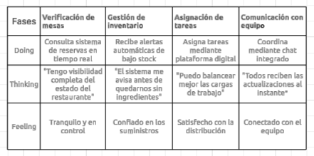
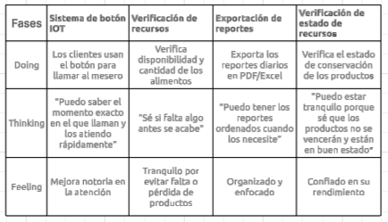

# Capítulo III: Requirements Specification

## 3.1. To-Be Scenario Mapping.
En esta sección se presenta el escenario futuro ideal para cada User Persona, diseñado a partir del análisis de necesidades y oportunidades detectadas en los mapas As-Is. Se detalla el proceso seguido por el equipo, que incluyó preparación, lluvia de ideas individual, revisión colaborativa y definición de fases clave. Cada To-Be Scenario Mapping muestra cómo cambiaría la experiencia del usuario con la implementación de la solución propuesta, incluyendo sus acciones, pensamientos y emociones. Además, se comparan los cambios respecto al escenario actual, resaltando mejoras en eficiencia, claridad y satisfacción del usuario.

**Segmento 1**

**Segmento 2**

## 3.2. User Stories.

| **Epic ID** | **Título**                            | **Descripción**                                                                                                                                                          | **Relacionado con (User Story ID)** |
|-------------|----------------------------------------|--------------------------------------------------------------------------------------------------------------------------------------------------------------------------|--------------------------------------|
| EP01        | Información sobre el startup y producto | **Como** visitante **Quiero** poder visualizar información del producto y la startup encargada **Para** entender lo que ofrecen y saber quiénes están detrás del proyecto |                                      |
| EP02        | Suscripciones y precios                | **Como** visitante **Quiero** poder suscribirme a membresías en la aplicación **Para** tener acceso a beneficios adicionales                                        |                                      |
| EP03        | Beneficios y Features del producto     | **Como** visitante **Quiero** contar con una sección de beneficios y features del producto **Para** entender cómo ayudará a mi negocio y ver opiniones             |                                      |
| EP04        | Contacto a soporte                     | **Como** visitante **Quiero** poder contactar fácilmente al equipo de soporte de KeepItFresh o encontrar ayuda **Para** resolver preguntas, reportar problemas o recibir asistencia con la plataforma |                                      |
| EP05        | Registro y autenticación               | **Como** usuario **Quiero** poder registrarme e iniciar sesión de forma segura **Para** acceder a la plataforma y mantener mi información protegida                 |                                      |
| EP06        | Gestión de inventario                  | **Como** usuario **Quiero** poder gestionar el inventario de mi restaurante **Para** mantener el control de mis productos y minimizar desperdicios                  |                                      |
| EP07        | Sistema de atención al cliente         | **Como** usuario **Quiero** tener acceso a un sistema de atención al cliente **Para** resolver mis dudas o problemas de manera rápida y eficiente                   |                                      |
| EP08        | Dashboard y visualización de datos     | **Como** usuario **Quiero** acceder a un dashboard con métricas e información relevante **Para** tomar decisiones informadas en mi negocio                         |                                      |
| EP09        | Alertas y notificaciones               | **Como** usuario **Quiero** recibir alertas sobre eventos importantes (como productos por vencer) **Para** actuar rápidamente y evitar pérdidas                    |                                      |
| EP10        | Reportes y analítica                   | **Como** usuario **Quiero** obtener reportes sobre el rendimiento y uso de la plataforma **Para** evaluar resultados y optimizar procesos                          |                                      |
| EP11        | Manejo de órdenes                      | **Como** usuario **Quiero** gestionar las órdenes de compra y abastecimiento **Para** mantener un flujo constante de productos necesarios en mi restaurante         |                                      |

| EPIC/ USER STORY ID | Título                                      | Descripción                                                                 | Criterio de aceptación                                                                                                                                                                                                                  | Relacionado a la épica # |
|---------------------|---------------------------------------------|-----------------------------------------------------------------------------|-----------------------------------------------------------------------------------------------------------------------------------------------------------------------------------------------------------------------------------------|--------------------------|
| US01                | Información general del proyecto           | Como visitante quiero conocer una breve descripción del proyecto KeepItFresh para entender su propósito.             | Escenario 1: Dado que el visitante entra a la página, cuando visualiza la sección "Sobre KeepItFresh", entonces encuentra una descripción clara y concisa del propósito del producto.                                                     | EP1                      |
| US02                | Conocer al equipo detrás del producto      | Como visitante quiero saber quiénes son los fundadores o responsables del proyecto para conocer su experiencia.       | Escenario 1: Dado que el visitante accede a la sección del equipo, cuando se desplaza por ella, entonces puede visualizar los nombres, cargos y fotografías de los miembros del equipo.                                                    | EP1                      |
| US03                | Historia y visión del proyecto             | Como visitante quiero conocer la historia y visión del proyecto para saber cómo planean crecer o ayudar a negocios.    | Escenario 1: Dado que el visitante navega en la página, cuando accede a la sección “Nuestra Historia” o similar, entonces encuentra una narración breve de cómo surgió KeepItFresh y cuál es su visión a futuro.                          | EP1                      |
| US04                | Información de precios y suscripciones     | Como visitante quiero conocer los precios del producto para conocer el presupuesto que debo tener.                   | Escenario 1: Dado que el visitante visualiza los planes de precios en la página, cuando observa una opción, entonces ve claramente el precio mensual expresado en dólares y las funcionalidades incluidas en cada plan.                    | EP2                      |
| US05                | Vista desde dispositivos móviles           | Como usuario que visita la página desde mi celular, quiero que la sección de precios se vea bien en pantalla pequeña. | Escenario 1: Dado que el visitante accede a la landing page desde un dispositivo móvil, cuando navega hasta la sección de precios, entonces la interfaz se adapta automáticamente al ancho de la pantalla sin requerir zoom ni scroll horizontal.  | EP2                      |
| US06                | Sección de beneficios del producto         | Como visitante quiero contar con una sección que me explique los beneficios de usar KeepItFresh para evaluar cómo puede ayudarme. | Escenario 1: Dado que el visitante accede a la landing page, cuando navega a la sección de beneficios, entonces puede leer una lista con al menos 3 beneficios principales del producto, explicados de manera clara.                       | EP3                      |
| US07                | Características clave del sistema          | Como visitante quiero ver un resumen de las principales funcionalidades de KeepItFresh para saber qué ofrece la plataforma. | Escenario 1: Dado que el visitante navega en la landing page, cuando llega a la sección de “Características” o “Features”, entonces ve una lista destacada con iconos y descripciones breves de las funcionalidades clave.                  | EP3                      |
| US08                | Opiniones o testimonios de usuarios        | Como visitante quiero ver opiniones de otros usuarios que ya usan KeepItFresh para saber si les ha sido útil en su negocio. | Escenario 1: Dado que el visitante está en la sección de testimonios, cuando lee los comentarios, entonces puede ver el nombre o rol del usuario y su opinión. Hay al menos 3 testimonios visibles en pantalla o accesibles por carrusel. | EP3                      |
| US09                | Enviar mensajes a través del apartado de contacto | Como visitante quiero poder contactar fácilmente al equipo de soporte para resolver mis dudas.  | Escenario 1: Dado que el visitante llega a la sección de contacto, cuando visualiza el formulario de contacto, entonces puede ver un campo de mensaje y un botón para enviarlo.                                                             | EP4                      |
| US10                | Copiar información de contacto             | Como visitante quiero poder copiar la información de contacto para poder compartirla rápidamente. | Escenario 1: Dado que el visitante ve los datos de contacto, cuando pasa el cursor por encima, entonces el correo electrónico y número de teléfono tienen un icono que permite copiarlos.                                                    | EP4                      |
| US11                | Registro de usuario                        | Como visitante quiero registrarme en la plataforma para tener acceso a más funcionalidades. | Escenario 1: Dado que el visitante decide registrarse, cuando hace clic en el botón de "Registrarse", entonces ve un formulario para ingresar sus datos y un botón para confirmar la creación de cuenta.                                    | EP5                      |
| US12                | Inicio de sesión                           | Como usuario registrado quiero iniciar sesión para acceder a mi cuenta. | Escenario 1: Dado que el usuario tiene una cuenta, cuando hace clic en el botón de "Iniciar sesión", entonces ve un formulario para ingresar su correo y contraseña.                                                                     | EP5                      |
| US13                | Registro de Producto                       | Como usuario quiero registrar un nuevo producto para agregarlo a mi inventario. | Escenario 1: Dado que el usuario está en la sección de inventario, cuando selecciona "Agregar Producto", entonces ve un formulario para ingresar detalles del producto como nombre, categoría, cantidad y precio.                             | EP6                      |
| US14                | Consulta de inventario                     | Como usuario quiero consultar el estado de mi inventario para saber qué productos tengo disponibles. | Escenario 1: Dado que el usuario está en la página de inventario, cuando accede a la sección, entonces puede ver una lista con los productos registrados, su cantidad disponible y fecha de vencimiento.                                    | EP6                      |
| US15                | Alertas de vencimiento                     | Como usuario quiero recibir alertas de vencimiento de productos para gestionar el inventario de manera eficiente. | Escenario 1: Dado que un producto se acerca a su fecha de vencimiento, cuando el usuario ingresa a su inventario, entonces recibe una alerta destacada que le informa sobre el vencimiento cercano.                                          | EP6                      |
| US16                | Ingresar nuevo pedido para una mesa        | Como mesero quiero ingresar un pedido para una mesa para gestionar las órdenes. | Escenario 1: Dado que el mesero está en la interfaz, cuando selecciona una mesa y elige los productos, entonces puede ver un resumen de la orden y un botón para finalizar el pedido.                                                        | EP7                      |
| US17                | Editar un pedido existente                 | Como mesero quiero editar un pedido ya ingresado para corregir posibles errores. | Escenario 1: Dado que el mesero accede a la orden, cuando selecciona un pedido existente, entonces puede modificar los productos o cantidades y ver el total actualizado.                                                                  | EP7                      |
| US18                | Eliminar un pedido                         | Como mesero quiero eliminar un pedido incorrecto para evitar confusiones en la mesa. | Escenario 1: Dado que el mesero accede a la orden, cuando selecciona un pedido y hace clic en "Eliminar", entonces el pedido se borra y se actualiza el total de la mesa.                                                                 | EP7                      |
| US19                | Visualizar los pedidos por mesa            | Como gerente quiero ver todos los pedidos realizados por cada mesa para gestionar las órdenes. | Escenario 1: Dado que el gerente accede al sistema, cuando accede a la vista de pedidos, entonces puede ver los pedidos divididos por mesa y el estado de cada uno (en espera, en proceso, finalizado).                                      | EP7                      |
| US20                | Ver estado del pedido                      | Como usuario quiero saber el estado de mi pedido para estar informado sobre su progreso. | Escenario 1: Dado que el cliente realiza un pedido, cuando consulta su pedido, entonces ve el estado actualizado (en preparación, listo para servir, servido).                                                                             | EP7                      |
| US21                | Registro de tiempo de respuesta            | Como

## 3.3. Impact Mapping.

## 3.4. Product Backlog.

|     #Orden    |     User Story Id    |                   Título                 |                                                                                          Descripción                                                                                        |     Story Points (1/2/3/5/8)    |
|:-------------:|:--------------------:|:----------------------------------------:|:-------------------------------------------------------------------------------------------------------------------------------------------------------------------------------------------:|:-------------------------------:|
|        1      |          US03        |        Visualización en tiempo real      |                                   Como dueño de restaurante    Quiero ver los datos actuales de sensores IoT    Para monitorear condiciones del inventario.                                 |                 8               |
|        2      |          US04        |        Configuración de alertas IoT      |     Como dueño de restaurante    Quiero configurar alertas cuando los valores de los sensores   estén fuera del rango ideal    Para poder reaccionar a tiempo ante condiciones críticas.    |                 8               |
|        3      |          US05        |           Registro de productos          |         Como dueño de restaurante    Quiero registrar nuevos productos con su fecha de vencimiento y   condiciones de almacenamiento    Para llevar un mejor control del inventario.        |                 3               |
|        4      |          US06        |           Consulta de inventario         |                                     Como dueño de restaurante    Quiero consultar el inventario actualizado    Para tomar decisiones sobre compras y uso.                                   |                 3               |
|        5      |          US07        |           Alertas de vencimiento         |                               Como dueño de restaurante    Quiero recibir notificaciones cuando un producto está por vencer    Para evitar pérdidas económicas.                             |                 2               |
|        6      |          US12        |         Alerta de inventario bajo        |                           Como dueño de restaurante    Quiero alertas cuando el inventario esté bajo    Para llamar a la distribuidora antes que se acabe el stock.                         |                 2               |
|        7      |          US13        |       Notificación diaria de resumen     |                            Como dueño de restaurante    Quiero recibir un resumen diario de ventas    Para llamar a la distribuidora antes que se acabe el stock.                           |                 2               |
|        8      |          US10        |        Resumen general para dueños       |          Como dueño de restaurante    Quiero ver un resumen general de las ventas, pedidos y desempeño   del local en el dashboard    Para conocer el rendimiento de mi restaurante.        |                 5               |
|        9      |          US16        |             Reportes de ventas           |                            Como dueño de restaurante    Quiero generar reportes de ventas diarios, semanales y mensuales    Para saber el rendimiento de mi local.                          |                 5               |
|       10      |          US15        |             Exportar reportes            |                                 Como dueño de restaurante    Quiero exportar reportes en PDF o Excel    Para poder tener mis reportes en mi formato favorito.                               |                 3               |
|       11      |          US14        |            Historial de alertas          |                                      Como dueño de restaurante    Quiero ver un historial de alertas pasadas    Para saber lo ocurrido en ciertos días.                                     |                 1               |
|       12      |          US11        |       Alertas visuales en dashboard      |                        Como dueño de restaurante    Quiero que el dashboard me muestre alertas si hay demoras    Para saber en qué momento del día hay más movimiento.                      |                 1               |
|       13      |          US08        |           Solicitud de atención          |                                 Como comensal    Quiero presionar un botón para solicitar atención    Para que el personal reciba una notificación inmediata.                               |                 2               |
|       14      |          US09        |     Registro   de tiempo de respuesta    |                           Como administrador    Quiero medir cuánto tiempo tarda el personal en atender una   solicitud    Para evaluar la eficiencia del servicio.                         |                 2               |
|       15      |          US01        |            Registro de usuario           |                        Como dueño o trabajador de   restaurante    Quiero poder crear una cuenta en la plataforma    Para acceder a sus funcionalidades según mi rol.                       |                 3               |
|       16      |          US02        |              Inicio de sesión            |                 Como dueño o trabajador de   restaurante    Quiero poder iniciar sesión con mis credenciales    Para acceder a las funciones específicas asignadas a mi rol.                |                 3               |
