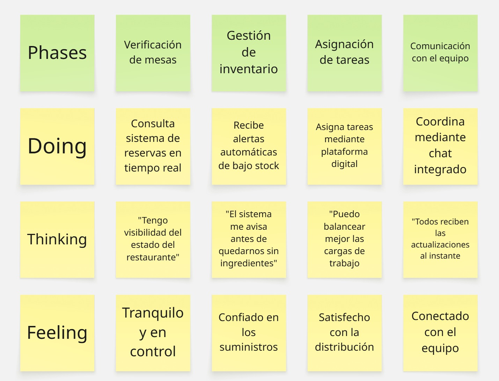
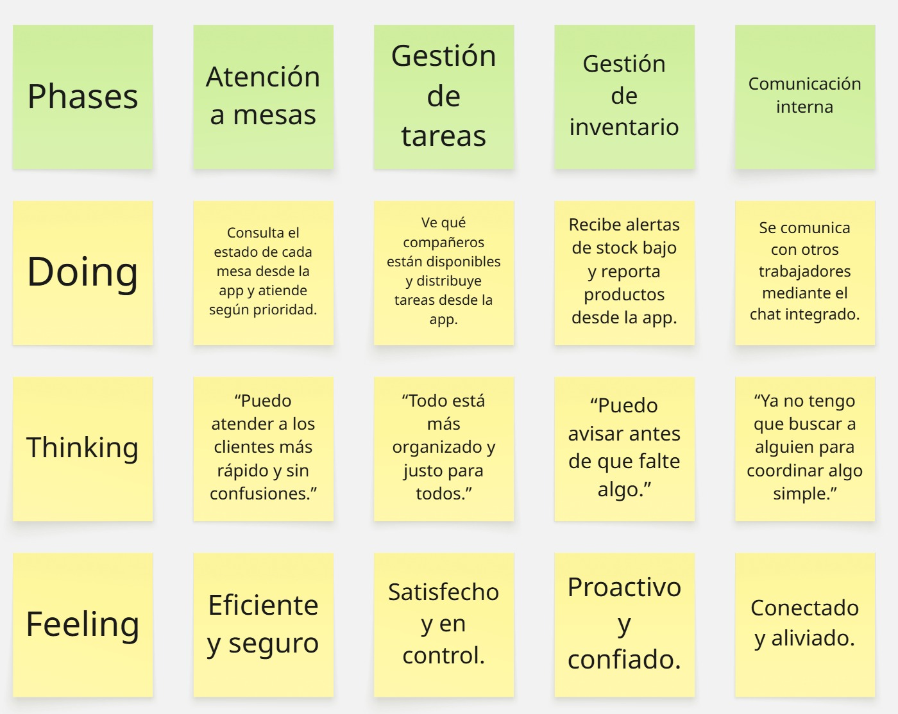
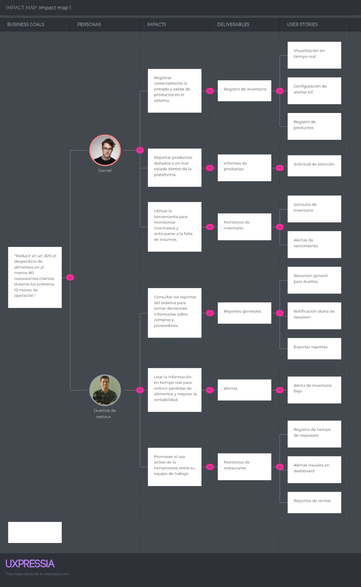

# Capítulo III: Requirements Specification

## 3.1. To-Be Scenario Mapping.
Este mapa To-Be fue elaborado tras un proceso que incluyó preparación, 
lluvia de ideas individual, revisión colaborativa y definición de fases clave para los
trabajadores del restaurante. A partir de los insights obtenidos en el mapa As-Is, 
se diseñó un escenario ideal que mejora la eficiencia operativa, comunicación y control 
de recursos dentro del restaurante.
La herramienta utilizada para la elaboración fue Miro.

A diferencia del escenario As-Is donde predominaban la falta de visibilidad del inventario
y la desorganización en la asignación de tareas, el escenario To-Be plantea un sistema 
más automatizado y conectado. Se observa un cambio en las emociones del trabajador,
pasando de frustración e incertidumbre a tranquilidad, confianza y conexión con su equipo.
A continuación, se presenta el escenario futuro ideal para el User Persona trabajador 
de restaurante y dueño de restaurante.”:

**To-be Scenario Mapping trabajador de restaurante:**  
Esta sección refleja cómo sería la experiencia ideal del personal del restaurante al implementar una solución 
tecnológica enfocada en la gestión interna de operaciones. Desde la verificación de mesas
hasta la comunicación con el equipo, se observa un proceso más organizado, digitalizado y
colaborativo. Los trabajadores pueden consultar reservas en tiempo real, recibir alertas 
sobre inventario, asignar tareas desde una plataforma centralizada y comunicarse eficientemente mediante un chat integrado. 
Esta mejora permite un entorno más fluido, equilibrado y con mayor control, generando satisfacción en la distribución del trabajo 
y confianza en la coordinación del equipo.

**To-be Scenario Mapping dueño de restaurante:**  
Este escenario ideal describe cómo se transforma la experiencia del dueño del restaurante
al implementar soluciones tecnológicas que facilitan la supervisión, control y toma
de decisiones. Gracias a sistemas IoT y plataformas digitales, puede monitorear la 
atención al cliente, verificar inventarios, exportar reportes detallados y asegurar el 
estado óptimo de los productos. Estas herramientas permiten una gestión más precisa, 
ordenada y proactiva, brindando tranquilidad, enfoque y confianza en el rendimiento 
general del negocio.

## 3.2. User Stories.

| **Epic ID** | **Título**                            | **Descripción**                                                                                                                                                          | **Relacionado con (User Story ID)**                                                                                                                                                        |
|-------------|----------------------------------------|--------------------------------------------------------------------------------------------------------------------------------------------------------------------------|--------------------------------------------------------------------------------------------------------------------------------------------------------------------------------------------|
| EP01        | Información sobre el startup y producto | **Como** visitante **Quiero** poder visualizar información del producto y la startup encargada **Para** entender lo que ofrecen y saber quiénes están detrás del proyecto | US01 - Información general del proyecto    US02 - Conocer al equipo detrás del producto    US03 - Historia y visión del proyecto                                                     |
| EP02        | Suscripciones y precios                | **Como** visitante **Quiero** poder suscribirme a membresías en la aplicación **Para** tener acceso a beneficios adicionales                                        | US04 - Información de precios y suscripciones   US05 - Vista desde dispositivos móviles                                                                                                 |
| EP03        | Beneficios y Features del producto     | **Como** visitante **Quiero** contar con una sección de beneficios y features del producto **Para** entender cómo ayudará a mi negocio y ver opiniones             | US06 -	Sección de beneficios del producto  US07 - Características clave del sistema  US08 -Opiniones o testimonios de usuarios                                                       |
| EP04        | Contacto a soporte                     | **Como** visitante **Quiero** poder contactar fácilmente al equipo de soporte de KeepItFresh o encontrar ayuda **Para** resolver preguntas, reportar problemas o recibir asistencia con la plataforma | US09 - Enviar mensajes a través del apartado de contacto  US10 - Copiar información de contacto  US11 - Registro de tiempo de respuesta                                              |
| EP05        | Registro y autenticación               | **Como** usuario **Quiero** poder registrarme e iniciar sesión de forma segura **Para** acceder a la plataforma y mantener mi información protegida                 | US13 - Registro de usuario  US14 - Inicio de sesión                                                                                                                                     |
| EP06        | Gestión de inventario                  | **Como** usuario **Quiero** poder gestionar el inventario de mi restaurante **Para** mantener el control de mis productos y minimizar desperdicios                  | US15 - Registro de Producto  US16 - Consulta de inventario                                                                                                                              |
| EP07        | Sistema de atención al cliente         | **Como** usuario **Quiero** tener acceso a un sistema de atención al cliente **Para** resolver mis dudas o problemas de manera rápida y eficiente                   | US12 - Solicitud de atención                                                                                                                                                            |
| EP08        | Dashboard y visualización de datos     | **Como** usuario **Quiero** acceder a un dashboard con métricas e información relevante **Para** tomar decisiones informadas en mi negocio                         | US24 - Reportes de ventas                                                                                                                                                                  |
| EP09        | Alertas y notificaciones               | **Como** usuario **Quiero** recibir alertas sobre eventos importantes (como productos por vencer) **Para** actuar rápidamente y evitar pérdidas                    | US17 - Alertas de vencimiento                                                                                                                                                           |
| EP10        | Reportes y analítica                   | **Como** usuario **Quiero** obtener reportes sobre el rendimiento y uso de la plataforma **Para** evaluar resultados y optimizar procesos                          | US23 - Notificación diaria de resumen                                                                                                                                                      |
| EP11        | Manejo de órdenes                      | **Como** usuario **Quiero** gestionar las órdenes de compra y abastecimiento **Para** mantener un flujo constante de productos necesarios en mi restaurante         | US18 - Ingresar nuevo pedido para una mesa  US19 - Editar un pedido existente  US20 - Eliminar un pedido  US21 - Visualizar los pedidos por mesa  US22 - Ver estado del pedido |

| EPIC/ USER STORY ID | Título                                            | Descripción                                                                                                                               | Criterio de aceptación                                                                                                                                                                                                                                              | Relacionado a la épica # |
|---------------------|---------------------------------------------------|-------------------------------------------------------------------------------------------------------------------------------------------|---------------------------------------------------------------------------------------------------------------------------------------------------------------------------------------------------------------------------------------------------------------------|--------------------------|
| US01                | Información general del proyecto                  | Como visitante quiero conocer una breve descripción del proyecto KeepItFresh para entender su propósito.                                  | Escenario 1: Dado que el visitante entra a la página, cuando visualiza la sección "Sobre KeepItFresh", entonces encuentra una descripción clara y concisa del propósito del producto.                                                                               | EP1                      |
| US02                | Conocer al equipo detrás del producto             | Como visitante quiero saber quiénes son los fundadores o responsables del proyecto para conocer su experiencia.                           | Escenario 1: Dado que el visitante accede a la sección del equipo, cuando se desplaza por ella, entonces puede visualizar los nombres, cargos y fotografías de los miembros del equipo.                                                                             | EP1                      |
| US03                | Historia y visión del proyecto                    | Como visitante quiero conocer la historia y visión del proyecto para saber cómo planean crecer o ayudar a negocios.                       | Escenario 1: Dado que el visitante navega en la página, cuando accede a la sección “Nuestra Historia” o similar, entonces encuentra una narración breve de cómo surgió KeepItFresh y cuál es su visión a futuro.                                                    | EP1                      |
| US04                | Información de precios y suscripciones            | Como visitante quiero conocer los precios del producto para conocer el presupuesto que debo tener.                                        | Escenario 1: Dado que el visitante visualiza los planes de precios en la página, cuando observa una opción, entonces ve claramente el precio mensual expresado en dólares y las funcionalidades incluidas en cada plan.                                             | EP2                      |
| US05                | Vista desde dispositivos móviles                  | Como usuario que visita la página desde mi celular, quiero que la sección de precios se vea bien en pantalla pequeña.                     | Escenario 1: Dado que el visitante accede a la landing page desde un dispositivo móvil, cuando navega hasta la sección de precios, entonces la interfaz se adapta automáticamente al ancho de la pantalla sin requerir zoom ni scroll horizontal.                   | EP2                      |
| US06                | Sección de beneficios del producto                | Como visitante quiero contar con una sección que me explique los beneficios de usar KeepItFresh para evaluar cómo puede ayudarme.         | Escenario 1: Dado que el visitante accede a la landing page, cuando navega a la sección de beneficios, entonces puede leer una lista con al menos 3 beneficios principales del producto, explicados de manera clara.                                                | EP3                      |
| US07                | Características clave del sistema                 | Como visitante quiero ver un resumen de las principales funcionalidades de KeepItFresh para saber qué ofrece la plataforma.               | Escenario 1: Dado que el visitante navega en la landing page, cuando llega a la sección de “Características” o “Features”, entonces ve una lista destacada con iconos y descripciones breves de las funcionalidades clave.                                          | EP3                      |
| US08                | Opiniones o testimonios de usuarios               | Como visitante quiero ver opiniones de otros usuarios que ya usan KeepItFresh para saber si les ha sido útil en su negocio.               | Escenario 1: Dado que el visitante está en la sección de testimonios, cuando lee los comentarios, entonces puede ver el nombre o rol del usuario y su opinión. Hay al menos 3 testimonios visibles en pantalla o accesibles por carrusel.                           | EP3                      |
| US09                | Enviar mensajes a través del apartado de contacto | Como visitante quiero poder contactar fácilmente al equipo de soporte para resolver mis dudas.                                            | Escenario 1: Dado que el visitante llega a la sección de contacto, cuando visualiza el formulario de contacto, entonces puede ver un campo de mensaje y un botón para enviarlo.                                                                                     | EP4                      |
| US10                | Copiar información de contacto                    | Como visitante quiero poder copiar la información de contacto para poder compartirla rápidamente.                                         | Escenario 1: Dado que el visitante ve los datos de contacto, cuando pasa el cursor por encima, entonces el correo electrónico y número de teléfono tienen un icono que permite copiarlos.                                                                           | EP4                      |
| US11                | Registro de tiempo de respuesta                   | Como administrador quiero medir cuánto tiempo tarda el personal en atender una solicitud para evaluar la eficiencia del servicio.         | Escenario 1: Se registra el tiempo de solicitud y atención. Dado que un cliente solicita atención y el personal le atiende, cuando la solicitud es marcada como atendida en el sistema, entonces el sistema registra la hora de la solicitud y la hora de atención. | EP4                      |
| US12                | Solicitud de atención                             | Como trabajador de restaurante quiero recibir una notificación cuando un cliente requiere de atención para poder atenderlo inmediatamente | Escenario 1: Botón presionado. Dado que un cliente necesita atención, cuando presiona el botón IoT en la mesa, entonces el trabajador recibe una notificación.                                                                                                      | EP7                      |
| US13                | Registro de usuario                               | Como visitante quiero registrarme en la plataforma para tener acceso a más funcionalidades.                                               | Escenario 1: Dado que el visitante decide registrarse, cuando hace clic en el botón de "Registrarse", entonces ve un formulario para ingresar sus datos y un botón para confirmar la creación de cuenta.                                                            | EP5                      |
| US14                | Inicio de sesión                                  | Como usuario registrado quiero iniciar sesión para acceder a mi cuenta.                                                                   | Escenario 1: Dado que el usuario tiene una cuenta, cuando hace clic en el botón de "Iniciar sesión", entonces ve un formulario para ingresar su correo y contraseña.                                                                                                | EP5                      |
| US15                | Registro de Producto                              | Como usuario quiero registrar un nuevo producto para agregarlo a mi inventario.                                                           | Escenario 1: Dado que el usuario está en la sección de inventario, cuando selecciona "Agregar Producto", entonces ve un formulario para ingresar detalles del producto como nombre, categoría, cantidad y precio.                                                   | EP6                      |
| US16                | Consulta de inventario                            | Como usuario quiero consultar el estado de mi inventario para saber qué productos tengo disponibles.                                      | Escenario 1: Dado que el usuario está en la página de inventario, cuando accede a la sección, entonces puede ver una lista con los productos registrados, su cantidad disponible y fecha de vencimiento.                                                            | EP6                      |
| US17                | Alertas de vencimiento                            | Como usuario quiero recibir alertas de vencimiento de productos para gestionar el inventario de manera eficiente.                         | Escenario 1: Dado que un producto se acerca a su fecha de vencimiento, cuando el usuario ingresa a su inventario, entonces recibe una alerta destacada que le informa sobre el vencimiento cercano.                                                                 | EP9                      |
| US18                | Ingresar nuevo pedido para una mesa               | Como mesero quiero ingresar un pedido para una mesa para gestionar las órdenes.                                                           | Escenario 1: Dado que el mesero está en la interfaz, cuando selecciona una mesa y elige los productos, entonces puede ver un resumen de la orden y un botón para finalizar el pedido.                                                                               | EP11                     |
| US19                | Editar un pedido existente                        | Como mesero quiero editar un pedido ya ingresado para corregir posibles errores.                                                          | Escenario 1: Dado que el mesero accede a la orden, cuando selecciona un pedido existente, entonces puede modificar los productos o cantidades y ver el total actualizado.                                                                                           | EP11                     |
| US20                | Eliminar un pedido                                | Como mesero quiero eliminar un pedido incorrecto para evitar confusiones en la mesa.                                                      | Escenario 1: Dado que el mesero accede a la orden, cuando selecciona un pedido y hace clic en "Eliminar", entonces el pedido se borra y se actualiza el total de la mesa.                                                                                           | EP11                     |
| US21                | Visualizar los pedidos por mesa                   | Como gerente quiero ver todos los pedidos realizados por cada mesa para gestionar las órdenes.                                            | Escenario 1: Dado que el gerente accede al sistema, cuando accede a la vista de pedidos, entonces puede ver los pedidos divididos por mesa y el estado de cada uno (en espera, en proceso, finalizado).                                                             | EP11                     |
| US22                | Ver estado del pedido                             | Como usuario quiero saber el estado de mi pedido para estar informado sobre su progreso.                                                  | Escenario 1: Dado que el cliente realiza un pedido, cuando consulta su pedido, entonces ve el estado actualizado (en preparación, listo para servir, servido).                                                                                                      | EP11                     |
| US23                | Notificación diaria de resumen                    | Como dueño de restaurante quiero recibir un resumen diario de ventas para llamar a la distribuidora antes que se acabe el stock           | Escenario 1: Dado que el gerente accede al resumen diario, cuando accede a la vista de alimentos, entonces puede darse cuenta de qué productos se acabarán.                                                                                                         | EP10                     |
| US24                | Reportes de ventas                                | Como dueño de restaurante quiero generar reportes de ventas diarios, semanales y mensuales para saber el rendimiento de mi local.         | Escenario 1: Dado que el gerente genera reportes de ventas diarios, cuando selecciona el reporte, entonces puede registrar sus ganancias rápidamente.                                                                                                               | EP8                      |

Technical User Stories 

| Story ID | Título                                          | Descripción                                                                                                                                                | Criterios de aceptación                                                                                                                                                                                                                                                                                                                                                                                                                | Relacionado con Epic ID |
|----------|-------------------------------------------------|------------------------------------------------------------------------------------------------------------------------------------------------------------|----------------------------------------------------------------------------------------------------------------------------------------------------------------------------------------------------------------------------------------------------------------------------------------------------------------------------------------------------------------------------------------------------------------------------------------|-------------------------|
|   TS01   |         Crear nuevo ingrediente vía POST        |  Como administrador, quiero que el administrador registre nuevos ingredientes en el inventario, para que el sistema mantenga una actualización del stock.  | Escenario 1: Datos válidos Dado que se proporciona nombre, cantidad, unidad y fecha de vencimiento, Cuando el administrador envía una solicitud POST a /api/v1/inventories, Entonces el sistema guarda el ingrediente y responde con estado 201.  Escenario 2: Datos incompletos Dado que falta algún campo obligatorio, Cuando se envía la solicitud, Entonces el sistema responde con estado 400 y un mensaje indicando los errores. | EP1                     |
| TS02     | Obtener reporte de ganancias y pérdidas vía GET | Como desarrollador, quiero permitir que el administrador obtenga reportes financieros entre fechas, para que pueda evaluar el rendimiento del restaurante. |                                  Escenario 1: Fechas válidas Dado que se especifica un rango de fechas, Cuando se consulta /api/v1/reports/finances, Entonces el sistema responde con ingresos, egresos y utilidad neta.  Escenario 2: Fechas inválidas Dado que el formato de fecha no es correcto, Cuando se envía la solicitud, Entonces el sistema responde con estado 400 y un mensaje de error.                                  | EP2                     |
| TS03     | Obtener reporte de ganancias y pérdidas vía GET | Como desarrollador, quiero permitir que el administrador obtenga reportes financieros entre fechas, para que pueda evaluar el rendimiento del restaurante. |                                  Escenario 1: Fechas válidas Dado que se especifica un rango de fechas, Cuando se consulta /api/v1/reports/finances, Entonces el sistema responde con ingresos, egresos y utilidad neta.  Escenario 2: Fechas inválidas Dado que el formato de fecha no es correcto, Cuando se envía la solicitud, Entonces el sistema responde con estado 400 y un mensaje de error.                                  | EP3                     |
| TS04     |    Actualizar cantidad de ingrediente vía PUT   |   Como desarrollador, quiero permitir que el administrador actualice la cantidad de un ingrediente, para reflejar correctamente el estado del inventario.  |                           Escenario 1: Ingrediente existente Dado que el ingrediente existe, Cuando se envía una solicitud PUT con la nueva cantidad, Entonces el sistema actualiza y responde con estado 200.  Escenario 2: Ingrediente no encontrado Dado que el ingrediente no existe, Cuando se intenta actualizar, Entonces el sistema responde con estado 404 y el mensaje "Ingrediente no encontrado"                           | EP4                     |
| TS05     |        Eliminar plato del menú vía DELETE       |            Como desarrollador, quiero permitir que el administrador elimine un plato del menú, para que ya no esté disponible en la aplicación.            |                                                          Escenario 1: Plato existe Dado que el plato está registrado, Cuando se envía DELETE a /api/v1/plates/{name}, Entonces el sistema elimina el plato y responde con estado 200.  Escenario 2: Plato no encontrado Dado que el plato no existe, Cuando se intenta eliminar, Entonces el sistema responde con estado 404.                                                          | EP5                     |
| TS06     |          Registrar nuevo plato vía POST         |                   Como desarrollador, quiero permitir que el administrador registre nuevos platos, para ampliar el menú del restaurante.                   |                               Escenario 1: Datos válidos Dado que se proporciona nombre, descripción, precio y disponibilidad, Cuando se envía POST a /api/v1/plates, Entonces el sistema guarda el nuevo plato y responde con estado 201.  Escenario 2: Faltan datos obligatorios Dado que faltan campos como nombre o precio, Cuando se intenta registrar, Entonces el sistema responde con estado 400.                              | EP6                     |
| TS07     |    TS12: Ver resumen de ventas diario vía GET   |           Como desarrollador, quiero permitir que el administrador vea el resumen diario de ventas, para ayudarle a tomar decisiones informadas.           |                             Escenario 1: Día con ventas Dado que hay órdenes registradas, Cuando se consulta /api/v1/sales/summary, Entonces el sistema muestra total de ventas, ingresos y platos más vendidos.  Escenario 2: Día sin ventas Dado que no se ha vendido nada, Cuando se hace la consulta, Entonces el sistema responde con ingresos en cero y mensaje "Sin ventas registradas en la fecha".                            | EP7                     |
| TS08     |        Obtener platos disponibles vía GET       |          Como desarrollador, quiero permitir que el mesero obtenga la lista de platos disponibles, para que sepa qué puede ofrecer a los clientes.         |                                                 Escenario 1: Platos disponibles Dado que hay platos registrados, Cuando el mesero envía GET a /api/v1/plates/availables, Entonces recibe la lista con nombre, categoría y disponibilidad.  Escenario 2: Sin platos disponibles Dado que no hay platos activos, Cuando el mesero consulta, Entonces recibe una lista vacía y un mensaje.                                                | EP8                     |
| TS09     |         Asignar orden a una mesa vía POST       |                   Como desarrollador, quiero permitir que el mesero asigne órdenes a mesas, para que la cocina las atienda correctamente.                  |                                                                 Escenario 1: Mesa libre Dado que la mesa está disponible, Cuando se registra una orden, Entonces se crea correctamente con estado 201.  Escenario 2: Mesa ocupada Dado que la mesa ya tiene orden activa, Cuando se intenta registrar otra, Entonces se responde con estado 409 y mensaje de conflicto.                                                                | EP9                     |
| TS10     | Ver historial de órdenes de una mesa vía GET    | Como desarrollador, quiero permitir que el mesero vea el historial de órdenes por mesa, para facilitar el seguimiento del servicio.                        | Escenario 1: Historial existente Dado que la mesa tiene órdenes previas, Cuando se consulta /api/v1/orders/table/{id}, Entonces el sistema responde con la lista de pedidos.  Escenario 2: Sin historial Dado que no hay órdenes registradas, Cuando se consulta, Entonces se recibe una lista vacía.                                                                                                                                  | EP10                    |
| TS11     | Registrar comentario de cliente vía POST        | Como desarrollador, quiero permitir que el mesero registre comentarios de clientes, para recopilar retroalimentación sobre el servicio.                    | Escenario 1: Comentario válido Dado que se proporciona el texto del comentario, Cuando se envía POST a /api/comentarios, Entonces el sistema lo guarda y responde con 201.  Escenario 2: Comentario vacío Dado que el comentario está vacío, Cuando se intenta registrar, Entonces se responde con estado 400 y mensaje de validación.                                                                                                 | EP11                    |

## 3.3. Impact Mapping.

## 3.4. Product Backlog.

| # Orden | User Story ID |                Título                |                                               Descripción                                               | Story Points |
|:-------:|:-------------:|:------------------------------------:|:-------------------------------------------------------------------------------------------------------:|:------------:|
| 1       | US08          | Panel de visualización de inventario | Como usuario deseo un dashboard para visualizar las cantidades de productos y vencimientos.             | 8            |
| 2       | US13          | Panel resumen general                | Como usuario deseo un dashboard general para ver el estado de mi inventario.                            | 8            |
| 3       | US16          | Chat en tiempo real con soporte      | Como usuario deseo un chat para comunicarme con soporte en tiempo real.                                 | 8            |
| 4       | US12          | Recibir alertas de vencimiento       | Como usuario deseo recibir notificaciones cuando un producto esté por vencer.                           | 5            |
| 5       | US15          | Sistema de tickets de atención       | Como usuario deseo generar tickets para registrar mis solicitudes a soporte.                            | 5            |
| 6       | US17          | Crear orden de reposición            | Como usuario deseo crear una orden cuando un producto se esté acabando.                                 | 5            |
| 7       | US19          | Exportar reportes de productos       | Como usuario deseo exportar un reporte con mis productos actuales.                                      | 5            |
| 8       | US20          | Visualización de métricas            | Como usuario deseo ver métricas de uso y consumo de productos.                                          | 5            |
| 9       | US21          | Configurar alertas personalizadas    | Como usuario deseo configurar mis propias alertas según criterios.                                      | 5            |
| 10      | US23          | Reporte detallado por categoría      | Como usuario deseo ver reportes por categoría de productos para analizar tendencias.                    | 5            |
| 11      | US24          | Exportar reporte completo en PDF     | Como usuario deseo exportar toda la información de inventario y órdenes en un solo PDF.                 | 5            |
| 12      | US03          | Suscripciones y precios              | Como visitante deseo poder suscribirme a membresías en la aplicación para obtener beneficios.           | 3            |
| 13      | US05          | Registro de cuenta                   | Como usuario deseo poder registrarme en la plataforma para tener acceso a funcionalidades.              | 3            |
| 14      | US06          | Inicio de sesión                     | Como usuario deseo iniciar sesión para acceder a mi cuenta y gestionar mi información.                  | 3            |
| 15      | US09          | Añadir productos al inventario       | Como usuario deseo añadir productos a mi inventario para llevar control.                                | 3            |
| 16      | US10          | Editar productos del inventario      | Como usuario deseo editar productos existentes para actualizar información.                             | 3            |
| 17      | US18          | Ver historial de órdenes             | Como usuario deseo ver mis órdenes pasadas para tener un registro.                                      | 3            |
| 18      | US22          | Comparar consumo entre meses         | Como usuario deseo comparar el consumo de productos entre meses diferentes.                             | 3            |
| 19      | US01          | Información del producto y startup   | Como visitante deseo poder visualizar información del producto y startup para entender lo que ofrecen.  | 2            |
| 20      | US02          | Beneficios y features del producto   | Como visitante deseo ver los beneficios y opiniones del producto para entender cómo ayuda a mi negocio. | 2            |
| 21      | US04          | Contacto a soporte desde Landing     | Como visitante deseo contactar fácilmente al equipo para resolver dudas o reportar problemas.           | 2            |
| 22      | US07          | Recuperar contraseña                 | Como usuario deseo recuperar mi contraseña en caso de olvidarla.                                        | 2            |
| 23      | US11          | Eliminar productos del inventario    | Como usuario deseo eliminar productos que ya no necesito.                                               | 2            |
| 24      | US14          | Contactar soporte desde la app       | Como usuario deseo contactar al soporte desde dentro de la aplicación.                                  | 2            |
