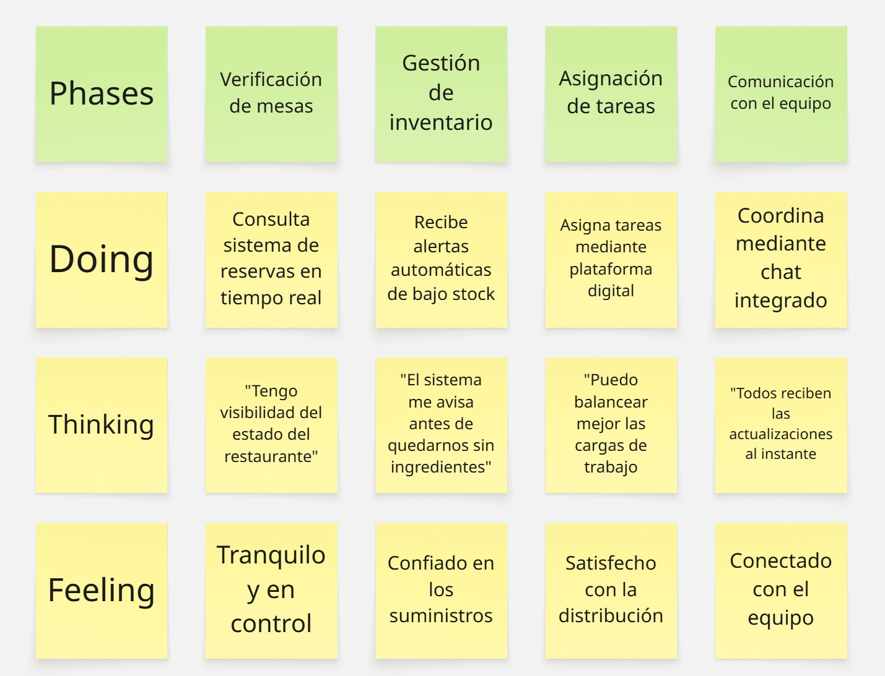
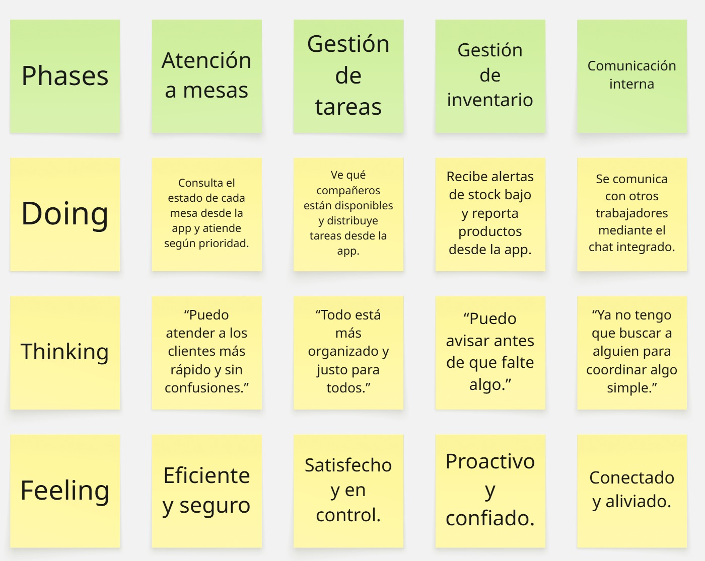
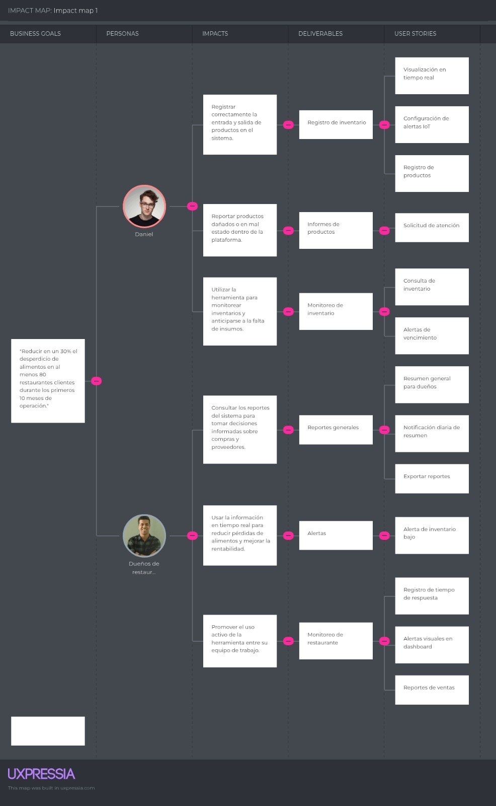

# Capítulo III: Requirements Specification

## 3.1. To-Be Scenario Mapping.
Este mapa To-Be fue elaborado tras un proceso que incluyó preparación, 
lluvia de ideas individual, revisión colaborativa y definición de fases clave para los
trabajadores del restaurante. A partir de los insights obtenidos en el mapa As-Is, 
se diseñó un escenario ideal que mejora la eficiencia operativa, comunicación y control 
de recursos dentro del restaurante.
La herramienta utilizada para la elaboración fue Miro.

A diferencia del escenario As-Is donde predominaban la falta de visibilidad del inventario
y la desorganización en la asignación de tareas, el escenario To-Be plantea un sistema 
más automatizado y conectado. Se observa un cambio en las emociones del trabajador,
pasando de frustración e incertidumbre a tranquilidad, confianza y conexión con su equipo.
A continuación, se presenta el escenario futuro ideal para el User Persona trabajador 
de restaurante y dueño de restaurante.”:

**To-be Scenario Mapping trabajador de restaurante:**  
Esta sección refleja cómo sería la experiencia ideal del personal del restaurante al implementar una solución 
tecnológica enfocada en la gestión interna de operaciones. Desde la verificación de mesas
hasta la comunicación con el equipo, se observa un proceso más organizado, digitalizado y
colaborativo. Los trabajadores pueden consultar reservas en tiempo real, recibir alertas 
sobre inventario, asignar tareas desde una plataforma centralizada y comunicarse eficientemente mediante un chat integrado. 
Esta mejora permite un entorno más fluido, equilibrado y con mayor control, generando satisfacción en la distribución del trabajo 
y confianza en la coordinación del equipo.

**To-be Scenario Mapping dueño de restaurante:**  
Este escenario ideal describe cómo se transforma la experiencia del dueño del restaurante
al implementar soluciones tecnológicas que facilitan la supervisión, control y toma
de decisiones. Gracias a sistemas IoT y plataformas digitales, puede monitorear la 
atención al cliente, verificar inventarios, exportar reportes detallados y asegurar el 
estado óptimo de los productos. Estas herramientas permiten una gestión más precisa, 
ordenada y proactiva, brindando tranquilidad, enfoque y confianza en el rendimiento 
general del negocio.

## 3.2. User Stories.

| EPIC/ USER STORY ID | Título                                      | Descripción                                                                                                                                                                                   | Criterio de aceptación                                                                                                                                                                                                                                                                                                                                                                                                                                                                                                                                                                                                                           | Relacionado a la épica # |
|---------------------|---------------------------------------------|-----------------------------------------------------------------------------------------------------------------------------------------------------------------------------------------------|----------------------------------------------------------------------------------------------------------------------------------------------------------------------------------------------------------------------------------------------------------------------------------------------------------------------------------------------------------------------------------------------------------------------------------------------------------------------------------------------------------------------------------------------------------------------------------------------------------------------------------------------------|--------------------------|
| E01                 | Registro y Autenticación                    | Como usuario de KeepItFresh (dueño de restaurante o trabajador), quiero poder registrarme e iniciar sesión en la plataforma para acceder a las funcionalidades específicas asignadas a mi rol. |                                                                                                                                                                                                                                                                                                                                                                                                                                                                                                                                                                                                                                                    |                          |
| E02                 | Monitoreo de Sensores IoT                   | Como dueño de restaurante, quiero poder monitorear en tiempo real las lecturas de los sensores IoT instalados para controlar temperatura, gases y otros factores críticos.                   |                                                                                                                                                                                                                                                                                                                                                                                                                                                                                                                                                                                                                                                    |                          |
| E03                 | Gestión de Inventario                      | Como dueño de restaurante, quiero poder gestionar el inventario de mis productos alimenticios para optimizar su uso y evitar pérdidas.                                                      |                                                                                                                                                                                                                                                                                                                                                                                                                                                                                                                                                                                                                                                    |                          |
| E04                 | Sistema de Atención al Cliente             | Como dueño o trabajador de restaurante, quiero administrar eficientemente la atención al cliente mediante el sistema de botones IoT.                                                         |                                                                                                                                                                                                                                                                                                                                                                                                                                                                                                                                                                                                                                                    |                          |
| E05                 | Dashboard y Visualización de Datos         | Como dueño de restaurante, quiero tener un apartado en la aplicación que me permita tener una vista general de todos los datos para así visualizar los datos que quiero más facil y rápido.   |                                                                                                                                                                                                                                                                                                                                                                                                                                                                                                                                                                                                                                                    |                          |
| E06                 | Sistema de Alertas y Notificaciones        | Como dueño de restaurante, quiero recibir notificaciones y alertas de la aplicación que me muestre cuando suceda algo.                                                         |                                                                                                                                                                                                                                                                                                                                                                                                                                                                                                                                                                                                                                                    |                          |
| E07                 | Configuración y Onboarding                 | Como dueño de restaurante, quiero modificar la configuración de la aplicación a mi gusto para así tenerlo personalizado a mi preferencia                                     |                                                                                                                                                                                                                                                                                                                                                                                                                                                                                                                                                                                                                                                    |                          |
| E08                 | Reportes y Analítica                        | Como dueño de restaurante, quiero reportes y analíticas que me muestren información y estadisticas importantes que la aplicación haya calculado para poder tenerlos guardados y tener la información poder tomar decisiones informadas sobre ventas, desempeño del personal, productos más vendidos y horarios con mayor actividad.                                                         |                                                                                                                                                                                                                                                                                                                                                                                                                                                                                                                                                                                                                                                    |                          |
| E09                 | Suscripciones                    | Como usuario de KeepItFresh, quiero poder suscribirme a los servicios completos de la aplicaciones para acceder a las funcionalidades premium de la pagina | 
| US01                | Registro de usuario                         | **Como** dueño o trabajador de restaurante  **Quiero** poder crear una cuenta en la plataforma  **Para** acceder a sus funcionalidades según mi rol.                                                                   | Escenario 1: Registro exitoso. Dado que el usuario proporciona datos válidos, cuando envía el formulario de registro, entonces el sistema confirma el registro y permite iniciar sesión. Escenario 2: Registro fallido por correo ya existente. Dado que el usuario usa un correo registrado, cuando intenta enviar el formulario, entonces se muestra un mensaje de error. | E01                      |
| US02                | Inicio de sesión                            | **Como** dueño o trabajador de restaurante  **Quiero** poder iniciar sesión con mis credenciales  **Para** acceder a las funciones específicas asignadas a mi rol.                                             | Escenario 1: Inicio exitoso. Dado que el usuario está registrado, cuando envía las credenciales correctas, entonces accede al sistema. Escenario 2: Error por credenciales inválidas. Dado que las credenciales son incorrectas, entonces el sistema muestra un mensaje de error.                                                                                                                              | E01                      |
| US03                | Visualización en tiempo real                | **Como** dueño de restaurante  **Quiero** ver los datos actuales de sensores IoT  **Para** monitorear condiciones del inventario.                                                                         | Escenario 1: Muestra lecturas en tiempo real de temperatura, humedad y gases. Escenario 2: Sensor desconectado muestra advertencia.                                                                                                                                                                                                                      | E02                      |
| US04                | Configuración de alertas IoT               | **Como** dueño de restaurante  **Quiero** configurar alertas cuando los valores de los sensores estén fuera del rango ideal  **Para** poder reaccionar a tiempo ante condiciones críticas.                                                                        | Escenario 1: Usuario define umbrales máximos/mínimos. Escenario 2: Sistema genera notificación en app cuando se supera un umbral.                                                                                                                                                                                                                      | E02                      |
| US05                | Registro de productos                      | **Como** dueño de restaurante  **Quiero** registrar nuevos productos con su fecha de vencimiento y condiciones de almacenamiento  **Para** llevar un mejor control del inventario.                                                                   | Escenario 1: Producto agregado con fecha de expiración válida. Escenario 2: Fecha inválida muestra mensaje de error.                                                                                                                                                                                                                      | E03                      |
| US06                | Consulta de inventario                     | **Como** dueño de restaurante  **Quiero** consultar el inventario actualizado  **Para** tomar decisiones sobre compras y uso.                                                                            | Escenario 1: Muestra lista de productos, fechas de vencimiento, cantidad. Escenario 2: Permite búsqueda por nombre/categoría.                                                                                                                                                                                                                      | E03                      |
| US07                | Alertas de vencimiento                     | **Como** dueño de restaurante  **Quiero** recibir notificaciones cuando un producto está por vencer  **Para** evitar pérdidas económicas.                                                                                                | Escenario 1: Sistema genera alerta X días antes del vencimiento. Escenario 2: Producto vencido aparece resaltado.                                                                                                                                                                                                                      | E03                      |
| US08                | Solicitud de atención                      | **Como** comensal  **Quiero** presionar un botón para solicitar atención  **Para** que el personal reciba una notificación inmediata.                                                                                 | Escenario 1: Botón presionado activa notificación. Escenario 2: Personal recibe alerta en dashboard o app móvil.                                                                                                                                                                                                                      | E04                      |
| US09                | Registro de tiempo de respuesta            | **Como** administrador  **Quiero** medir cuánto tiempo tarda el personal en atender una solicitud  **Para** evaluar la eficiencia del servicio.                                                                          | Escenario 1: Se registra timestamp de solicitud y atención. Escenario 2: Se genera reporte de eficiencia.                                                                                                                                                                                                                      | E04                      |
| US10                | Resumen general para dueños            | **Como** dueño de restaurante  **Quiero** ver un resumen general de las ventas, pedidos y desempeño del local en el dashboard  **Para** conocer el rendimiento de mi restaurante.                                                                          | Escenario 1: El dueño inicia su sesión, Accede al dashboard y ve un resumen con ventas, pedidos y desempeño general. Escenario 2: La aplicación muestra en rojo si hubo ventas, pedidos o desempeño por debajo del promedio.                                                                                                                                                                                                                      | E05                      |
| US11                | Alertas visuales en dashboard            | **Como** dueño de restaurante  **Quiero** que el dashboard me muestre alertas si hay demoras  **Para** saber en qué momento del día hay más movimiento.                                                                          | Escenario 1: El sistema detecta un retraso en la atención y genera una nota que muestra la hora en la que ocurrió. Escenario 2: La aplicación coloca la nota como una notificación en el dashboard.                                                                                                                                                                                                                      | E05                      |
| US12                | Alerta de inventario bajo            | **Como** dueño de restaurante  **Quiero** alertas cuando el inventario esté bajo  **Para** llamar a la distribuidora antes que se acabe el stock.                                                                          | Escenario 1: El sistema detecta un producto por debajo del stock mínimo y le envía una alerta al encargado. Escenario 2: El sistema coloca la alerta en notificaciones de la aplicación.                                                                                                                                                                                                                     | E06                      |
| US13                | Notificación diaria de resumen            | **Como** dueño de restaurante  **Quiero** recibir un resumen diario de ventas  **Para** llamar a la distribuidora antes que se acabe el stock.                                                                          | Escenario 1: Cuando termina el día, el sistema genera un resumen que muestra las ganancias y ventas y lo envía al dueño vía notificación.                                                                                                                                                                                                                     | E06                      |
| US14                | Historial de alertas            | **Como** dueño de restaurante  **Quiero** ver un historial de alertas pasadas  **Para** saber lo ocurrido en ciertos días.                                                                          | Escenario 1: El dueño accede a alertas y selecciona el historial de alertas y la aplicación muestra una lista de alertas pasadas. Escenario 2: Las alertas más peligrosas son resaltadas por la aplicación para dar a entender que son más importantes.                                                                                                                                                                                                                     | E06                      |
| US15                | Exportar reportes            | **Como** dueño de restaurante  **Quiero** exportar reportes en PDF o Excel  **Para** poder tener mis reportes en mi formato favorito.                                                                          | Escenario 1: La aplicación termina de generar el reporte y le da la opción al usuario de exportarlo en PDF o Excel. Escenario 2: El usuario decide no guardar el reporte y entonces se queda en una papelera de la aplicación hasta que pasen 30 días o lo borre.                                                                                                                                                                                                                   | E07  |
| US16                | Reportes de ventas            | **Como** dueño de restaurante  **Quiero** generar reportes de ventas diarios, semanales y mensuales  **Para** saber el rendimiento de mi local.                                                                          | Escenario 1:  El dueño entra a reportes de la aplicación, elige el rango de fechas y el sistema le muestra el reporte correspondiente.                                                                                                                                                                                                                     | E08                      |
| US17                | Conocer los planes de suscripción disponibles            | **Como** usuario de restaurante  **Quiero**conocer las opciones de suscripción que existen  **Para** decidir cuál se adapta mejor a mi negocio.                                                                          | Escenario 1: Acceso a información de planes Dado que tengo interés en suscribirme, cuando consulto las opciones, entonces debo poder conocer el nombre, precio y beneficios incluidos en cada plan.                                                                                                                                                                                                                    | E09                     |
| US18                | Elegir un plan de suscripción            | **Como** usuario de restaurante  **Quiero**  elegir un plan de suscripción  **Para** acceder a funciones adicionales de la plataforma.                                                                          | Escenario 1: Elección de plan con datos válidos Dado que elijo un plan e ingreso mi correo electrónico, cuando se inicia el proceso, entonces debo ser dirigido para completar la suscripción. Escenario 2: Cancelación por falta de información Dado que no proporciono mi correo electrónico, cuando intento suscribirme, entonces el proceso no debe continuar.                             | E09|
| US19 | Ser notificado si ocurre un problema durante la suscripción | **Como** usuario de restaurante  **Quiero** recibir una notificación clara si ocurre un error durante la suscripción  **Para** saber que debo intentar nuevamente o contactar soporte. | Escenario 1: Notificación de error  **Dado** que se presenta un problema en el proceso, **cuando** intento suscribirme, **entonces** debo recibir un mensaje indicando que no se pudo completar la acción. | E09 |
| TS01 | Endpoint de Registro     | **Como** desarrollador  **Quiero** crear el endpoint POST  **Para** permitir a nuevos usuarios registrarse en la plataforma.                                                       | Escenario 1: Registro exitoso devuelve status 201.  Escenario 2: Registro con email duplicado devuelve status 400 con mensaje de error.                                        | E01 |
| TS02                | Endpoint de Autenticación                   | **Como** desarrollador  **Quiero** crear el endpoint POST   **Para** autenticar a los usuarios y devolver un token de acceso.                                                                   | Escenario 1: Autenticación válida devuelve status 200 y token. Escenario 2: Credenciales inválidas devuelve status 401 con mensaje de error.                                                                                                                                                                                                                      | E01                      |
| TS03                | Lectura en tiempo real                      | **Como** desarrollador  **Quiero** implementar WebSocket o polling   **Para** mostrar lecturas en tiempo real en la interfaz.                                                                 | Escenario 1: Conexión activa transmite lecturas cada X segundos. Escenario 2: Error de red lanza mensaje de reconexión.                                                                                                                                                                                                                      | E02                      |
| TS04                | Configuración de alertas                   | **Como** desarrollador  **Quiero** crear el endpoint POST   **Para** permitir a los usuarios configurar alertas personalizadas.                                                                    | Escenario 1: Umbrales válidos se guardan correctamente (status 201). Escenario 2: Faltan campos y retorna error 400.                                                                                                                                                                                                                      | E02                      |
| TS05                | CRUD de inventario                         | **Como** desarrollador  **Quiero** implementar endpoints CRUD   **Para** permitir la gestión completa del inventario.                                                                     | Escenario 1: Endpoints permiten crear, leer, actualizar y eliminar productos. Escenario 2: Validaciones en campos obligatorios y duplicados.                                                                                                                                                                                                                      | E03                      |
| TS06                | Notificaciones de vencimiento              | **Como** desarrollador  **Quiero** crear una tarea programada que revise fechas de caducidad  **Para** generar alertas de productos próximos a vencer.                                                                                    | Escenario 1: La tarea se ejecuta diariamente y detecta productos próximos a caducar. Escenario 2: El sistema notifica vía email o app según configuración.                                                                                                                                                                                                                      | E03                      |
| TS07                | Integración con botón IoT                  | **Como** desarrollador  **Quiero** recibir eventos de los botones IoT en el backend  **Para** notificar al personal de atención.                                                                             | Escenario 1: POST enviado al endpoint con ID de mesa. Escenario 2: Solicitud almacenada y notificación enviada al staff.                                                                                                                                                                                                                      | E04                      |
| TS08                | Dashboard de atención                      | **Como** desarrollador  **Quiero** mostrar las solicitudes de atención pendientes en un panel web  **Para** que el personal pueda gestionarlas en tiempo real.                                                                                        | Escenario 1: Panel muestra lista cronológica de solicitudes activas. Escenario 2: Permite marcar solicitudes como atendidas.                                                                                                                                                                                                                      | E04                      |
| TS09                | API para Dashboard                      | **Como** desarrollador  **Quiero** crear un endpoint que consolide datos de ventas, pedidos y desempeño  **Para** alimentar el dashboard del dueño.                                                                                        | Escenario 1: La API devuelve métricas en JSON (status 200). Escenario 2: Filtros por fecha retornan datos específicos (status 200).	                                                                                                                                                                                                                      | E05                      |
| TS10                | 	Servicio de Alertas en Tiempo Real                      | **Como** desarrollador  **Quiero** implementar WebSockets  **Para** mostrar alertas visuales de demoras sin recargar la página.                                                                                        | Escenario 1: Las alertas se actualizan automáticamente en el frontend. Escenario 2: Fallos de conexión activan reintentos.	                                                                                                                                                                                                                      | E05                      |
| TS11                | 	Integración con Inventario                      | **Como** desarrollador  **Quiero** conectar el sistema de inventario al dashboard **Para** monitorear stock bajo.                                                                                        | Escenario 1: Stock < 10% del mínimo envía alerta (status 201). Escenario 2: Campos inválidos retornan error 400.	                                                                                                                                                                                                                      | E06                    |
| TS12                | 	Tarea Programada para Resúmenes Diarios                      | **Como** desarrollador  **Quiero** implementar una tarea programada que genere resúmenes diarios  **Para** enviarlos por notificación.                                                                                        | Escenario 1: La tarea se ejecuta automáticamente a las 23:59. Escenario 2: Datos nulos cancelan el envío (log de error).	                                                                                                                                                                                | E06                      |
| TS13                | 	Base de Datos de Historial de Alertas                      | **Como** desarrollador  **Quiero** diseñar una tabla para alertas pasadas **Para** permitir su consulta filtrada.                                                                                        |Escenario 1: Alertas se almacenan con tipo, fecha y gravedad. Escenario 2: Consulta por fecha devuelve resultados paginados.	                                                                                                                               | E06                      |
| TS14                | 	Módulo de Generación de Reportes                      | **Como** desarrollador  **Quiero** crear endpoints para reportes de ventas **Para** soportar rangos diarios/semanales/mensuales.                                                                                       |Escenario 1: GET /reports con parámetros de fecha devuelve PDF/JSON.  Escenario 2: Fechas inválidas retornan error 400.	                                                                                                                               | E07                      |
| TS15                | 	Exportación de Reportes                      | **Como** desarrollador  **Quiero**  integrar librerías de PDF/Excel **Para** permitir descargar reportes.                                                                                       |Escenario 1: El usuario elige formato y recibe el archivo (status 200). Escenario 2: Fallo en generación retorna error 500 con detalles.	                                                                                                                               | E08                      |
| TS16                | 	Obtener todas las suscripciones registradas                      | **Como** desarrollador  **Quiero**  obtener todas las suscripciones de usuarios a través del endpoint RESTful /api/subscriptions **Para** mostrarlas en el panel administrativo del sistema.                                                                                      |Escenario 1: Obtener lista completa de suscripciones Dado que el endpoint /api/subscriptions está disponible, cuando se realiza una solicitud GET a dicho endpoint, entonces la respuesta debe tener estado 200 y el cuerpo debe incluir una lista de suscripciones con los siguientes campos: id email nombre del usuario estado actual de la suscripción Escenario 2: Respuesta vacía si no hay suscripciones Dado que no existen suscripciones en la base de datos, cuando se realiza una solicitud GET a /api/subscriptions, entonces la respuesta debe tener estado 200 y el cuerpo debe ser un arreglo vacío.	                                                                                                                               | E09                      |
| TS17                | 	Crear sesión de pago con Stripe                    | **Como** desarrollador  **Quiero**  crear una sesión de pago a través del endpoint RESTful /api/subscriptions **Para** permitir que los usuarios se suscriban mediante Stripe. |Escenario 1: Sesión creada correctamente Dado que el endpoint /api/subscriptions está disponible, cuando se envía una solicitud POST con un email válido y plan seleccionado, entonces la respuesta debe tener estado 200 y el cuerpo debe incluir un sessionId de Stripe válido. Escenario 2: Faltan datos requeridos Dado que se omite el campo email o plan, cuando se realiza una solicitud POST a /api/subscriptions, entonces la respuesta debe tener estado 400 y debe incluir un mensaje indicando los campos faltantes. Escenario 3: Error al comunicarse con Stripe Dado que ocurre un error con la API de Stripe, cuando se realiza una solicitud POST a /api/subscriptions, entonces la respuesta debe tener estado 500 y debe incluir un mensaje indicando que no se pudo generar la sesión.	                                                                                                                               | E09                     |
| TS18            | 	Procesar eventos de Stripe con Webhook                    | **Como** desarrollador  **Quiero**  recibir y procesar eventos de Stripe mediante el endpoint RESTful /api/webhooks/stripe  **Para**  actualizar el estado de las suscripciones de forma automática.  |Escenario 1: Procesar evento de suscripción completada Dado que Stripe envía un evento checkout.session.completed, cuando se recibe la solicitud en /api/webhooks/stripe, entonces el backend debe guardar o actualizar la suscripción asociada al usuario. Escenario 2: Firma inválida del webhook Dado que la firma del evento es inválida, cuando se intenta procesar la solicitud, entonces la respuesta debe tener estado 400 y el evento debe ser descartado. Escenario 3: Tipo de evento no soportado Dado que se recibe un tipo de evento que el sistema no maneja, cuando se procesa el webhook, entonces el evento debe ser ignorado sin afectar la respuesta.	                                                                                                                               | E09                     |
| TS19               | 	Eliminar todas las suscripciones (modo desarrollo)                   | **Como** desarrollador  **Quiero**  eliminar todas las suscripciones de prueba a través del endpoint RESTful /api/webhooks/stripe/delete-all **Para**   facilitar pruebas limpias durante el desarrollo.                                                                                       |Escenario 1: Eliminación exitosa de suscripciones Dado que el endpoint /api/webhooks/stripe/delete-all está disponible, cuando se realiza una solicitud DELETE, entonces todas las suscripciones de prueba deben eliminarse y la respuesta debe tener estado 200 con mensaje de éxito. Escenario 2: Error interno durante eliminación Dado que ocurre un error al intentar borrar las suscripciones, cuando se realiza la solicitud DELETE, entonces la respuesta debe tener estado 500 y un cuerpo con mensaje "No se pudieron eliminar las suscripciones".	                                                                                                                               | E09                     |

## 3.3. Impact Mapping.

## 3.4. Product Backlog.

| # Orden | User Story ID |                Título                |                                               Descripción                                               | Story Points |
|:-------:|:-------------:|:------------------------------------:|:-------------------------------------------------------------------------------------------------------:|:------------:|
| 1       | US08          | Panel de visualización de inventario | Como usuario deseo un dashboard para visualizar las cantidades de productos y vencimientos.             | 8            |
| 2       | US13          | Panel resumen general                | Como usuario deseo un dashboard general para ver el estado de mi inventario.                            | 8            |
| 3       | US16          | Chat en tiempo real con soporte      | Como usuario deseo un chat para comunicarme con soporte en tiempo real.                                 | 8            |
| 4       | US12          | Recibir alertas de vencimiento       | Como usuario deseo recibir notificaciones cuando un producto esté por vencer.                           | 5            |
| 5       | US15          | Sistema de tickets de atención       | Como usuario deseo generar tickets para registrar mis solicitudes a soporte.                            | 5            |
| 6       | US17          | Crear orden de reposición            | Como usuario deseo crear una orden cuando un producto se esté acabando.                                 | 5            |
| 7       | US19          | Exportar reportes de productos       | Como usuario deseo exportar un reporte con mis productos actuales.                                      | 5            |
| 8       | US20          | Visualización de métricas            | Como usuario deseo ver métricas de uso y consumo de productos.                                          | 5            |
| 9       | US21          | Configurar alertas personalizadas    | Como usuario deseo configurar mis propias alertas según criterios.                                      | 5            |
| 10      | US23          | Reporte detallado por categoría      | Como usuario deseo ver reportes por categoría de productos para analizar tendencias.                    | 5            |
| 11      | US24          | Exportar reporte completo en PDF     | Como usuario deseo exportar toda la información de inventario y órdenes en un solo PDF.                 | 5            |
| 12      | US03          | Suscripciones y precios              | Como visitante deseo poder suscribirme a membresías en la aplicación para obtener beneficios.           | 3            |
| 13      | US05          | Registro de cuenta                   | Como usuario deseo poder registrarme en la plataforma para tener acceso a funcionalidades.              | 3            |
| 14      | US06          | Inicio de sesión                     | Como usuario deseo iniciar sesión para acceder a mi cuenta y gestionar mi información.                  | 3            |
| 15      | US09          | Añadir productos al inventario       | Como usuario deseo añadir productos a mi inventario para llevar control.                                | 3            |
| 16      | US10          | Editar productos del inventario      | Como usuario deseo editar productos existentes para actualizar información.                             | 3            |
| 17      | US18          | Ver historial de órdenes             | Como usuario deseo ver mis órdenes pasadas para tener un registro.                                      | 3            |
| 18      | US22          | Comparar consumo entre meses         | Como usuario deseo comparar el consumo de productos entre meses diferentes.                             | 3            |
| 19      | US01          | Información del producto y startup   | Como visitante deseo poder visualizar información del producto y startup para entender lo que ofrecen.  | 2            |
| 20      | US02          | Beneficios y features del producto   | Como visitante deseo ver los beneficios y opiniones del producto para entender cómo ayuda a mi negocio. | 2            |
| 21      | US04          | Contacto a soporte desde Landing     | Como visitante deseo contactar fácilmente al equipo para resolver dudas o reportar problemas.           | 2            |
| 22      | US07          | Recuperar contraseña                 | Como usuario deseo recuperar mi contraseña en caso de olvidarla.                                        | 2            |
| 23      | US11          | Eliminar productos del inventario    | Como usuario deseo eliminar productos que ya no necesito.                                               | 2            |
| 24      | US14          | Contactar soporte desde la app       | Como usuario deseo contactar al soporte desde dentro de la aplicación.                                  | 2            |
