# Capítulo IV: Product Design

## 4.1. Style Guidelines.

### 4.1.1. General Style Guidelines.

**Tono de Comunicación:**  
- Serio, por tratarse de un sistema dirigido a ambientes laborales.
- Formal pero amigable, para mantener una comunicación profesional, sin ser distante.
- Entusiasta, para transmitir pasión e impacto por la solución que representa KeepItFresh.

**Tipografía:** 
- **Montserrat:** Utilizada en títulos y encabezados. Moderna y clara.
- **Open Sans:** Utilizada en párrafos y textos largos. Legible y versátil basado en el contenido.

**Colores de Marca:** 
- **Primario:** Verde (#28a745) - Representa frescura y sostenibilidad.
- **Secundario:** Naranja (#ff9800) - Utilizado para elementos interactivos y botones.
- **Neutro:** Gris (#2e2e2e) - Utilizado para textos secundarios y elementos de fondo.
- **Fondo:** Blanco (#ffffff) - Limpio y claro, para facilitar la lectura.

**Paleta de Colores:** 

    Color            | Código Hex   |	Uso Principal
    -----------------|--------------|--------------------------------
    Verde	         |   #28a745    |	Color principal (frescura, sostenibilidad)
    Blanco           |   #ffffff    |	Fondo principal
    Naranja          |   #ff9800    |	Elementos interactivos (CTA, botones)
    Gris             |   #2e2e2e    |	Fondos de cards

**Spacing y Layout:** 
- Uso de espacios en gris claro para dar claridad visual.
- Márgenes y paddings bien definidos para evitar sobrecarga visual.
- Cards con bordes redondeados, sombras suaves y aparición con transición para mejorar la jerarquía visual y la estética.

### 4.1.2. Web Style Guidelines.

**Responsive Design:** 

La página es adaptable visualmente a cualquier dispositivo.

**Componentes Implementados:** 

- Header: Título y botones de navegación.
- Sección Hero: Título, descripción y botón llamativo.
- Cards de características: Cada una con título, texto explicativo, y visual coherente.
- Sección de CTA (Call To Action): Clara, directa y llamativa.
- Footer: Señalización de derechos de autor.

**Interacciones:**  

- Hover sobre botones (cambio de color).
- Layout limpio, sin mucha carga de imágenes y videos.

## 4.2. Information Architecture.

Se realizó la página basada en órdenes simples y coherentes para usuarios familiarizados y no familiarizados con la tecnología.

Orden lógico de las secciones:

- Hero: Primer impacto visual y botón CTA.
- ¿Qué es KeepItFresh?
- ¿Quiénes somos?
- Beneficios.
- Comentarios de usuarios.
- Contacto

Dichos órdenes están detallados en las siguientes secciones.

### 4.2.1. Organization Systems.

- Jerárquico: El contenido se organiza desde lo más impactante e importante al detalle.
- Secuencial: La explicación del funcionamiento del sistema sigue un paso a paso lógico.
- Por audiencia: El mensaje está adaptado al grupo clave: Restaurantes

### 4.2.2. Labeling Systems.

Se representarán los datos basados en el sistema de organización detallado anteriormente, buscando así, la simplicidad y objetividad.

Etiquetas utilizadas en el sitio:

- “¿Qué es KeepItFresh?”
- “Sobre nosotros”
- “Beneficios”
- “Experiencias de usuarios”

### 4.2.3. SEO Tags and Meta Tags
- **Title:** KeepItFresh - Sistema de gestión de alimentos.
- **Description:** KeepItFresh es un sistema de gestión de alimentos que ayuda a los restaurantes a optimizar su inventario y reducir el desperdicio.
- **Keywords:** KeepItFresh, gestión de alimentos, optimización de inventario, reducción de desperdicio.
- **Meta Tags:**
  - **Viewport:** width=device-width, initial-scale=1.0
  - **Charset:** UTF-8
- **Author:** Go4U

### 4.2.4. Searching Systems.

- **Búsqueda por categorías:** Facilita la navegación a través de diferentes secciones del sitio mediante la barra de navegación.
- **Búsqueda por etiquetas:** Permite a los usuarios encontrar contenido relacionado a través de etiquetas asignadas a diferentes secciones del sitio en la barra de navegación.

### 4.2.5. Navigation Systems.
- **Barra de navegación:** Incluye enlaces a las secciones principales del sitio: Inicio, ¿Qué es KeepItFresh?, Beneficios, Comentarios de usuarios, Contacto.
- **Botones de llamada a la acción (CTA):** Botones destacados en la sección Hero y en otras partes del sitio para guiar a los usuarios hacia acciones específicas, como "Solicitar una demostración" o "Contactar".
- **Footer:** Incluye enlaces a las políticas de privacidad, términos de servicio y contacto.
## 4.3. Landing Page UI Design.
Se optó por utilizar una Landing Page como herramienta clave para captar potenciales clientes mediante mensajes atractivos e información relevante del producto. Se diseñaron dos versiones: una para dispositivos móviles y otra para computadoras.
En móviles, el contenido es el mismo que en la versión de escritorio, pero adaptado al tamaño de pantalla. Se reorganizó el diseño y se incluyó un botón de navegación que mejora la experiencia del usuario al recorrer la página de forma sencilla e intuitiva.
En la versión para computadoras, se incorporaron secciones con descripciones claras de cada opción, facilitando la comprensión del sitio. Además, la barra de navegación permanece fija, permitiendo un acceso constante y fluido a todas las secciones de la Landing Page
### 4.3.1. Landing Page Wireframe.
En esta sección se define la base del diseño web del software, tanto para la versión de escritorio como para la versión móvil. El objetivo es mostrar de forma clara el contenido principal de la plataforma.

La Landing Page se adapta al tamaño de cada pantalla, con la información centrada para mejorar la visibilidad. Se prioriza una presentación concisa, evitando sobrecargar al usuario. Además, se incluye una barra de navegación fija que facilita el recorrido por la página de forma intuitiva.

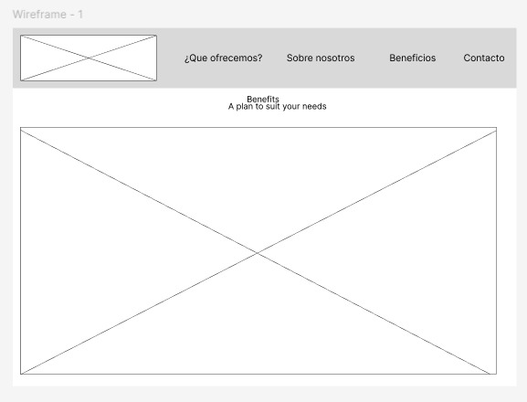
Menu inicio de KeepItFresh.

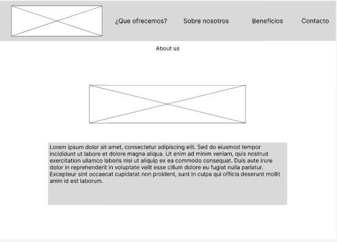
Apartado About us de KeepItFresh

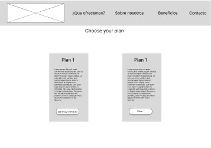

Planes disponibles de la plataforma

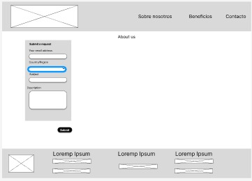

Menu de contacto a soporte

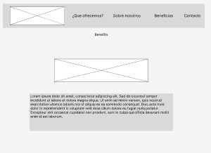

Menu de beneficios

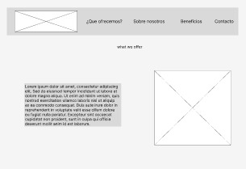

Sobre nosotros

### 4.3.2. Landing Page Mock-up.
Se muestra una versión inicial de nuestro sitio web, en la cual se describe el contenido que incluirá. A esta propuesta se le incorporan los colores definidos en nuestra guía de estilo, así como imágenes acordes a la información presentada, con el objetivo de brindar al usuario una comprensión más clara de los conceptos que deseamos transmitir.

**Desktop Web Browser**
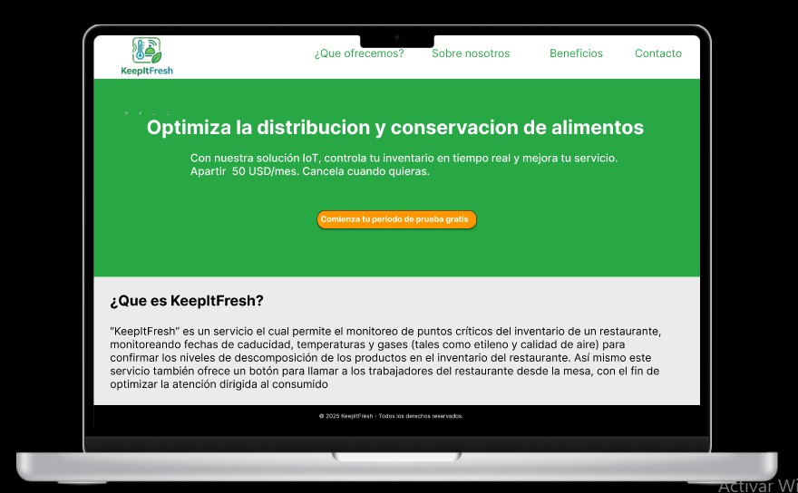
Menu de la aplicacion

Informacion sobre el producto

Informacion sobre la startup

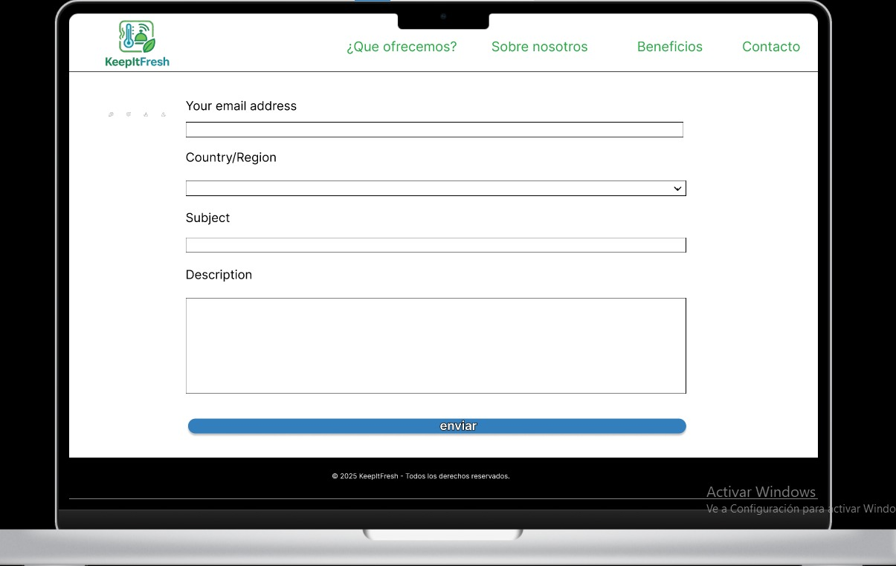
Formulario de soporte para antender cualquier problema

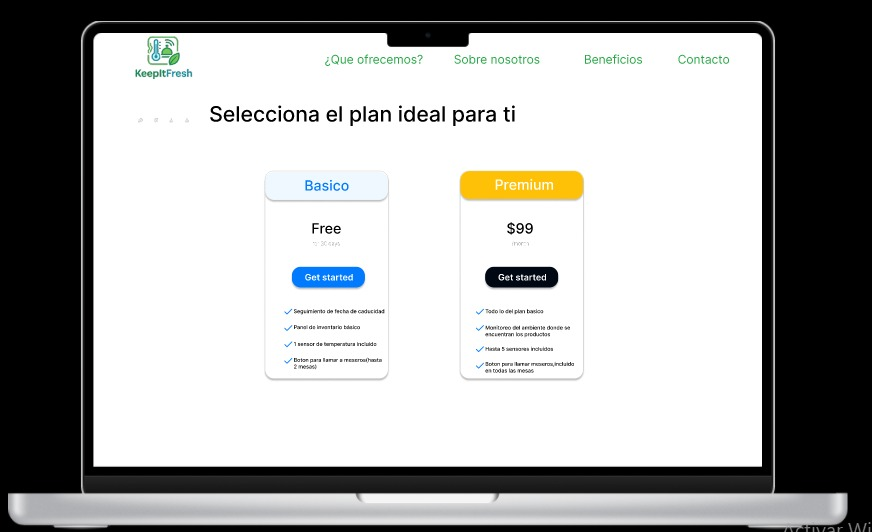
Planes disponibles

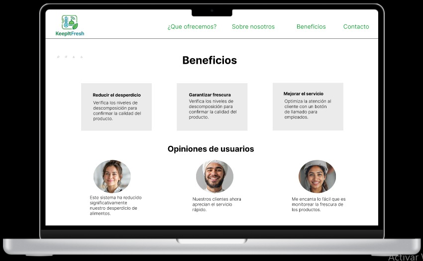
Beneficios y opiniones de usuario

**Desktop Mobile Browser**

Menu mobile
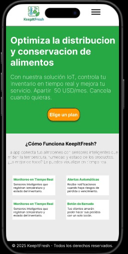

Menu  opciones
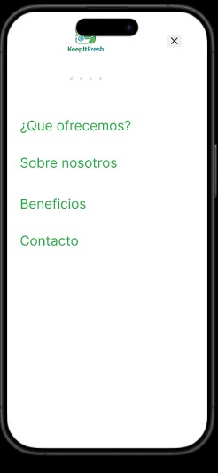

Presentacion de la solucion
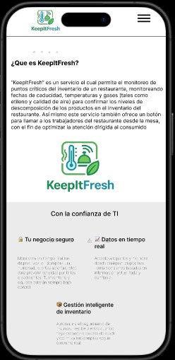

Presentacion de la startup
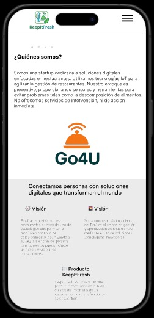

Beneficios y opiniones
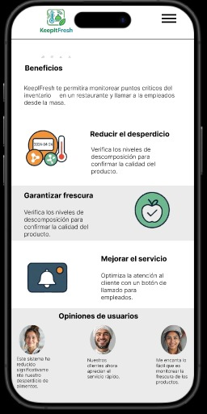

Contacto a soporte
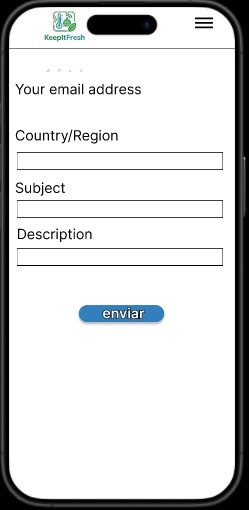

Planes disponibles
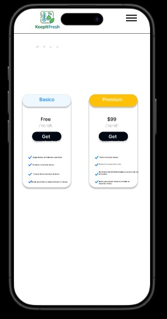
## 4.4. Web Applications UX/UI Design.

### 4.4.1. Web Applications Wireframes.

### 4.4.2. Web Applications Wireflow Diagrams.

### 4.4.3. Web Applications Mock-ups.

### 4.4.4. Web Applications User Flow Diagrams.

## 4.5. Web Applications Prototyping.

## 4.6. Domain-Driven Software Architecture.

### 4.6.1. Software Architecture Context Diagram.
En el diagrama de contexto se presenta cómo los usuarios, que incluyen a dueños de restaurantes y trabajadores, interactúan tanto con nuestro software. Además, se incluyen los sistemas externos que utilizaría KeepFresh.

### 4.6.2. Software Architecture Container Diagrams.
A continuación, se presentará el diagrama de contenedores de nuestro sistema. Este artefacto corresponde al segundo nivel del modelo C4 y ofrece una descripción más detallada de los componentes técnicos, lo que proporciona una visión ampliada de la arquitectura del software.

### 4.6.3. Software Architecture Components Diagrams.
A continuación, se mostrarán los diagramas de componentes para cada Bounded Context, junto con detalles sobre las tecnologías utilizadas e implementaciones específica## 4.7. Software Object-Oriented Design.

Diagrama de componente de Customer Feedback

Diagrama de componente de Inventory Monitoring

Diagrama de componente de Location and Environment

Diagrama de componente de Restaurant Operations

Diagrama de componente de Supplier Management

### 4.7.1. Class Diagrams.
### 4.7.2. Class Dictionary.

## 4.8. Database Design.
### 4.8.1. Database Diagram.

