# Capítulo IV: Product Design

## 4.1. Style Guidelines.

En esta sección, se presentan las pautas de estilo y diseño que guiarán la creación de la página web y la aplicación web de KeepItFresh. Estas pautas aseguran una experiencia de usuario coherente y atractiva, alineada con la identidad de marca y los objetivos del proyecto.

### 4.1.1. General Style Guidelines.

**Tono de Comunicación:**  
- Serio, por tratarse de un sistema dirigido a ambientes laborales.
- Formal pero amigable, para mantener una comunicación profesional, sin ser distante.
- Entusiasta, para transmitir pasión e impacto por la solución que representa KeepItFresh.

**Tipografía:** 
- **Montserrat:** Utilizada en títulos y encabezados. Moderna y clara.
- **Open Sans:** Utilizada en párrafos y textos largos. Legible y versátil basado en el contenido.

**Colores de Marca:** 
- **Primario:** Verde (#28a745) - Representa frescura y sostenibilidad.
- **Secundario:** Naranja (#ff9800) - Utilizado para elementos interactivos y botones.
- **Neutro:** Gris (#2e2e2e) - Utilizado para textos secundarios y elementos de fondo.
- **Fondo:** Blanco (#ffffff) - Limpio y claro, para facilitar la lectura.

**Paleta de Colores:** 

    Color            | Código Hex   |	Uso Principal
    -----------------|--------------|--------------------------------
    Verde	         |   #28a745    |	Color principal (frescura, sostenibilidad)
    Blanco           |   #ffffff    |	Fondo principal
    Naranja          |   #ff9800    |	Elementos interactivos (CTA, botones)
    Gris             |   #2e2e2e    |	Fondos de cards

**Spacing y Layout:** 
- Uso de espacios en gris claro para dar claridad visual.
- Márgenes y paddings bien definidos para evitar sobrecarga visual.
- Cards con bordes redondeados, sombras suaves y aparición con transición para mejorar la jerarquía visual y la estética.

### 4.1.2. Web Style Guidelines.

**Responsive Design:** 

La página es adaptable visualmente a cualquier dispositivo.

**Componentes Implementados:** 

- Header: Título y botones de navegación.
- Sección Hero: Título, descripción y botón llamativo.
- Cards de características: Cada una con título, texto explicativo, y visual coherente.
- Sección de CTA (Call To Action): Clara, directa y llamativa.
- Footer: Señalización de derechos de autor.

**Interacciones:**  

- Hover sobre botones (cambio de color).
- Layout limpio, sin mucha carga de imágenes y videos.

## 4.2. Information Architecture.

Se realizó la página basada en órdenes simples y coherentes para usuarios familiarizados y no familiarizados con la tecnología.

Orden lógico de las secciones:

- Hero: Primer impacto visual y botón CTA.
- ¿Qué es KeepItFresh?
- ¿Quiénes somos?
- Beneficios.
- Comentarios de usuarios.
- Contacto

Dichos órdenes están detallados en las siguientes secciones.

### 4.2.1. Organization Systems.

- Jerárquico: El contenido se organiza desde lo más impactante e importante al detalle.
- Secuencial: La explicación del funcionamiento del sistema sigue un paso a paso lógico.
- Por audiencia: El mensaje está adaptado al grupo clave: Restaurantes

### 4.2.2. Labeling Systems.

Se representarán los datos basados en el sistema de organización detallado anteriormente, buscando así, la simplicidad y objetividad.

Etiquetas utilizadas en el sitio:

- “¿Qué es KeepItFresh?”
- “Sobre nosotros”
- “Beneficios”
- “Experiencias de usuarios”

### 4.2.3. SEO Tags and Meta Tags
- **Title:** KeepItFresh - Sistema de gestión de alimentos.
- **Description:** KeepItFresh es un sistema de gestión de alimentos que ayuda a los restaurantes a optimizar su inventario y reducir el desperdicio.
- **Keywords:** KeepItFresh, gestión de alimentos, optimización de inventario, reducción de desperdicio.
- **Meta Tags:**
  - **Viewport:** width=device-width, initial-scale=1.0
  - **Charset:** UTF-8
- **Author:** Go4U

### 4.2.4. Searching Systems.

- **Búsqueda por categorías:** Facilita la navegación a través de diferentes secciones del sitio mediante la barra de navegación.
- **Búsqueda por etiquetas:** Permite a los usuarios encontrar contenido relacionado a través de etiquetas asignadas a diferentes secciones del sitio en la barra de navegación.

### 4.2.5. Navigation Systems.
- **Barra de navegación:** Incluye enlaces a las secciones principales del sitio: Inicio, ¿Qué es KeepItFresh?, Beneficios, Comentarios de usuarios, Contacto.
- **Botones de llamada a la acción (CTA):** Botones destacados en la sección Hero y en otras partes del sitio para guiar a los usuarios hacia acciones específicas, como "Solicitar una demostración" o "Contactar".
- **Footer:** Incluye enlaces a las políticas de privacidad, términos de servicio y contacto.
## 4.3. Landing Page UI Design.

En esta sección, se presentan los wireframes y mock-ups de la página de inicio de KeepItFresh. Estos diseños visuales son fundamentales para establecer la estructura y apariencia del sitio web, asegurando una experiencia de usuario fluida y atractiva.

### 4.3.1. Landing Page Wireframe.

### 4.3.2. Landing Page Mock-up.

## 4.4. Web Applications UX/UI Design.

En esta sección, se presentan los wireframes y mock-ups de la aplicación web de KeepItFresh. Así como también, los wireflow y user flow diagrams. Estos diseños son esenciales para establecer la estructura y funcionalidad de la plataforma, asegurando una experiencia de usuario intuitiva y eficiente.

### 4.4.1. Web Applications Wireframes.

Los wireframes de la plataforma web KeepItFresh muestran la estructura funcional pensada para ayudar a propietarios y gestores a mantener un control eficiente sobre su inventario con sensores inteligentes. Incluyen:

**Dashboard:**

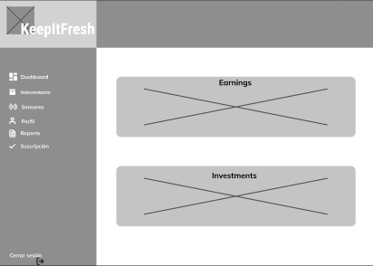

**IoT Sensors:**

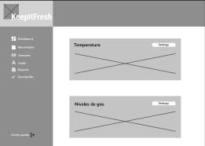

**Inventory:**

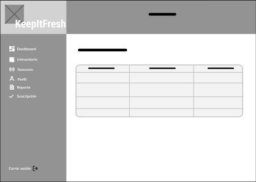

**Summary:**

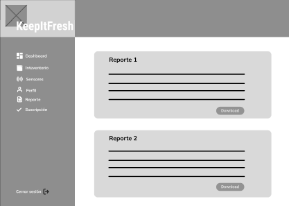

**Profile:**

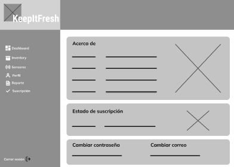

### 4.4.2. Web Applications Wireflow Diagrams.

**User goal:** Como administrador deseo agregar productos al inventario.

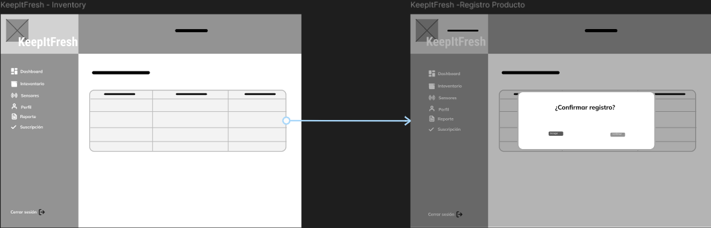

**User goal:** Como administrador deseo guardar un nuevo reporte.

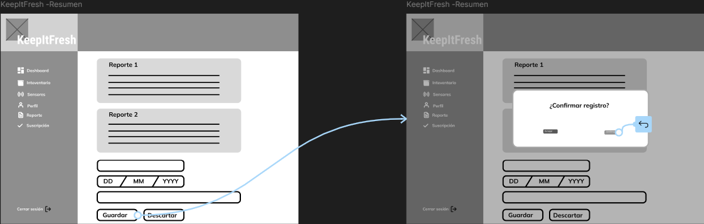

**User goal:** Como administrador deseo observer los detalles de las notificaciones.

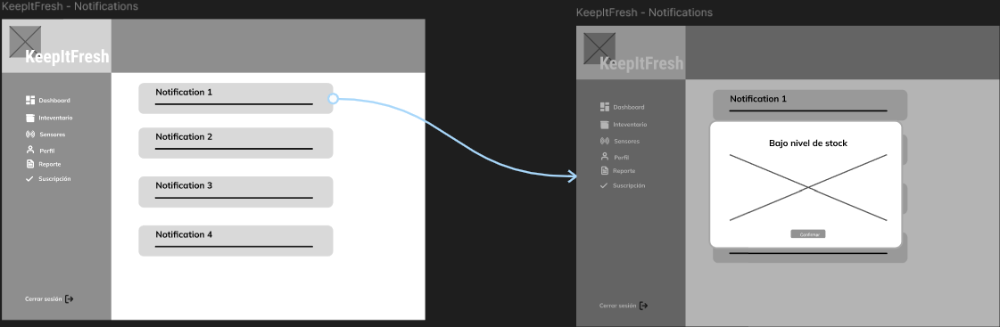

**User goal:** Como trabajador deseo registrar órdenes.

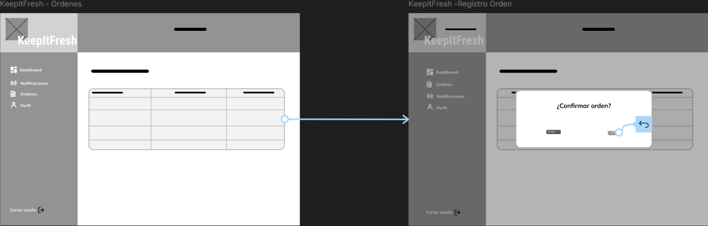

### 4.4.2. Web Applications Mock-ups.

En esta sección, presentamos los mock-ups de la aplicación web, 
proporcionando una visión detallada de la apariencia final de las 
diferentes páginas y funcionalidades. Son representaciones visuales 
de alta fidelidad que muestran el diseño y la interfaz de usuario, 
permitiendo una comprensión clara de cómo funcionará la aplicación.

**Dashboard:**

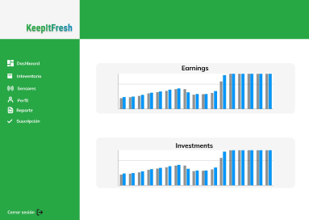

**IoT Sensors:**

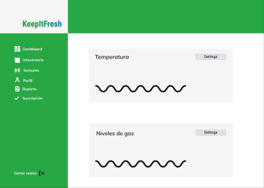

**Inventory:**

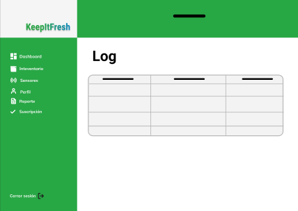

**Summary:**

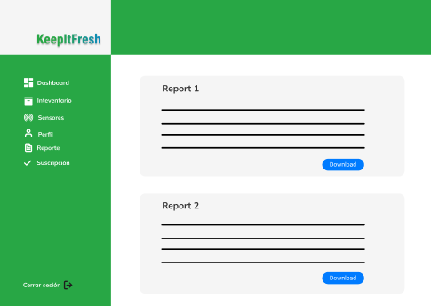

**Profile:**

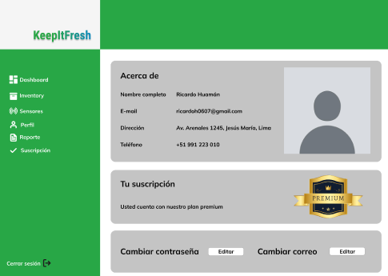

### 4.4.3. Web Applications User Flow Diagrams.

Los diagramas de flujo de usuario (User Flow Diagrams) son representaciones visuales que muestran cómo los usuarios interactúan con la aplicación, desde el inicio hasta la finalización de una tarea específica. Estos diagramas ayudan a comprender el recorrido del usuario y a identificar posibles mejoras en la experiencia de usuario.

**User goal:** Como administrador deseo agregar productos al inventario.

Happy Path:

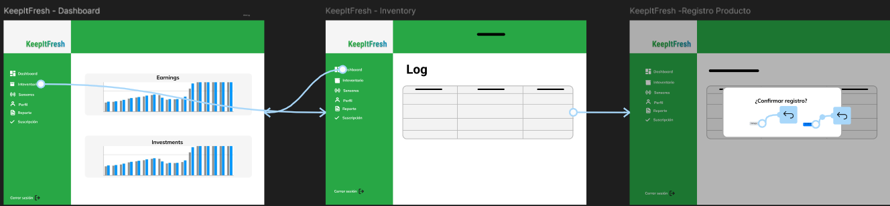

**User goal:** Como administrador deseo visualizar un resumen de reportes

Happy Path:
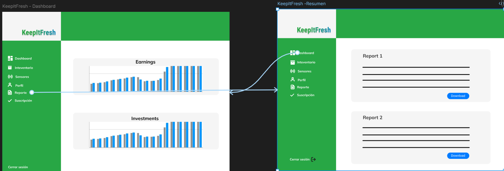

**User goal:** Como administrador deseo configurar los sensores que adquirí.

Happy Path:
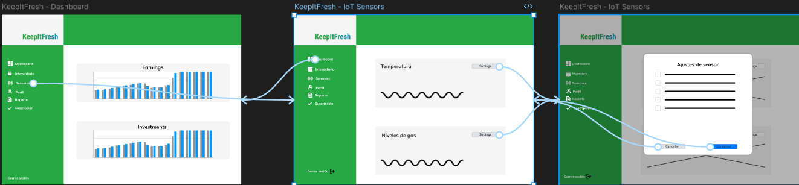

**User goal:** Como trabajador deseo registrar órdenes

Happy Path:
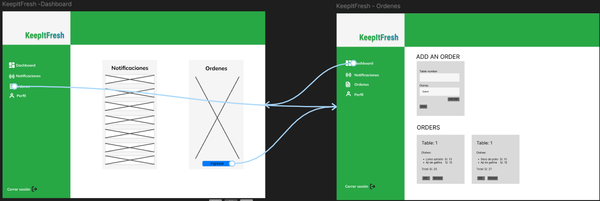

**User goal:** Como trabajador deseo recibir notificaciones de los pedidos realizados

Happy Path:
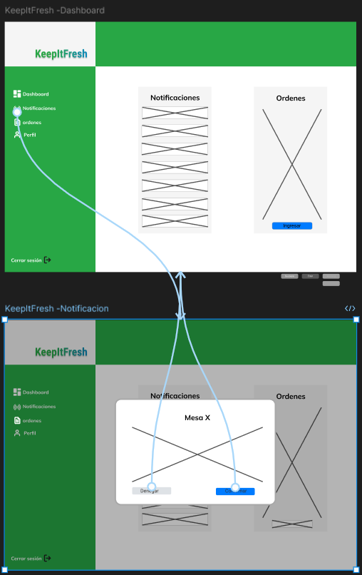

## 4.5. Web Applications Prototyping.

En esta sección, se presentan los prototipos de la aplicación web de KeepItFresh. Estos prototipos son representaciones interactivas que permiten a los usuarios explorar y experimentar con la interfaz antes de su desarrollo final. Proporcionan una visión clara de la navegación, la disposición de los elementos y la funcionalidad general de la aplicación.

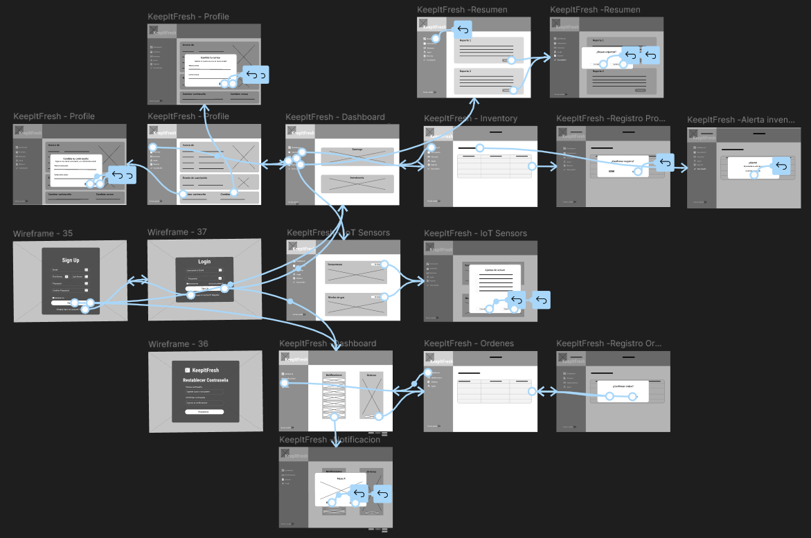

## 4.6. Domain-Driven Software Architecture.

### 4.6.1. Software Architecture Context Diagram.
En el diagrama de contexto se presenta cómo los usuarios, que incluyen a dueños de restaurantes y trabajadores, interactúan tanto con nuestro software. Además, se incluyen los sistemas externos que utilizaría KeepFresh.

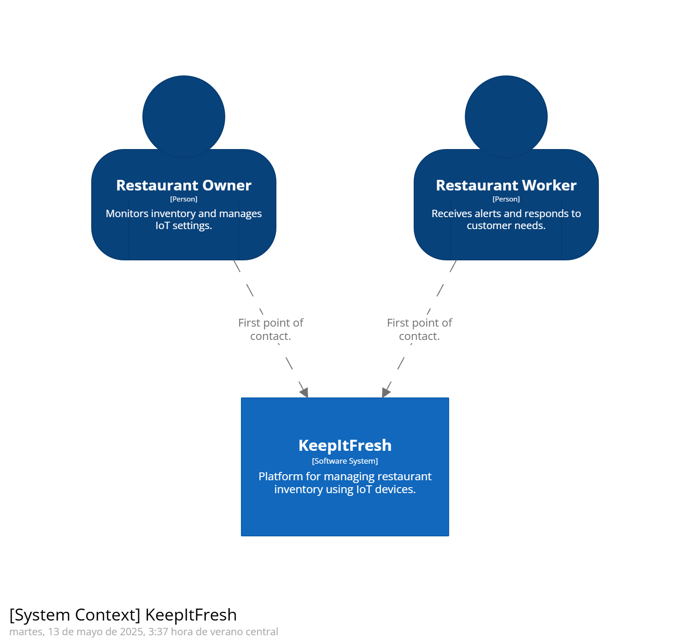

### 4.6.2. Software Architecture Container Diagrams.
A continuación, se presentará el diagrama de contenedores de nuestro sistema. Este artefacto corresponde al segundo nivel del modelo C4 y ofrece una descripción más detallada de los componentes técnicos, lo que proporciona una visión ampliada de la arquitectura del software.

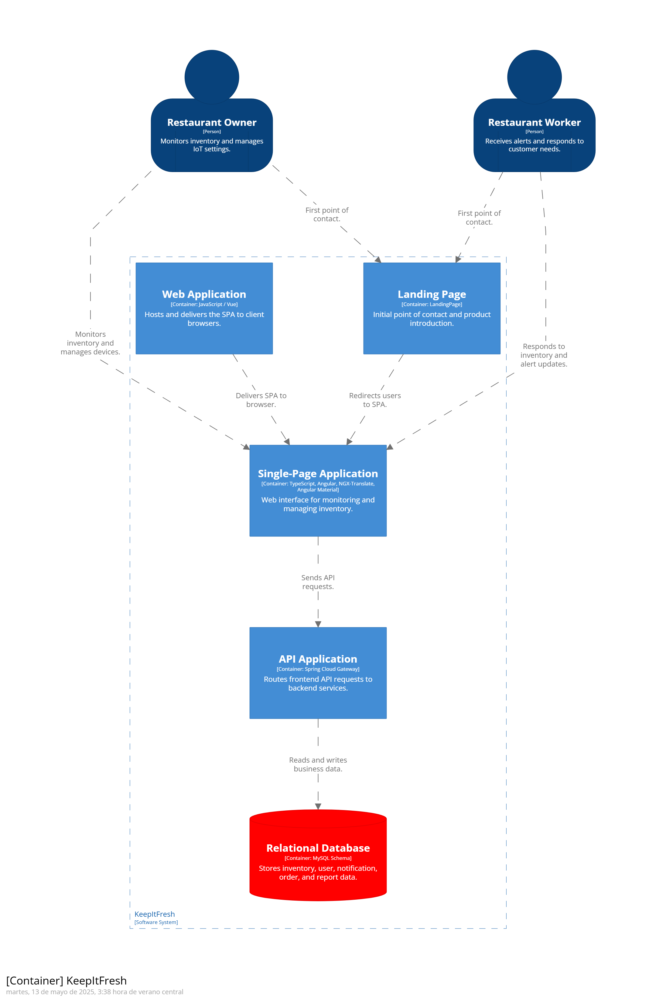

### 4.6.3. Software Architecture Components Diagrams.
A continuación, se mostrarán los diagramas de componentes para cada Bounded Context, junto con detalles sobre las tecnologías utilizadas e implementaciones específica## 4.7. Software Object-Oriented Design.

Diagrama de componente de Inventario

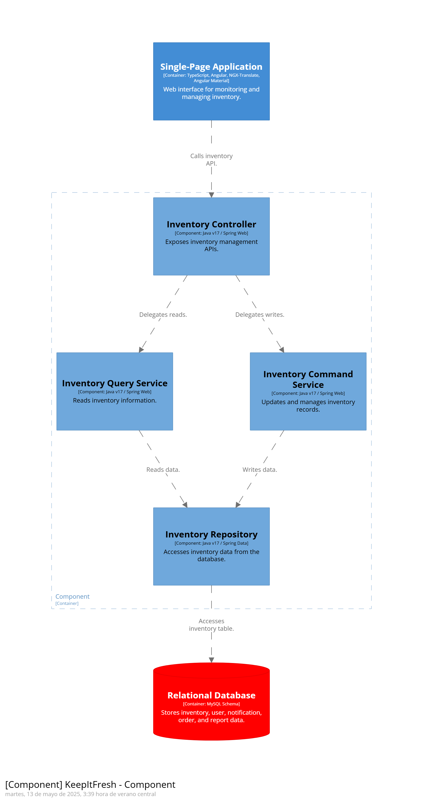

Diagrama de componente de Notificaciones

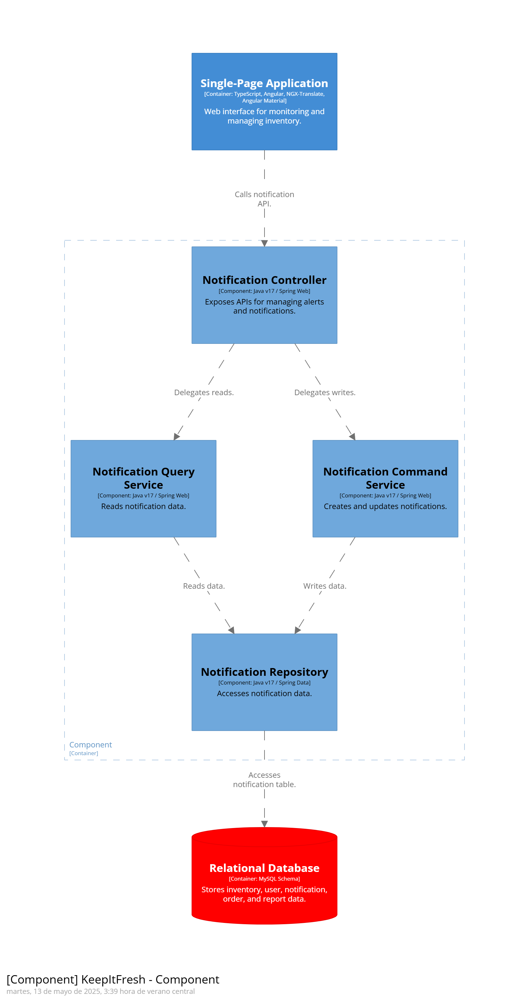

Diagrama de componente de Órdenes

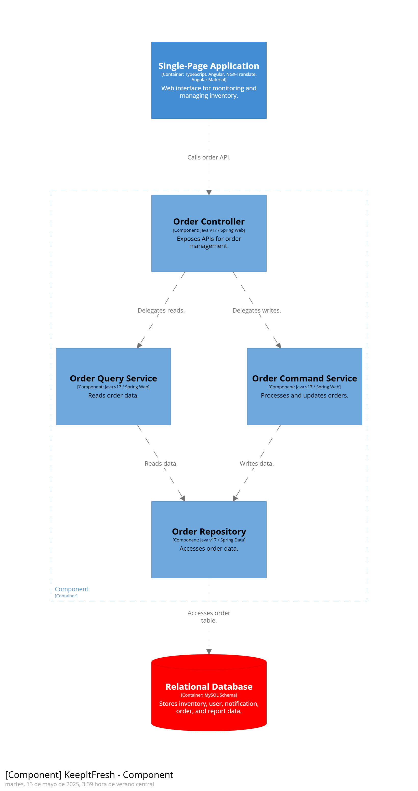

Diagrama de componente de Reportes

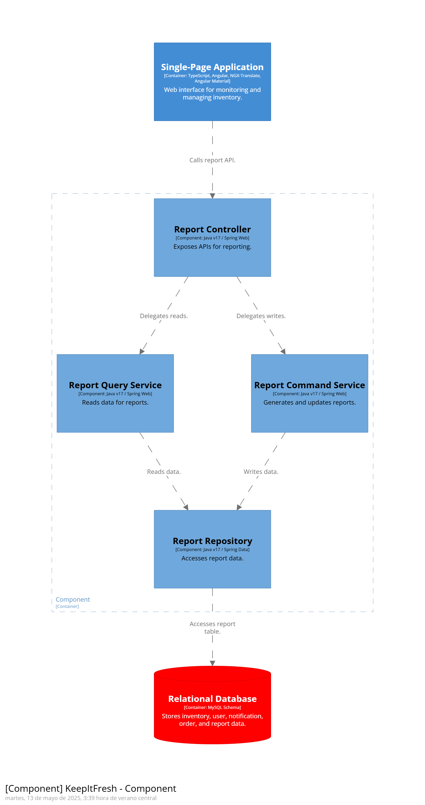

Diagrama de componente de Manejo de usuario

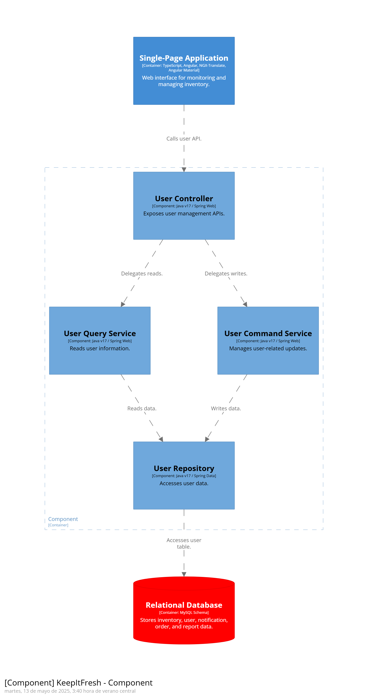

### 4.7.1. Class Diagrams.

Aquí se presenta el diagrama de clases del sistema KeepItFresh. Este diagrama ilustra las entidades y sus relaciones, proporcionando una visión clara de la estructura del software.

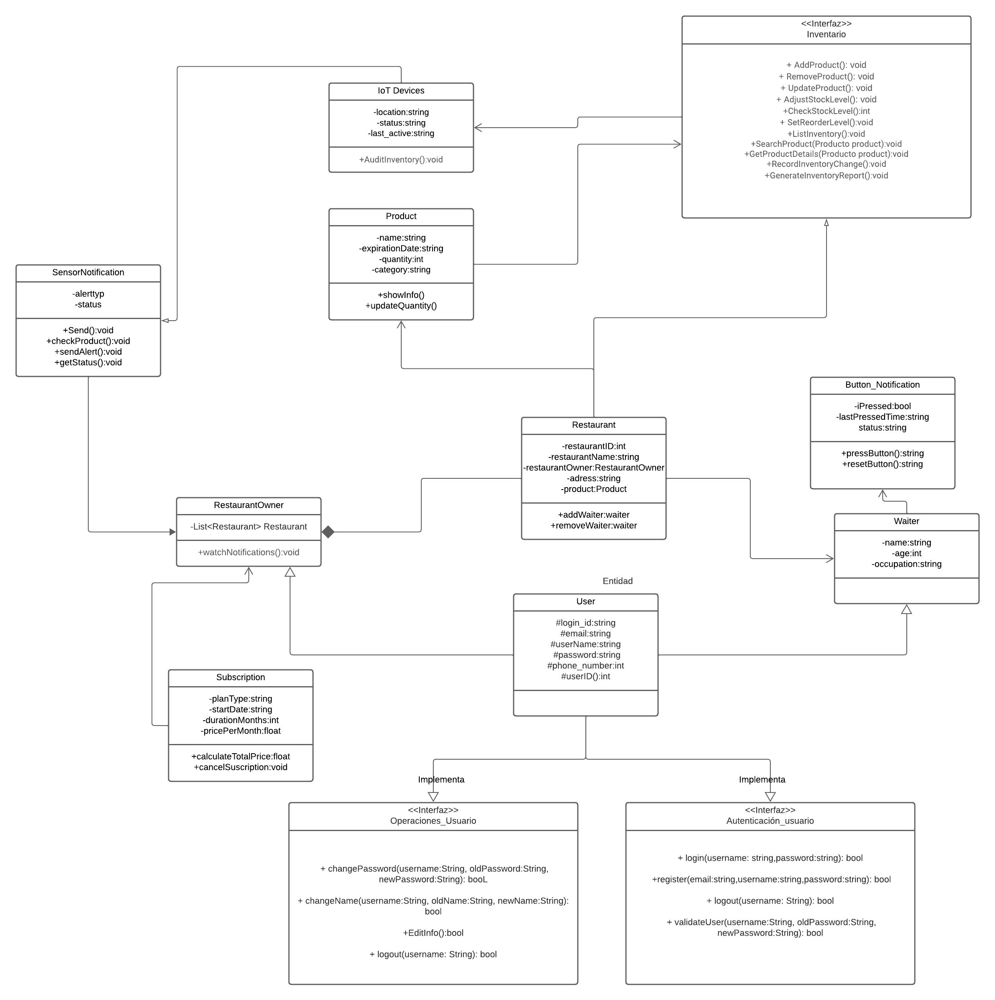
### 4.7.2. Class Dictionary.
A continuación, se presenta un diccionario de clases que describe las entidades y sus atributos, así como los métodos asociados a cada una. Este diccionario proporciona una referencia clara para comprender la estructura y funcionalidad del sistema.
### IoT Devices
**Atributos:**
- location: string
- status: string
- last_active: string

**Métodos:**
- AuditInventory(): void

---

### Product

**Atributos:**
- name: string
- expirationDate: string
- quantity: int
- category: string

**Métodos:**
- showInfo(): void
- updateQuantity(): void

---

### Inventario (interface)
**Métodos:**
- AddProduct(): void
- RemoveProduct(): void
- UpdateProduct(): void
- AdjustStockLevel(): void
- CheckStockLevel(): void
- SetInventory(): void
- RetrieveInventory(): void
- SearchProductByName(productName: string): void
- GetProductList(): void
- RecordInventoryChange(): void
- GenerateInventoryReport(): void

---

### Button_Notification
**Atributos:**
- pressed: bool
- lastPressedTime: string
- status: string

**Métodos:**
- pressButton(): string
- resetButton(): string

---

### Waiter
**Atributos:**
- name: string
- age: int
- occupation: string

---

### Restaurant
**Atributos:**
- restaurantID: int
- restaurantName: string
- restaurantOwner: RestaurantOwner
- address: string
- product: Product

**Métodos:**
- addWaiter(w: Waiter): void
- removeWaiter(w: Waiter): void

---

### RestaurantOwner
**Atributos:**
- List<Restaurant>: Restaurant

**Métodos:**
- watchNotifications(): void

---

### SensorNotification
**Atributos:**
- alertType: string
- status: string

**Métodos:**
- send(): void
- checkDevice(): void
- sendAlert(): void
- getStatus(): void

---

### Subscription
**Atributos:**
- planType: string
- startDate: string
- durationMonths: int
- pricePerMonth: float

**Métodos:**
- calculateTotalPrice(): float
- cancelSubscription(): void

---

### User (Entidad)
**Atributos:**
- loginID: string
- email: string
- userName: string
- password: string
- phone_number: int
- userID: int

---

### Operaciones_Usuario (interface)
**Métodos:**
- changePassword(username: String, oldPassword: String, newPassword: String): bool
- changeName(username: String, oldName: String, newName: String): bool
- editInfo(): bool
- logout(username: String): bool

---

### Autenticación_usuario (interface)
**Métodos:**
- login(username: String, password: String): bool
- register(email: String, username: String, password: String): bool
- logout(username: String): bool
- validateUser(username: String, oldPassword: String, newPassword: String): bool

## 4.8. Database Design.
En esta sección, se presenta el diseño de la base de datos para el sistema KeepItFresh. Este diseño incluye el diagrama de entidad-relación (ERD) y una descripción de las tablas y sus relaciones.
### 4.8.1. Database Diagram.
