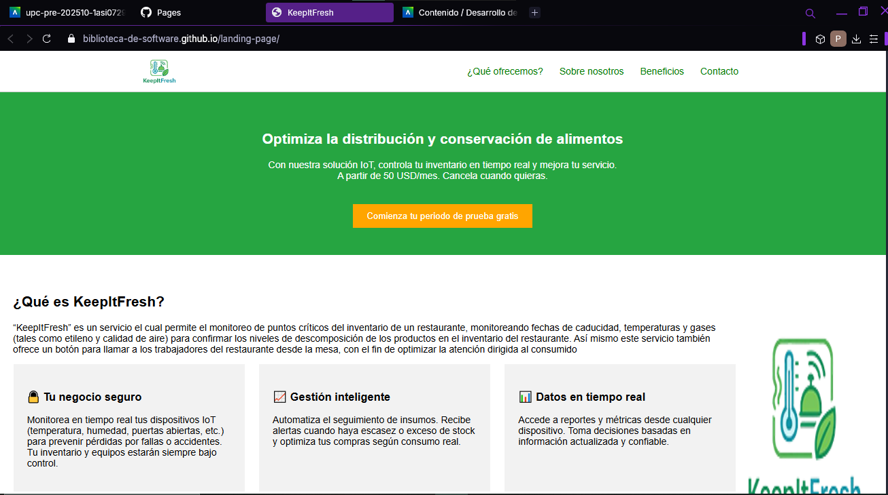
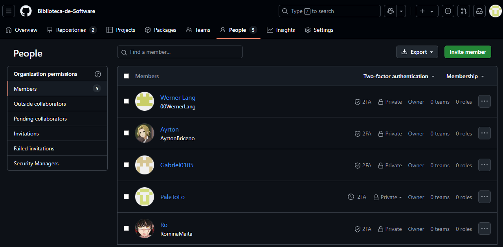
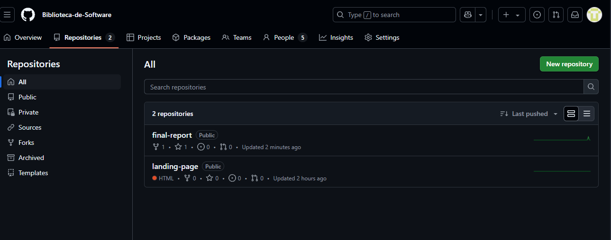
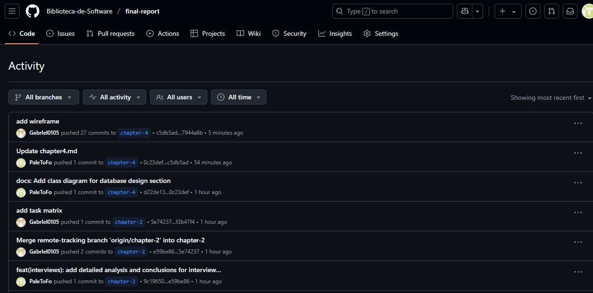
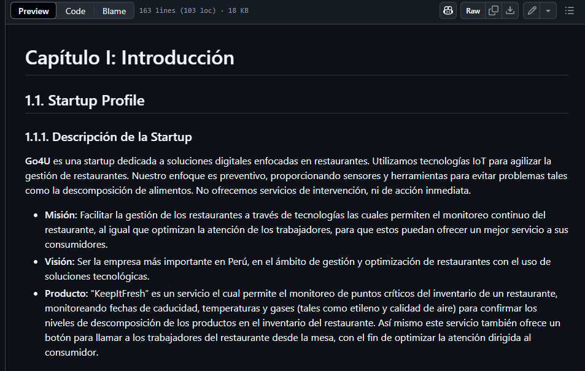
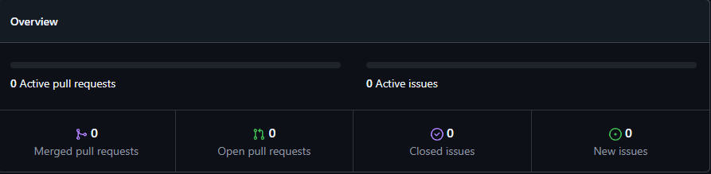

# Capítulo V: Product Implementation, Validation & Deployment

## 5.1. Software Configuration Management.
### 5.1.1. Software Development Environment Configuration.

En esta sección, se incluirá los productos de software que se usaron el en proyecto.

Se clasificará en el siguiente orden:
- Producto UX/UI Design.
- Software Development.
- Software Deployment.

**Producto UX/UI Design:** 
- [Figma](https://www.figma.com/) - Herramienta de diseño colaborativo para crear prototipos y maquetas de interfaces de usuario.
- [Lucidchart](https://lucid.app/) - Herramienta de diagramación para crear diagramas de flujo, wireframes y otros elementos visuales.
- [Uxpressia](https://uxpressia.com/) - Herramienta de diseño centrada en el usuario para crear mapas de empatía y customer journey maps.
- [Structurizr](https://structurizr.com/) - Herramienta de modelado de software para crear diagramas de arquitectura y diseño orientado a dominios.

**Software Development:** 
- [IntelliJ IDEA](https://www.jetbrains.com/idea/) - Entorno de desarrollo integrado (IDE) para Java y otros lenguajes de programación.
- [Github](https://www.github.com/) - Plataforma de control de versiones y colaboración para el desarrollo de software.
- [Visual Studio Code](https://code.visualstudio.com/) - Editor de código fuente ligero y potente para varios lenguajes de programación.
- [HTML](https://www.w3.org/TR/html52/) - Lenguaje de marcado para la creación de páginas web.
- [CSS](https://www.w3.org/Style/CSS/) - Lenguaje de estilo para la presentación de documentos HTML.

**Software Deployment:** 
- GitHub Pages - Servicio de alojamiento web para proyectos estáticos.
### 5.1.2. Source Code Management.
Para el sistema, se usará Github como herramienta de gestión de código fuente. Se creará un repositorio para el proyecto, donde se almacenará todo el código fuente y los documentos relacionados.

**URL de la organización:** https://github.com/Biblioteca-de-Software
**URL del repositorio:**https://github.com/Biblioteca-de-Software/final-report
**URL del repositorio de la landing page:** https://github.com/Biblioteca-de-Software/landing-page

Para el modelo de desarrollo, se decidió usar GitFlow como modelo de ramificación. Este modelo permite una gestión eficiente de las ramas y facilita la colaboración entre los desarrolladores.
Se crearán las siguientes ramas:
- **dev:** Rama principal de desarrollo, donde se integrarán todas las características y correcciones de errores.
- **chapter-1:** Rama para el desarrollo del capítulo 1 del informe.
- **chapter-2:** Rama para el desarrollo del capítulo 2 del informe.
- **chapter-3:** Rama para el desarrollo del capítulo 3 del informe.
- **chapter-4:** Rama para el desarrollo del capítulo 4 del informe.
- **chapter-5:** Rama para el desarrollo del capítulo 5 del informe.

### 5.1.3. Source Code Style Guide & Conventions.

**Principios Generales** 
- **Idioma estándar:** Todo el código está en inglés.

- **Legibilidad primero:** Se prefiere nombres descriptivos, claros y significativos sobre abreviaciones o tecnicismos innecesarios.

- **Formato consistente:** Se sigue el mismo estilo en todo el equipo y en todos los lenguajes.

- **Nombres significativos:** Se ua sustantivos para clases, nombres de archivos y componentes. Verbos para funciones o métodos.

**HTML & CSS** 
- Archivos HTML terminan en .html

- Archivos CSS terminan en .css

- Se usa kebab-case para nombres de clases y archivos:
Ej: main-header, product-card, login-form.

**HTML**
- Elementos estructurados correctamente (header, section, nav, footer).

- Se usa alt para imágenes y aria-* para accesibilidad.

### 5.1.4. Software Deployment Configuration.
El deployment del software se realizó en GitHub Pages. Se creó, donde se alojará el código HTML, CSS del proyecto.
 

**URL del repositorio de la landing page:** https://biblioteca-de-software.github.io/landing-page/
 
**URL de la landing page deployada:** https://biblioteca-de-software.github.io/landing-page/

## 5.2. Landing Page, Services & Applications Implementation.
### 5.2.1. Sprint n

#### 5.2.1.1. Sprint Planning n.

<table>
<tr>
    <th colspan="5">Sprint 1</th>
    <th colspan="9">Sprint 1</th>
  </tr>
      <tr>
    <td colspan="13">Sprint Planning Background</td>
  </tr>
  <tr>
    <td colspan="5">Date</td>
    <td colspan="8">2025-04-16</td>
</tr>
  <tr>
    <td colspan="5">Time</td>
    <td colspan="8">5:30 PM</td>
  </tr>
  <tr>
    <td colspan="5">Location</td>
    <td colspan="8">Via Discord</td>
<tr>
    <td colspan="5">Prepared By</td>
    <td colspan="8">Ayrton Omar Briceño Llanos</td>
</tr>
<tr>
    <td colspan="5">Attendees (to planning meeting)</td>
    <td colspan="8">Ayrton Omar Briceño Llanos, Maita Falckenheiner Romina Guadalupe, Lang Nassi Werner Khalil, Torres Flores Paolo Alessandro, Mamani Marca Gabriel Cristian.</td>
</tr>
<tr>
    <td colspan="5">Sprint  1 Review Summary</td>
    <td colspan="8">En esta primera sección se planteo el desarrollo de la Landing Page para el proyecto de KeeptItFresh.</td>
</tr>
<tr>
    <td colspan="5">Sprint 1 Retrospective Summary</td>
    <td colspan="8">En esta sección todos los integrantes mencionaron tener aciertos en partes del codigo y en otras partes poder mejorar sus habilidades realizando la Landing Page</td>
</tr>
<tr>
    <td colspan="13">Sprint Goal & User Stories</td>
</tr>
<tr>
    <td colspan="5">Sprint 1 Goal</td>
    <td colspan="8">
Desarrollar y desplegar una landing page que presente información a los usuarios a través de imágenes. La página debe ser completamente adaptable a cualquier tipo de dispositivo que utilicen los usuarios, garantizando una experiencia de usuario fluida y responsiva.</td>
</tr>
</table>

#### 5.2.1.2. Aspect Leaders and Collaborators.

#### 5.2.1.3. Sprint Backlog n.

#### 5.2.1.4. Development Evidence for Sprint Review.
Aquí podemos notar como está conformado el grupo de trabajo dentro de la organización.

#### 5.2.1.5. Execution Evidence for Sprint Review.
Aquí podemos notar la aplicación en ejecución luego de los sprints realizados.

 

Aquí vemos la evidencia de la creación de dichos repositorios mencionados con anterioridad.

Aquí podemos notar la ejecución de los commits a lo largo del reporte

#### 5.2.1.6. Services Documentation Evidence for Sprint Review.
En esta sección se evidencia el servicio documentado al detalle dentro del reporte.

#### 5.2.1.7. Software Deployment Evidence for Sprint Review.
Aquí podemos evidenciar como ya se realizaron las tareas y no hay ningún error que corregir.

#### 5.2.1.8. Team Collaboration Insights during Sprint.
Durante el proceso de desarrollo del trabajo, se realizaron las reuniones necesarias para todo tipo de dificultad que se presentaba. Se usó la herramienta de Discord para poder comunicarnos y realizar las reuniones necesarias.

# Conclusiones
Durante el proceso de creación y desarrollo de este trabajo pudimos llegar a las siguientes conclusiones:
- La importancia del trabajo en equipo y la colaboración entre los miembros del grupo.
- La importancia de la planificación y organización en el desarrollo de software.
- La importancia de la tecnología y las herramientas en el desarrollo de software aplicado a la realidad.
- Se concluye que este trabajo es una solución rentable y sostenible para la problemática de la reducción de desperdicios alimentarios en el Perú por medio de los restaurantes.
- Se usa la tecnología de la información y la comunicación para poder llegar a un público más amplio y poder ayudar a la reducción de desperdicios alimentarios en el Perú.
- Se concluye que la aplicación es fácil de usar y tiene una buena usabilidad, lo que permite a los usuarios interactuar con ella de manera eficiente.
- Se concluye que la aplicación es escalable y puede adaptarse a diferentes necesidades y requerimientos de los usuarios.

# Video About-the-Team.

# Bibliografía

Bedoya-Perales, N. S., & Magro, G. P. D. (2021). Quantification of Food Losses and Waste in Peru: A Mass Flow Analysis along the Food Supply Chain. Sustainability, 13(5), 2807. https://doi.org/10.3390/su13052807

# Anexos
**Anexo A: Entrevistas** 
https://upcedupe-my.sharepoint.com/personal/u20221f613_upc_edu_pe/_layouts/15/stream.aspx?id=%2Fpersonal%2Fu20221f613_upc_edu_pe%2FDocuments%2Fupc-pre-202510-1asi0729-4350-Go4U-Entrevistas-tb1%2Emp4&nav=eyJyZWZlcnJhbEluZm8iOnsicmVmZXJyYWxBcHAiOiJPbmVEcml2ZUZvckJ1c2luZXNzIiwicmVmZXJyYWxBcHBQbGF0Zm9ybSI6IldlYiIsInJlZmVycmFsTW9kZSI6InZpZXciLCJyZWZlcnJhbFZpZXciOiJNeUZpbGVzTGlua0NvcHkifX0&ga=1&referrer=StreamWebApp%2EWeb&referrerScenario=AddressBarCopied%2Eview%2Ef9358ec4-5889-4ffc-ab48-1cc2b59b3f66

**Anexo B: Diagrama de clases** 
https://lucid.app/lucidchart/30ba92cc-d4a4-4173-a345-d9df240369ba/edit?viewport_loc=-1225%2C-952%2C3838%2C1768%2CizzJqiIIuiUG&invitationId=inv_162805fe-76e1-4eb0-9f55-a1369699a168

**Anexo C: Diagrama de Base de Datos** 
https://lucid.app/lucidchart/8b68a7d9-d409-4131-a858-0ff68f0d77e7/edit?viewport_loc=-1872%2C-635%2C2551%2C1175%2C0_0&invitationId=inv_04e0583c-2c83-4d99-b9e1-5c12dee721ad

**Anexo D: Landing Page** 
https://biblioteca-de-software.github.io/landing-page/

**Anexo E: Wireframe** 
https://www.figma.com/design/qhRLKjdaF9fijkKjSNQYEV/wireframe?node-id=0-1&t=aAudnWYnV3hGkMou-1

**Anexo F: Mockup** 
https://www.figma.com/design/XuRVo3M9aclKQzb5VTGsC7/Untitled?node-id=0-1&t=iMrbvYmaqMFpc3SE-1

**Anexo G: Web Application MockUp and Wireframe** 
https://www.figma.com/design/ZPqKdgAXbM04JV4jEnc5rw/KeepItFresh--Copy-?node-id=74-247&t=CLgUbrYHBU9JTQu1-1

