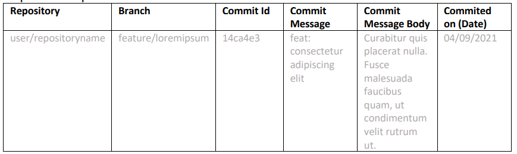

# Capítulo V: Product Implementation, Validation & Deployment

## 5.1. Software Configuration Management.

En esta sección se muestran las decisiones y convenciones que permitirán mantener consistencia durante el ciclo de vida del proyecto.

### 5.1.1. Software Development Environment Configuration.

En esta sección, se incluirá los productos de software que se usaron en el proyecto.
Los enlaces a cada una de las herramientas se encuentran disponibles en los anexos.

##### Project Management:
- Trello: Herramienta de gestión de proyectos basada en Kanban, utilizada para planificar tareas y asignar responsabilidades al equipo.

##### Product UX/UI Design:
- Figma: Herramienta colaborativa para crear prototipos interactivos de interfaces.
- Lucidchart: Para creación de diagramas de flujo y wireframes.
- Uxpressia: Para elaboración de mapas de empatía y recorridos del usuario (Customer Journey).
- Structurizr: Para modelado de arquitectura de software.

#### Software Development
- IntelliJ IDEA: IDE para desarrollo backend en Java. Para el primer y segundo sprint se utilizó para la redacción del informe del proyecto.
- WebStorm: IDE especializado para el desarrollo frontend. Se utilizó para el desarrollo de la Landing Page y frontend de la aplicación.
- Visual Studio Code: Editor utilizado únicamente para la exportación del reporte de formato markdown a PDF.
- GitHub: Plataforma de control de versiones y colaboración.

#### Software Deployment
- GitHub Pages: Servicio de despliegue de aplicaciones web estáticas desde repositorios GitHub.

### 5.1.2. Source Code Management.

Para la gestión del código fuente, se utilizará GitHub como plataforma central de control de versiones y colaboración entre los miembros del equipo. Se han creado repositorios separados para los distintos productos del proyecto.
Los enlaces también están disponibles en la sección de anexos.

- **Organización en GitHub:** [https://github.com/Biblioteca-de-Software](https://github.com/Biblioteca-de-Software)
- **Repositorio del informe final:** [https://github.com/Biblioteca-de-Software/final-report](https://github.com/Biblioteca-de-Software/final-report)
- **Repositorio de la Landing Page:** [https://github.com/Biblioteca-de-Software/landing-page](https://github.com/Biblioteca-de-Software/landing-page)
- **Repositorio del FrontEnd:** [https://github.com/Biblioteca-de-Software/frontend](https://github.com/Biblioteca-de-Software/frontend)

#### Modelo de ramificación: GitFlow

Para el modelo de desarrollo, se decidió usar GitFlow como modelo de ramificación. Este modelo permite una gestión eficiente de las ramas y facilita la colaboración entre los desarrolladores.

Para el repositorio del informe final se crearon las siguientes ramas:
- **dev:** Rama principal de desarrollo, donde se integrarán todas las características y correcciones de errores.
- **chapter-1:** Rama para el desarrollo del capítulo 1 del informe.
- **chapter-2:** Rama para el desarrollo del capítulo 2 del informe.
- **chapter-3:** Rama para el desarrollo del capítulo 3 del informe.
- **chapter-4:** Rama para el desarrollo del capítulo 4 del informe.
- **chapter-5:** Rama para el desarrollo del capítulo 5 del informe.

Para el repositorio de Landing Page se crearon las siguientes ramas:

Para el repositorio del Fronted se crearon las siguientes ramas:
- **develop**: Rama principal donde una vez concluida la programación de un bounded context se hace un merge a esta rama.
- **feature/orders**: Rama en la que se desarrolla el bounded context de órdenes donde una persona del segmento trabajadores del restaurante registra las órdenes de cada mesa.
- **feature/inventory**: Rama donde se desarrolla el bounded context del inventario donde una persona del segmento dueños de restaurante puede ingresar productos al inventario y revisar su fecha de caducidad.
- **feature/notifications**: Rama donde se desarrolla del bounded context de notificaciones donde el usuario, ya sea dueño o trabajador, puede ver todas las notificaciones. Es parte del core del negocio, ya que para el segmento de dueños las notificaciones le permiten estar alerta de la fecha de vencimiento de los productos. 
- **feature/userManagement**: Rama donde se desarrolla el código respecto a el registro o ingreso a la cuenta de cada segmento objetivo.

#### Estilo de commits: Conventional Commits
Para asegurar mensajes de commits claros y estandarizados, se seguirá la convención [Conventional Commits](https://www.conventionalcommits.org/en/v1.0.0/). Algunos ejemplos:

- `feat: add search by name functionality`
- `fix: correct form validation error`
- `docs: update installation instructions`
- `refactor: simplify calculation logic`

El prefijo de categorías se define de la siguiente forma:
- `feat`: A new feature
- `fix`: A bug fix
- `docs`: Documentation only changes
- `style`: Changes that do not affect the meaning of the code (formatting, missing semicolons, etc.)
- `refactor`: A code change that neither fixes a bug nor adds a feature
- `test`: Adding missing tests or correcting existing ones
- `chore`: Changes to the build process or auxiliary tools

### 5.1.3. Source Code Style Guide & Conventions.

En esta sección se definen las convenciones de nombres y codificación adoptadas por el equipo para los lenguajes utilizados en el proyecto: HTML, CSS, JavaScript, TypeScript y Java. El idioma estándar para todo el código (nombres de variables, funciones, clases, archivos, etc.) es el **inglés**.

#### Principios generales

- **Idioma estándar:** Todo el código fuente está escrito en inglés, incluyendo nombres de archivos, clases, variables y funciones.
- **Legibilidad ante todo:** Se prioriza el uso de nombres descriptivos y claros por encima de abreviaciones o tecnicismos innecesarios.
- **Formato consistente:** Se aplica un estilo uniforme en todo el equipo y en todos los lenguajes, reforzado por herramientas automáticas.
- **Nombres semánticos:** Se usan **sustantivos** para clases, componentes y archivos, y **verbos** para funciones o métodos.
- **Indentación:** 2 espacios para HTML, CSS, JS y TS. 4 espacios para Java.

#### HTML y CSS

**HTML**
- Archivos terminan en `.html`.
- Se utilizan etiquetas semánticas como `<header>`, `<section>`, `<nav>`, `<footer>`, etc.
- Se incluye `alt` en imágenes y atributos `aria-*` para accesibilidad.
- Atributos con comillas dobles (`"`).
- Se usa `camelCase` para IDs y `kebab-case` para clases.
- Indentación: 2 espacios.

**CSS**
- Archivos terminan en `.css`.
- Se usa `kebab-case` para nombres de clases y archivos: `main-header`, `product-card`, `login-form`.
- Se agrupan estilos relacionados y se separan con comentarios.

#### JavaScript y TypeScript

- Archivos terminan en `.js` o `.ts`.
- Se usa `camelCase` para variables y funciones: `userName`, `getUserData()`.
- Se usa `PascalCase` para clases y componentes: `UserProfile`, `LoginForm`.
- Se prefiere `const` y `let` en lugar de `var`.
- Se prefieren funciones flecha (`=>`) y nombres explícitos.
- Cada archivo debe tener una única responsabilidad o componente.

Basado en:
- [Guía de estilo TypeScript de Google](https://google.github.io/styleguide/tsguide.html)
- [Guía de estilo JavaScript de Airbnb](https://github.com/airbnb/javascript)

#### Java

- Archivos terminan en `.java`.
- Clases con `PascalCase`: `UserService`, `OrderController`.
- Métodos y variables con `camelCase`: `getUserById()`, `userEmail`.
- Constantes con `UPPER_SNAKE_CASE`: `MAX_ATTEMPTS`.
- Una clase pública por archivo.
- Se documentan métodos y clases públicas con JavaDoc.

Basado en:
- [Guía de estilo Java de Google](https://google.github.io/styleguide/javaguide.html)
- [Buenas prácticas de Spring Boot](https://docs.spring.io/spring-boot/docs/current/reference/htmlsingle/)

### 5.1.4. Software Deployment Configuration.

En esta sección se describe la configuración necesaria para desplegar cada uno de los componentes del proyecto: Landing Page, Web Services y Frontend Web Application. El objetivo es garantizar que, a partir del código fuente almacenado en los repositorios, se pueda lograr una publicación funcional y accesible para los usuarios.

#### Despliegue de Landing Page

La **Landing Page** fue desarrollada usando HTML y CSS, y fue desplegada mediante **GitHub Pages**, un servicio gratuito de hosting para sitios estáticos.

**Pasos de despliegue:**
1. Se creó el repositorio `landing-page` en GitHub.
2. Se subió el código fuente HTML, CSS y recursos estáticos.
3. Desde la configuración del repositorio, se activó **GitHub Pages** seleccionando la rama `main` y la carpeta raíz (`/`).
4. Automáticamente, GitHub publicó el sitio web en una URL pública.

**Repositorio:** [https://github.com/Biblioteca-de-Software/landing-page](https://github.com/Biblioteca-de-Software/landing-page)  
**URL desplegada:** [https://biblioteca-de-software.github.io/landing-page/](https://biblioteca-de-software.github.io/landing-page/)

#### Frontend Web Application

#### RESTful Web Services

Los servicios backend serán desarrollados en **Java (Spring Boot)** más adelante.

## 5.2. Landing Page, Services & Applications Implementation.

En esta sección se detalla y evidencia la implementación de cada entregable de KeepItFresh.

#### Landing page:
La landing page fue realizada de manera grupal y desplegada debidamente con la herramienta GitHub Pages.
A continuación las siguientes imágenes sirven de referencia para evidencia la implementación de la Landing Page.

#### Frontend:

### 5.2.1. Sprint 1

#### 5.2.1.1. Sprint Planning 1.

<table>
<tr>
    <th colspan="5">Sprint 1</th>
    <th colspan="9">Sprint 1</th>
  </tr>
      <tr>
    <td colspan="13">Sprint Planning Background</td>
  </tr>
  <tr>
    <td colspan="5">Date</td>
    <td colspan="8">2025-04-16</td>
</tr>
  <tr>
    <td colspan="5">Time</td>
    <td colspan="8">5:30 PM</td>
  </tr>
  <tr>
    <td colspan="5">Location</td>
    <td colspan="8">Via Discord</td>
<tr>
    <td colspan="5">Prepared By</td>
    <td colspan="8">Ayrton Omar Briceño Llanos</td>
</tr>
<tr>
    <td colspan="5">Attendees (to planning meeting)</td>
    <td colspan="8">Ayrton Omar Briceño Llanos, Maita Falckenheiner Romina Guadalupe, Lang Nassi Werner Khalil, Torres Flores Paolo Alessandro, Mamani Marca Gabriel Cristian.</td>
</tr>
<tr>
    <td colspan="5">Sprint  1 Review Summary</td>
    <td colspan="8">En este primer sprint se asignaron responsabilidades a cada integrante y planteo los requerimientos para el desarrollo de la Landing Page.</td>
</tr>
<tr>
    <td colspan="5">Sprint 1 Retrospective Summary</td>
    <td colspan="8">En esta sección todos los integrantes mencionaron tener aciertos en partes del codigo y en otras partes poder mejorar sus habilidades realizando la Landing Page</td>
</tr>
<tr>
    <td colspan="13">Sprint Goal & User Stories</td>
</tr>
<tr>
    <td colspan="5">Sprint 1 Goal</td>
    <td colspan="8">
Desarrollar y desplegar una landing page que presente información a los usuarios a través de imágenes. La página debe ser completamente adaptable a cualquier tipo de dispositivo que utilicen los usuarios, garantizando una experiencia de usuario fluida y responsiva.</td>
</tr>
</table>

#### 5.2.1.2. Aspect Leaders and Collaborators.

En esta sección se detalla los líderes de cada aspecto. Para el primer Sprint hemos segmentado en 3 aspectos relacionados a los entregables.

| Team member (LastName, First Name) | GitHub UserName | Aspect 1: Landing Page Leader (L) / Collaborator (C) | Aspect 2: Diseños Figma: Leader (L) / Collaborator (C) | Aspect 3: Reporte (L) / Collaborator (C) |
|------------------------------------|-----------------|------------------------------------------------------|--------------------------------------------------------|------------------------------------------|
| Maita Romina                       | RominaMaita     | C                                                    | C                                                      | L                                        |
| Torres Paolo                       | PaleToFo        | L                                                    | C                                                      | L                                        |
| Lang Werner                        | 00WernerLang    | C                                                    | L                                                      | L                                        |
| Briceño Ayrton                     | Ayrton          | C                                                    | L                                                      | L                                        |
| Mamani Gabriel                     | Gabriel0105     | C                                                    | C                                                      | L                                        |

#### 5.2.1.3. Sprint Backlog 1.

#### 5.2.1.4. Development Evidence for Sprint Review.

| Repository | Branch | Commit Id | commit Message | Commit Message Body | Commited on (Date) |
|------------|--------|-----------|----------------|---------------------|--------------------|
|            |        |           |                |                     |                    |

#### 5.2.1.5. Execution Evidence for Sprint Review.

#### 5.2.1.6. Services Documentation Evidence for Sprint Review.
Durante el presente Sprint, el equipo se enfocó en el desarrollo inicial del proyecto, completando la Landing Page de la aplicación. Aún no se han implementado ni documentado Endpoints con OpenAPI, ya que el desarrollo de los servicios web está planificado para los siguientes Sprints, conforme al roadmap del proyecto.

#### 5.2.1.7. Software Deployment Evidence for Sprint Review.

Durante este Sprint, se completó el desarrollo de la Landing Page y se realizó su despliegue utilizando GitHub Pages como plataforma de publicación gratuita. El objetivo fue contar con una primera versión accesible en línea del producto digital para revisión y retroalimentación.

Actividades realizadas:
Se creó el repositorio en GitHub: https://github.com/Biblioteca-de-Software/landing-page

Se subió el código fuente de la Landing Page, incluyendo los archivos HTML, CSS necesarios.

Se configuró GitHub Pages desde la pestaña Settings > Pages, seleccionando la rama principal y la carpeta raíz.

Se verificó la correcta publicación de la Landing Page en la siguiente URL:

🔗 Landing Page desplegada: https://biblioteca-de-software.github.io/landing-page/

**Evidencia del despliegue:**

---
#### 5.2.1.8. Team Collaboration Insights during Sprint.
En esta sección se evidencia la colaboración de cada integrante en el repositorio de la Landing Page.

🔗 Repositorio de Landing Page: https://github.com/Biblioteca-de-Software/landing-page

#### Capturas de Insights del repositorio:

### 5.2.2. Sprint 2
### 5.2.2.1. Sprint Planning 2.

<table>
<tr>
    <th colspan="5">Sprint 2</th>
    <th colspan="9">Sprint 2</th>
  </tr>
      <tr>
    <td colspan="13">Sprint Planning Background</td>
  </tr>
  <tr>
    <td colspan="5">Date</td>
    <td colspan="8">06/05/2025</td>
</tr>
  <tr>
    <td colspan="5">Time</td>
    <td colspan="8">8:00 pm</td>
  </tr>
  <tr>
    <td colspan="5">Location</td>
    <td colspan="8">Via Discord</td>
<tr>
    <td colspan="5">Prepared By</td>
    <td colspan="8">Ayrton Omar Briceño Llanos</td>
</tr>
<tr>
    <td colspan="5">Attendees (to planning meeting)</td>
    <td colspan="8">Ayrton Omar Briceño Llanos, Maita Falckenheiner Romina Guadalupe, Lang Nassi Werner Khalil, Torres Flores Paolo Alessandro, Mamani Marca Gabriel Cristian.</td>
</tr>
<tr>
    <td colspan="5">Sprint  1 Review Summary</td>
    <td colspan="8">En este segundo sprint se definió los procesos necesarios para el desarrollo del frontend y correcciones necesarias de la landing page. Para ello, se asignaron responsabilidades a cada integrante.</td>
</tr>
<tr>
    <td colspan="5">Sprint 1 Retrospective Summary</td>
    <td colspan="8">Los integrantes mencionaron sus habilidades y puntos de mejora con respecto a la programación y diseño del frontend.</td>
</tr>
<tr>
    <td colspan="13">Sprint Goal & User Stories</td>
</tr>
<tr>
    <td colspan="5">Sprint 2 Goal</td>
    <td colspan="8">Desarrollar y desplegar una primera versión del frontend con las características más fundamentales con relación al negocio, con la finalidad de que los usuarios puedan interactuar con una interfaz funcional, validar los flujos principales del sistema y brindar retroalimentación temprana que permita ajustar el desarrollo de las siguientes iteraciones. </td>
</tr>
</table>

#### 5.2.X.2. Aspect Leaders and Collaborators.

En esta sección se detalla los líderes de cada aspecto. Para este segundo sprint se crearon 

| Team member (LastName, First Name) | GitHub UserName | Aspect 1: Landing Page Leader (L) / Collaborator (C) | Aspect 2: Figma Designs: Leader (L) / Collaborator (C) | Aspect 3: Report Leader (L) / Collaborator (C) | Aspect 4: Frontend (L) / Collaborator (C) | Aspect 5: Videos (L) / Collaborator (C) |
|------------------------------------|-----------------|------------------------------------------------------|--------------------------------------------------------|------------------------------------------------|-------------------------------------------|-----------------------------------------|
| Maita Romina                       | RominaMaita     | C                                                    | C                                                      | C                                              | L                                         | C                                       |
| Torres Paolo                       | PaleToFo        | C                                                    | C                                                      | L                                              | C                                         | C                                       |
| Lang Werner                        | 00WernerLang    | C                                                    | L                                                      | C                                              | C                                         | C                                       |
| Briceño Ayrton                     | Ayrton          | L                                                    | C                                                      | C                                              | C                                         | C                                       |
| Mamani Gabriel                     | Gabriel0105     | C                                                    | C                                                      | C                                              | C                                         | L                                       |

#### 5.2.X.3. Sprint Backlog n.

#### 5.2.X.4. Development Evidence for Sprint Review.
#### 5.2.X.5. Execution Evidence for Sprint Review.
#### 5.2.X.6. Services Documentation Evidence for Sprint Review.
#### 5.2.X.7. Software Deployment Evidence for Sprint Review.
#### 5.2.X.8. Team Collaboration Insights during Sprint.

# Conclusiones
Durante el proceso de creación y desarrollo de este trabajo pudimos llegar a las siguientes conclusiones:
- La importancia del trabajo en equipo y la colaboración entre los miembros del grupo.
- La importancia de la planificación y organización en el desarrollo de software.
- La importancia de la tecnología y las herramientas en el desarrollo de software aplicado a la realidad.
- Se concluye que este trabajo es una solución rentable y sostenible para la problemática de la reducción de desperdicios alimentarios en el Perú por medio de los restaurantes.
- Se usa la tecnología de la información y la comunicación para poder llegar a un público más amplio y poder ayudar a la reducción de desperdicios alimentarios en el Perú.
- Se concluye que la aplicación es fácil de usar y tiene una buena usabilidad, lo que permite a los usuarios interactuar con ella de manera eficiente.
- Se concluye que la aplicación es escalable y puede adaptarse a diferentes necesidades y requerimientos de los usuarios.

# Video About-the-Team.

# Bibliografía

Bedoya-Perales, N. S., & Magro, G. P. D. (2021). Quantification of Food Losses and Waste in Peru: A Mass Flow Analysis along the Food Supply Chain. Sustainability, 13(5), 2807. https://doi.org/10.3390/su13052807

# Anexos
**Anexo A: Entrevistas** 
https://upcedupe-my.sharepoint.com/personal/u20221f613_upc_edu_pe/_layouts/15/stream.aspx?id=%2Fpersonal%2Fu20221f613_upc_edu_pe%2FDocuments%2Fupc-pre-202510-1asi0729-4350-Go4U-Entrevistas-tb1%2Emp4&nav=eyJyZWZlcnJhbEluZm8iOnsicmVmZXJyYWxBcHAiOiJPbmVEcml2ZUZvckJ1c2luZXNzIiwicmVmZXJyYWxBcHBQbGF0Zm9ybSI6IldlYiIsInJlZmVycmFsTW9kZSI6InZpZXciLCJyZWZlcnJhbFZpZXciOiJNeUZpbGVzTGlua0NvcHkifX0&ga=1&referrer=StreamWebApp%2EWeb&referrerScenario=AddressBarCopied%2Eview%2Ef9358ec4-5889-4ffc-ab48-1cc2b59b3f66

**Anexo B: Diagrama de clases** 
https://lucid.app/lucidchart/30ba92cc-d4a4-4173-a345-d9df240369ba/edit?viewport_loc=-1225%2C-952%2C3838%2C1768%2CizzJqiIIuiUG&invitationId=inv_162805fe-76e1-4eb0-9f55-a1369699a168

**Anexo C: Diagrama de Base de Datos** 
https://lucid.app/lucidchart/8b68a7d9-d409-4131-a858-0ff68f0d77e7/edit?viewport_loc=-1872%2C-635%2C2551%2C1175%2C0_0&invitationId=inv_04e0583c-2c83-4d99-b9e1-5c12dee721ad

**Anexo D: Landing Page** 
https://biblioteca-de-software.github.io/landing-page/

**Anexo E: Wireframe** 
https://www.figma.com/design/qhRLKjdaF9fijkKjSNQYEV/wireframe?node-id=0-1&t=aAudnWYnV3hGkMou-1

**Anexo F: Mockup** 
https://www.figma.com/design/XuRVo3M9aclKQzb5VTGsC7/Untitled?node-id=0-1&t=iMrbvYmaqMFpc3SE-1

**Anexo G: Web Application MockUp and Wireframe** 
https://www.figma.com/design/ZPqKdgAXbM04JV4jEnc5rw/KeepItFresh--Copy-?node-id=74-247&t=CLgUbrYHBU9JTQu1-1

figma
https://acortar.link/4Ym8OK