# Capítulo V: Product Implementation, Validation & Deployment

## 5.1. Software Configuration Management.

En esta sección se muestran las decisiones y convenciones que permitirán mantener consistencia durante el ciclo de vida del proyecto.

### 5.1.1. Software Development Environment Configuration.

En esta sección, se incluirá los productos de software que se usaron en el proyecto.
Los enlaces a cada una de las herramientas se encuentran disponibles en los anexos.

##### Project Management:
- Trello: Herramienta de gestión de proyectos basada en Kanban, utilizada para planificar tareas y asignar responsabilidades al equipo.

##### Product UX/UI Design:
- Figma: Herramienta colaborativa para crear prototipos interactivos de interfaces.
- Lucidchart: Para creación de diagramas de flujo y wireframes.
- Uxpressia: Para elaboración de mapas de empatía y recorridos del usuario (Customer Journey).
- Structurizr: Para modelado de arquitectura de software.

#### Software Development
- IntelliJ IDEA: IDE para desarrollo backend en Java. Para el primer y segundo sprint se utilizó para la redacción del informe del proyecto.
- WebStorm: IDE especializado para el desarrollo frontend. Se utilizó para el desarrollo de la Landing Page y frontend de la aplicación.
- Visual Studio Code: Editor utilizado únicamente para la exportación del reporte de formato markdown a PDF.
- GitHub: Plataforma de control de versiones y colaboración.

#### Software Deployment
- GitHub Pages: Servicio de despliegue de aplicaciones web estáticas desde repositorios GitHub.
- Netlify: Plataforma para desplegar aplicaciones web frontend, utilizada para el frontend de la aplicación.
- Azure: Plataforma de nube para el despliegue de aplicaciones backend y servicios web. Se utilizará para el despliegue de la API RESTful en Java (Spring Boot) en los siguientes sprints.

### 5.1.2. Source Code Management.

Para la gestión del código fuente, se utilizará GitHub como plataforma central de control de versiones y colaboración entre los miembros del equipo. Se han creado repositorios separados para los distintos productos del proyecto.
Los enlaces también están disponibles en la sección de anexos.

- **Organización en GitHub:** [https://github.com/Biblioteca-de-Software](https://github.com/Biblioteca-de-Software)
- **Repositorio del informe final:** [https://github.com/Biblioteca-de-Software/final-report](https://github.com/Biblioteca-de-Software/final-report)
- **Repositorio de la Landing Page:** [https://github.com/Biblioteca-de-Software/landing-page](https://github.com/Biblioteca-de-Software/landing-page)
- **Repositorio del FrontEnd:** [https://github.com/Biblioteca-de-Software/frontend](https://github.com/Biblioteca-de-Software/frontend)
- **Repositorio del BackEnd:** https://github.com/Biblioteca-de-Software/KeepItFresh-platform 

#### Modelo de ramificación: GitFlow

Para el modelo de desarrollo, se decidió usar GitFlow como modelo de ramificación. Este modelo permite una gestión eficiente de las ramas y facilita la colaboración entre los desarrolladores.

Para el repositorio del informe final se crearon las siguientes ramas:
- **dev:** Rama principal de desarrollo, donde se integrarán todas las características y correcciones de errores.
- **chapter-1:** Rama para el desarrollo del capítulo 1 del informe.
- **chapter-2:** Rama para el desarrollo del capítulo 2 del informe.
- **chapter-3:** Rama para el desarrollo del capítulo 3 del informe.
- **chapter-4:** Rama para el desarrollo del capítulo 4 del informe.
- **chapter-5:** Rama para el desarrollo del capítulo 5 del informe.

Para el repositorio de Landing Page se crearon las siguientes ramas:

- **main**: Rama principal donde se una vez terminada los features, se uniran en esta rama para realizar el despliegue.
- **develop**: Rama de desarrollo donde se realiza, como su nombre lo dice, las principales acciones de desarrollo y unión de ramas.
- **feature/header**: Rama de desarrollo de la cabecera de la landing page.
- **feature/footer**: Rama de desarrollo del pie de página de la landing page.
- **feature/about-us**: Rama de desarrollo de la sección principal de información del producto KeepItFresh y la startup Go4U.
- **feature/suscriptions**: Rama de desarrollo de la sección de suscripciones.
- **feature/contact**: Rama de desarrollo de la sección de contacto.

Para el repositorio del Fronted se crearon las siguientes ramas:
- **develop**: Rama principal donde una vez concluida la programación de un bounded context se hace un merge a esta rama.
- **feature/orders**: Rama en la que se desarrolla el bounded context de órdenes donde una persona del segmento trabajadores del restaurante registra las órdenes de cada mesa.
- **feature/inventory**: Rama donde se desarrolla el bounded context del inventario donde una persona del segmento dueños de restaurante puede ingresar productos al inventario y revisar su fecha de caducidad.
- **feature/notifications**: Rama donde se desarrolla del bounded context de notificaciones donde el usuario, ya sea dueño o trabajador, puede ver todas las notificaciones. Es parte del core del negocio, ya que para el segmento de dueños las notificaciones le permiten estar alerta de la fecha de vencimiento de los productos. 
- **feature/userManagement**: Rama donde se desarrolla el código respecto al registro o ingreso a la cuenta de cada segmento objetivo.

Para el repositorio de Backend se crearon las siguientes ramas:
- **develop:** Rama principal donde se realizan merge de las versiones finales de cada rama y se utiliza para el despliegue.
- **feature/inventory**: Rama de desarrollo del bounded context inventory que proporciona endpoints para guardado y muestra de datos de los productos del almacén de un restaurante. 
- **feature/subscriptions:** Rama de desarrollo del bounded context de subscriptions donde se almacena la información del tipo de suscripción del restaurante, ya que el proyecto sigue el modelo Software as a Service.
- **feature/userManagement:** Rama de desarrollo del bounded context iam y profiles para el ingreso de cuenta a los segmentos objetivos dueños de restaurantes y trabajadores.
- **feature/reports:** Rama de desarrollo del bounded context reports que proporciona los endpoints necesarios para almacenar los documentos del restaurante.
- **feature/orders:** Rama de desarrollo del bounded context orders que proporciona los endpoints que se usa para los gráficos del frontend y la muestra y creación de orders.

#### Estilo de commits: Conventional Commits
Para asegurar mensajes de commits claros y estandarizados, se seguirá la convención [Conventional Commits](https://www.conventionalcommits.org/en/v1.0.0/). Algunos ejemplos:

- feat: add search by name functionality
- fix: correct form validation error
- docs: update installation instructions
- refactor: simplify calculation logic

El prefijo de categorías se define de la siguiente forma:
- feat: A new feature
- fix: A bug fix
- docs: Documentation only changes
- style: Changes that do not affect the meaning of the code (formatting, missing semicolons, etc.)
- refactor: A code change that neither fixes a bug nor adds a feature
- test: Adding missing tests or correcting existing ones
- chore: Changes to the build process or auxiliary tools

### 5.1.3. Source Code Style Guide & Conventions.

En esta sección se definen las convenciones de nombres y codificación adoptadas por el equipo para los lenguajes utilizados en el proyecto: HTML, CSS, JavaScript, TypeScript y Java. El idioma estándar para todo el código (nombres de variables, funciones, clases, archivos, etc.) es el **inglés**.

#### Principios generales

- **Idioma estándar:** Todo el código fuente está escrito en inglés, incluyendo nombres de archivos, clases, variables y funciones.
- **Legibilidad ante todo:** Se prioriza el uso de nombres descriptivos y claros por encima de abreviaciones o tecnicismos innecesarios.
- **Formato consistente:** Se aplica un estilo uniforme en todo el equipo y en todos los lenguajes, reforzado por herramientas automáticas.
- **Nombres semánticos:** Se usan **sustantivos** para clases, componentes y archivos, y **verbos** para funciones o métodos.
- **Indentación:** 2 espacios para HTML, CSS, JS y TS. 4 espacios para Java.

#### HTML y CSS

**HTML**
- Archivos terminan en `.html`.
- Se utilizan etiquetas semánticas como `<header>`, `<section>`, `<nav>`, `<footer>`, etc.
- Se incluye `alt` en imágenes y atributos `aria-*` para accesibilidad.
- Atributos con comillas dobles (`"`).
- Se usa `camelCase` para ID's y `kebab-case` para clases.
- Indentación: 2 espacios.

**CSS**
- Archivos terminan en `.css`.
- Se usa `kebab-case` para nombres de clases y archivos: `main-header`, `product-card`, `login-form`.
- Se agrupan estilos relacionados y se separan con comentarios.

#### JavaScript y TypeScript

- Archivos terminan en `.js` o `.ts`.
- Se usa `camelCase` para variables y funciones: `userName`, `getUserData()`.
- Se usa `PascalCase` para clases y componentes: `UserProfile`, `LoginForm`.
- Se prefiere `const` y `let` en lugar de `var`.
- Se prefieren funciones flecha (`=>`) y nombres explícitos.
- Cada archivo debe tener una única responsabilidad o componente.

Basado en:
- [Guía de estilo TypeScript de Google](https://google.github.io/styleguide/tsguide.html)
- [Guía de estilo JavaScript de Airbnb](https://github.com/airbnb/javascript)

#### Java

- Archivos terminan en `.java`.
- Clases con `PascalCase`: `UserService`, `OrderController`.
- Métodos y variables con `camelCase`: `getUserById()`, `userEmail`.
- Constantes con `UPPER_SNAKE_CASE`: `MAX_ATTEMPTS`.
- Una clase pública por archivo.
- Se documentan métodos y clases públicas con JavaDoc.

Basado en:
- [Guía de estilo Java de Google](https://google.github.io/styleguide/javaguide.html)
- [Buenas prácticas de Spring Boot](https://docs.spring.io/spring-boot/docs/current/reference/htmlsingle/)

### 5.1.4. Software Deployment Configuration.

En esta sección se describe la configuración necesaria para desplegar cada uno de los componentes del proyecto: Landing Page, Web Services y Frontend Web Application. El objetivo es garantizar que, a partir del código fuente almacenado en los repositorios, se pueda lograr una publicación funcional y accesible para los usuarios.

#### Despliegue de Landing Page

La **Landing Page** fue desarrollada usando HTML y CSS, y fue desplegada mediante **GitHub Pages**, un servicio gratuito de hosting para sitios estáticos.

**Pasos de despliegue:**
1. Se creó el repositorio `landing-page` en GitHub.
2. Se subió el código fuente HTML, CSS y recursos estáticos.
3. Desde la configuración del repositorio, se activó **GitHub Pages** seleccionando la rama `main` y la carpeta raíz (`/`).
4. Automáticamente, GitHub publicó el sitio web en una URL pública.

**Repositorio:** [https://github.com/Biblioteca-de-Software/landing-page](https://github.com/Biblioteca-de-Software/landing-page)   
**URL desplegada:** [https://biblioteca-de-software.github.io/landing-page/](https://biblioteca-de-software.github.io/landing-page/)

#### Frontend Web Application
El frontend se desplegó utilizando la herramienta Netlify.

**Pasos de despliegue:**
1. Build del proyecto: Generar los archivos estáticos de producción (ng build --configuration=production)
2. Verificar que el proyecto esté completado en la rama develop.
3. Creación de cuenta en Netlify
4. Click en "Add new site" → "Import an existing project" y elegir el repositorio y rama (develop)
5. Configurar build:
- Build command: ng build --configuration=production
- Publish directory: dist/nombre-de-tu-app

**Repositorio:** https://github.com/Biblioteca-de-Software/frontend  
**URL desplegada:** http://keepitfresh.netlify.app  

#### Restful API

Los servicios backend serán desarrollados en **Java (Spring Boot)** más adelante.

##### Backend Web Service
El backend se desplegó utilizando la plataforma Azure App Service.

**Pasos de despliegue:**

1. Build del proyecto: Generar el archivo ejecutable .jar usando el comando ./mvnw clean package.
2. Verificar que el proyecto esté completado en la rama develop.
3. Crear una cuenta en Azure e iniciar sesión mediante Azure CLI (az login).
4. Crear un grupo de recursos en Azure desde el portal o CLI.
5. Crear un App Service Plan con sistema operativo Windows y runtime Java 21.
6. Crear una instancia de Web App con soporte para Java (por ejemplo: JAVA|21-java21).
7. Realizar el despliegue del archivo .jar mediante la opción ZIP Deploy usando el portal o CLI.
8. Configurar variables de entorno necesarias para perfiles de Spring, conexión a base de datos, etc.
9. Probar el servicio en la URL pública proporcionada por Azure App Service.

**Repositorio:** https://github.com/Biblioteca-de-Software/KeepItFresh-platform  
**URL desplegada:** https://keepitfresh-platform-yrav.onrender.com  

## 5.2. Landing Page, Services & Applications Implementation.

En esta sección se detalla y evidencia la implementación de cada entregable de KeepItFresh.

#### Landing page:
La landing page fue realizada de manera grupal y desplegada debidamente con la herramienta GitHub Pages.
A continuación las siguientes imágenes sirven de referencia para evidencia la implementación de la Landing Page.

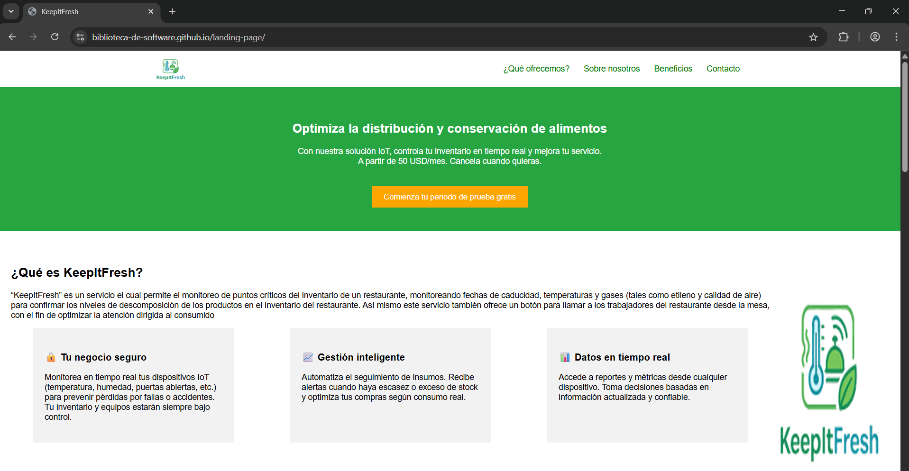
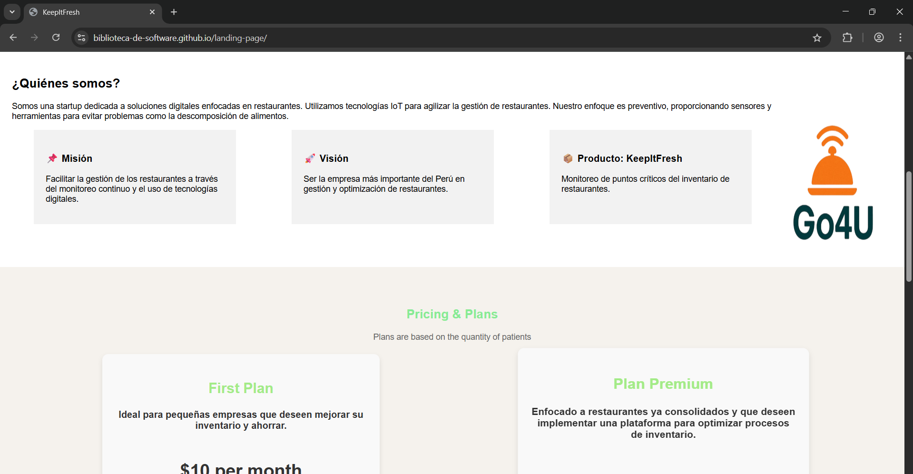
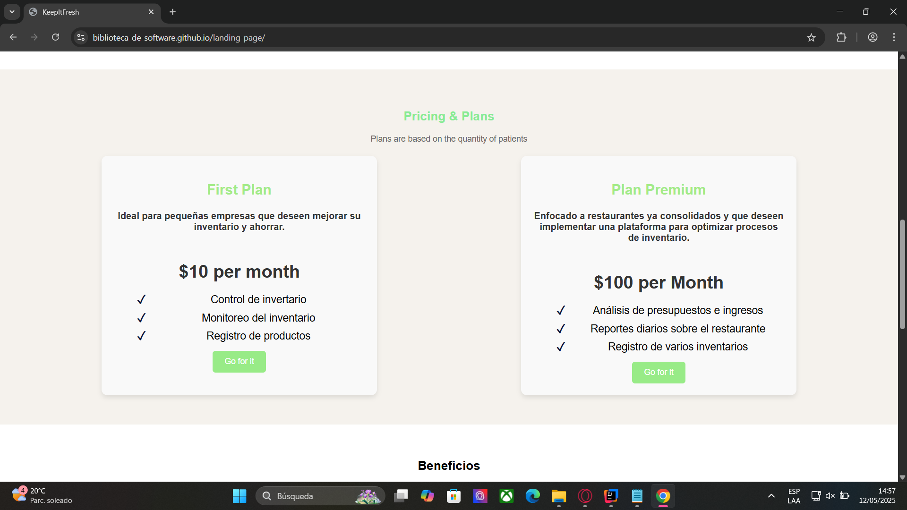
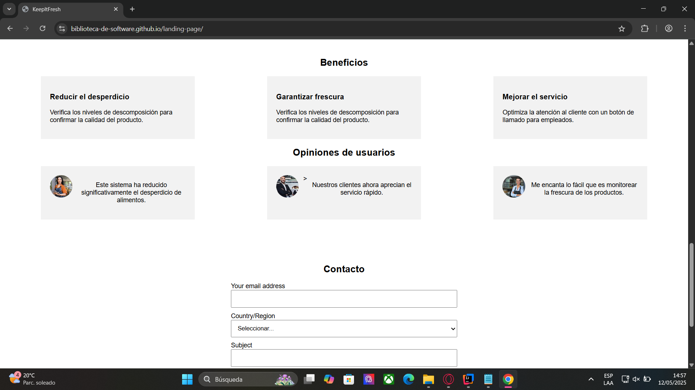
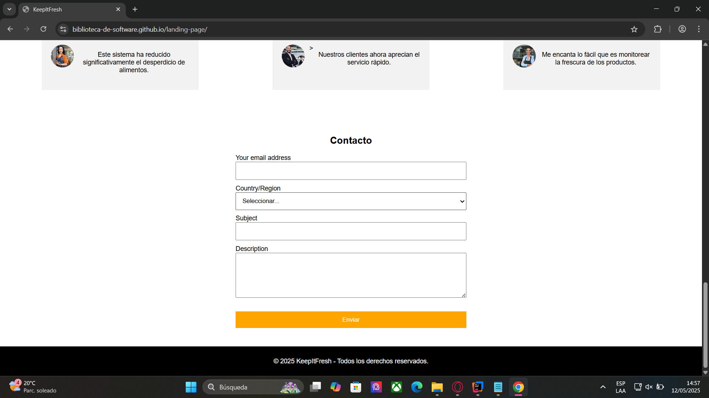

#### Frontend:
El frontend fue realizado de manera grupal utilizando el framework Angular.
A continuación las siguientes imágenes sirven de referencia para evidencia la implementación del frontend.

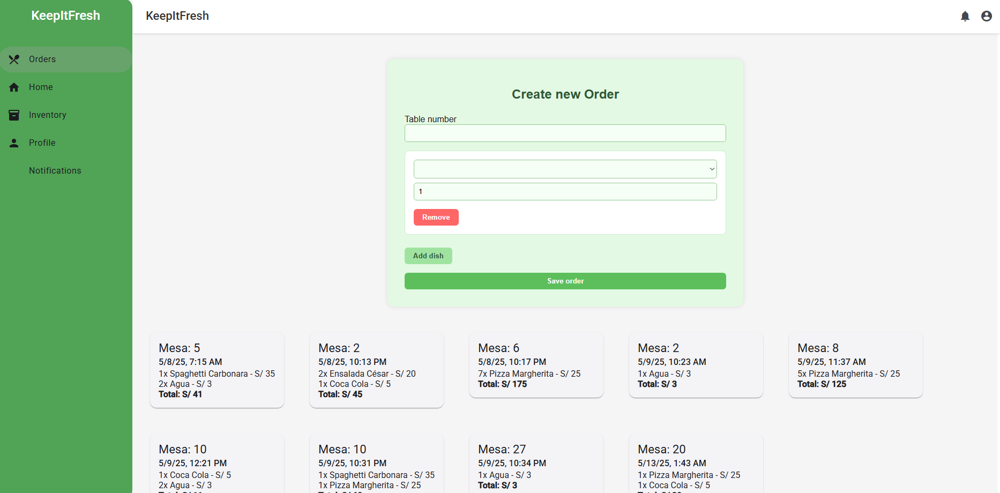
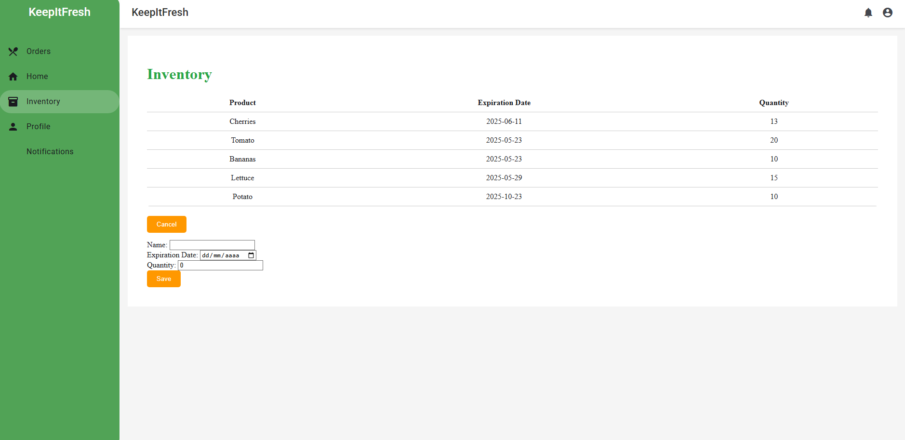
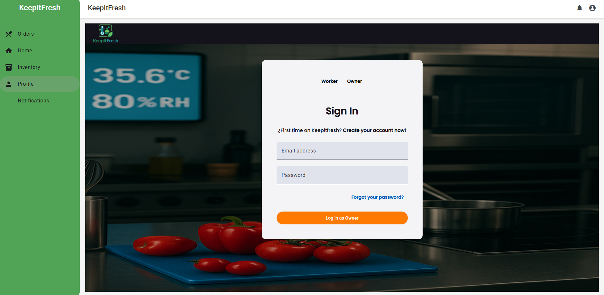
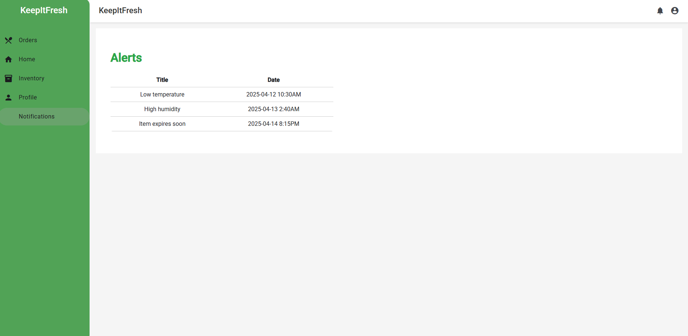

#### Backend:
El backend fue realizado de manera grupal utilizando el framework Spring Boot.
A continuación las siguientes imágenes sirven de referencia para evidencia la implementación del backend.

 

### 5.2.1. Sprint 1

#### 5.2.1.1. Sprint Planning 1.

<table>
<tr>
    <th colspan="5">Sprint 1</th>
    <th colspan="9">Sprint 1</th>
  </tr>
      <tr>
    <td colspan="13">Sprint Planning Background</td>
  </tr>
  <tr>
    <td colspan="5">Date</td>
    <td colspan="8">2025-04-16</td>
</tr>
  <tr>
    <td colspan="5">Time</td>
    <td colspan="8">5:30 PM</td>
  </tr>
  <tr>
    <td colspan="5">Location</td>
    <td colspan="8">Via Discord</td>
<tr>
    <td colspan="5">Prepared By</td>
    <td colspan="8">Ayrton Omar Briceño Llanos</td>
</tr>
<tr>
    <td colspan="5">Attendees (to planning meeting)</td>
    <td colspan="8">Ayrton Omar Briceño Llanos, Maita Falckenheiner Romina Guadalupe, Lang Nassi Werner Khalil, Torres Flores Paolo Alessandro, Mamani Marca Gabriel Cristian.</td>
</tr>
<tr>
    <td colspan="5">Sprint  1 Review Summary</td>
    <td colspan="8">En este primer sprint se asignaron responsabilidades a cada integrante y planteo los requerimientos para el desarrollo de la Landing Page.</td>
</tr>
<tr>
    <td colspan="5">Sprint 1 Retrospective Summary</td>
    <td colspan="8">En esta sección todos los integrantes mencionaron tener aciertos en partes del codigo y en otras partes poder mejorar sus habilidades realizando la Landing Page</td>
</tr>
<tr>
    <td colspan="13">Sprint Goal & User Stories</td>
</tr>
<tr>
    <td colspan="5">Sprint 1 Goal</td>
    <td colspan="8">
Desarrollar y desplegar una landing page que presente información a los usuarios a través de imágenes. La página debe ser completamente adaptable a cualquier tipo de dispositivo que utilicen los usuarios, garantizando una experiencia de usuario fluida y responsiva.</td>
</tr>
</table>

#### 5.2.1.2. Aspect Leaders and Collaborators.

En esta sección se detalla los líderes de cada aspecto. Para el primer Sprint hemos segmentado en 3 aspectos relacionados a los entregables.

| Team member (LastName, First Name) | GitHub UserName | Aspect 1: Landing Page Leader (L) / Collaborator (C) | Aspect 2: Diseños Figma: Leader (L) / Collaborator (C) | Aspect 3: Reporte (L) / Collaborator (C) |
|------------------------------------|-----------------|------------------------------------------------------|--------------------------------------------------------|------------------------------------------|
| Maita Romina                       | RominaMaita     | C                                                    | C                                                      | L                                        |
| Torres Paolo                       | PaleToFo        | L                                                    | C                                                      | L                                        |
| Lang Werner                        | 00WernerLang    | C                                                    | L                                                      | L                                        |
| Briceño Ayrton                     | Ayrton          | C                                                    | L                                                      | L                                        |
| Mamani Gabriel                     | Gabriel0105     | C                                                    | C                                                      | L                                        |

#### 5.2.1.3. Sprint Backlog 1.

|  Sprint 1  |            Sprint 1             |     |                              |                                                                     |                    |             |                                                |
|:----------:|:-------------------------------:|:---:|:----------------------------:|:-------------------------------------------------------------------:|:------------------:|:-----------:|:----------------------------------------------:|
| User Story |        Work-Item / Task         |     |                              |                                                                     |                    |             |                                                |
|     Id     |              Title              | Id  |            Title             |                             Description                             | Estimation (Hours) | Assigned To | Status (To do / In process / To review / Done) |
|    US01    |      Registro de Producto       | W01 | Crear formulario de registro | Diseñar y codificar el formulario para ingresar datos del producto. |         3          |   Ayrton    |                     To do                      |
|    US02    |     Consulta de inventario      | W02 |  Crear vista de inventario   |        Mostrar los productos almacenados y su stock actual.         |         4          |   Romina    |                      Done                      |
|    US03    |       Registro de usuario       | W03 |    Formulario de registro    |      Crear un formulario de registro con validación de datos.       |         3          |   Ayrton    |                   To review                    |
|    US04    |        Inicio de sesión         | W04 |      Interfaz de login       |         Crear pantalla de inicio de sesión con validación.          |         2          |    Paolo    |                   To review                    |
|    US05    |     Alertas de vencimiento      | W05 |  Programar lógica de alerta  |       Generar alertas automáticas según fecha de vencimiento.       |         1          |   Werner    |                      Done                      |
|    US06    | Registro de tiempo de respuesta | W06 |   Medir tiempo de atención   |       Registrar tiempo desde la solicitud hasta la atención.        |         2          |   Gabriel   |                      Done                      |
|    US07    |      Solicitud de atención      | W07 | Crear formulario de atención |       Interfaz para solicitar atención con datos necesarios.        |         2          |   Gabriel   |                   To review                    |
|    US08    |   Resumen general para dueños   | W08 |       Panel de resumen       |     Crear dashboard con métricas clave (ventas, pedidos, etc).      |         2          |    Paolo    |                      Done                      |
|    US09    |  Alertas visuales en dashboard  | W09 |  Integrar alertas al panel   |        Mostrar alertas de demora o alto volumen de pedidos.         |         2          |   Werner    |                   To review                    |
 

#### 5.2.1.4. Development Evidence for Sprint Review.
En esta sección se demuestran los commits relacionados con los principales avances en la implementación.
Estos commits provienen del repositorio del frontend de la organización de GitHub.

🔗 Enlace al repositorio de la Landing Page: https://github.com/Biblioteca-de-Software/landing-page

| Repository                           | Branch | Commit Id                                 | Commit Message                  | Commit Message Body | Commited on (Date) |
|--------------------------------------|--------|-------------------------------------------|---------------------------------|---------------------|--------------------|
| Biblioteca-de-Software/landing-page  | main   | ac5503593079bdd29fcee4682e28a29cac8cc300  | feat(main): basic structure     |                     | 24/4/2025          |
| Biblioteca-de-Software/landing-page  | main   | f0d37bfbf9cd357a095eaea176d9515738bbc38e  | feat: added subscriptions plans |                     | 24/4/2025          |
| Biblioteca-de-Software/landing-page  | main   | 1312725155bd1bafd3abc0682592e7686a26ebd1  | feat: add opinions              |                     | 27/4/2025          |

#### 5.2.1.5. Execution Evidence for Sprint Review.
Este sprint estuvo únicamente enfocado en el desarrollo de la Landing Page. La cual fue programada en el repositorio "landing-page" de nuestra organización de Github.

#### 5.2.1.6. Services Documentation Evidence for Sprint Review.
Como se mencionó previamente, este sprint solo tuvo como objetivo el desarrollo de Landing Page. Aún no se han implementado ni documentado Endpoints con OpenAPI, ya que el desarrollo de los servicios web está planificado para los siguientes Sprints, conforme al roadmap del proyecto.

#### 5.2.1.7. Software Deployment Evidence for Sprint Review.

Durante este Sprint, se completó el desarrollo de la Landing Page y se realizó su despliegue utilizando GitHub Pages como plataforma de publicación gratuita. El objetivo fue contar con una primera versión accesible en línea del producto digital para revisión y retroalimentación.

Actividades realizadas:
Se creó el repositorio en GitHub: https://github.com/Biblioteca-de-Software/landing-page

Se subió el código fuente de la Landing Page, incluyendo los archivos HTML, CSS necesarios.

Se configuró GitHub Pages desde la pestaña Settings > Pages, seleccionando la rama principal y la carpeta raíz.

Se verificó la correcta publicación de la Landing Page en la siguiente URL:

🔗 Landing Page desplegada: https://biblioteca-de-software.github.io/landing-page/

**Evidencia del despliegue:**
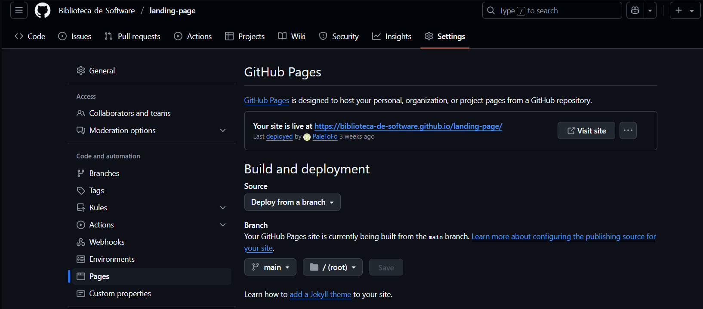

#### 5.2.1.8. Team Collaboration Insights during Sprint.
En esta sección se evidencia la colaboración de cada integrante en el repositorio de la Landing Page.

Cada integrante del equipo contribuyó al desarrollo de la Landing Page, realizando commits y pull requests para implementar las diferentes secciones y funcionalidades. A continuación, se muestran algunos insights del repositorio:
- **Maita Romina:** Implementó la sección de suscripciones y colaboró en el diseño general.
- **Torres Paolo:** Se encargó de la sección de sobre nosotros, contacto y validación de formularios.
- **Mamani Gabriel:** Implementó la sección de opiniones y testimonios de usuarios.

🔗 Repositorio de Landing Page: https://github.com/Biblioteca-de-Software/landing-page

#### Capturas de Insights del repositorio:
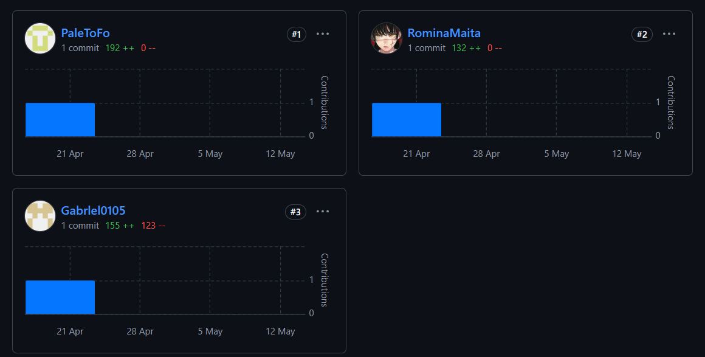

### 5.2.2. Sprint 2
### 5.2.2.1. Sprint Planning 2.

<table>
<tr>
    <th colspan="5">Sprint 2</th>
    <th colspan="9">Sprint 2</th>
  </tr>
      <tr>
    <td colspan="13">Sprint Planning Background</td>
  </tr>
  <tr>
    <td colspan="5">Date</td>
    <td colspan="8">06/05/2025</td>
</tr>
  <tr>
    <td colspan="5">Time</td>
    <td colspan="8">8:00 pm</td>
  </tr>
  <tr>
    <td colspan="5">Location</td>
    <td colspan="8">Via Discord</td>
<tr>
    <td colspan="5">Prepared By</td>
    <td colspan="8">Ayrton Omar Briceño Llanos</td>
</tr>
<tr>
    <td colspan="5">Attendees (to planning meeting)</td>
    <td colspan="8">Ayrton Omar Briceño Llanos, Maita Falckenheiner Romina Guadalupe, Lang Nassi Werner Khalil, Torres Flores Paolo Alessandro, Mamani Marca Gabriel Cristian.</td>
</tr>
<tr>
    <td colspan="5">Sprint  1 Review Summary</td>
    <td colspan="8">En este segundo sprint se definió los procesos necesarios para el desarrollo del frontend y correcciones necesarias de la landing page. Para ello, se asignaron responsabilidades a cada integrante.</td>
</tr>
<tr>
    <td colspan="5">Sprint 1 Retrospective Summary</td>
    <td colspan="8">Los integrantes mencionaron sus habilidades y puntos de mejora con respecto a la programación y diseño del frontend.</td>
</tr>
<tr>
    <td colspan="13">Sprint Goal & User Stories</td>
</tr>
<tr>
    <td colspan="5">Sprint 2 Goal</td>
    <td colspan="8">Desarrollar y desplegar una primera versión del frontend con las características más fundamentales con relación al negocio, con la finalidad de que los usuarios puedan interactuar con una interfaz funcional, validar los flujos principales del sistema y brindar retroalimentación temprana que permita ajustar el desarrollo de las siguientes iteraciones. </td>
</tr>
</table>

#### 5.2.2.2. Aspect Leaders and Collaborators.

En esta sección se detalla los líderes de cada aspecto. Para este segundo sprint se crearon 

| Team member (LastName, First Name) | GitHub UserName | Aspect 1: Landing Page Leader (L) / Collaborator (C) | Aspect 2: Figma Designs: Leader (L) / Collaborator (C) | Aspect 3: Report Leader (L) / Collaborator (C) | Aspect 4: Frontend (L) / Collaborator (C) | Aspect 5: Videos (L) / Collaborator (C) |
|------------------------------------|-----------------|------------------------------------------------------|--------------------------------------------------------|------------------------------------------------|-------------------------------------------|-----------------------------------------|
| Maita Romina                       | RominaMaita     | C                                                    | C                                                      | C                                              | L                                         | C                                       |
| Torres Paolo                       | PaleToFo        | C                                                    | C                                                      | L                                              | C                                         | C                                       |
| Lang Werner                        | 00WernerLang    | C                                                    | L                                                      | C                                              | C                                         | C                                       |
| Briceño Ayrton                     | Ayrton          | L                                                    | C                                                      | C                                              | C                                         | C                                       |
| Mamani Gabriel                     | Gabriel0105     | C                                                    | C                                                      | C                                              | C                                         | L                                       |

#### 5.2.2.3. Sprint Backlog 2.
| User Story ID | Title                               | Task ID | Title                          | Description                                                                                                      | Estimation | Assigned to | Status (To-do) |
|---------------|-------------------------------------|---------|--------------------------------|------------------------------------------------------------------------------------------------------------------|------------|-------------|----------------|
| US13          | Registro de Producto                | T01     | Crear formulario de registro   | Crear formulario en el frontend para registrar productos con nombre, categoría, cantidad y fecha de vencimiento. | 3h         | Paolo       | Done           |
|               |                                     | T02     | Configurar servicio HTTP       | Implementar servicio Angular para enviar los datos del producto al backend (JSON Server).                        | 2h         | Paolo       | Done           |
| US14          | Consulta de inventario              | T03     | Crear vista de inventario      | Desarrollar una página que muestre todos los productos registrados usando PrimeVue o Angular Material.           | 3h         | Paolo       | Done           |
| US15          | Alertas de vencimiento              | T06     | Mostrar alerta visual          | Mostrar alertas visuales (badge o toast) para productos próximos a vencer.                                       | 2h         | Paolo       | Done           |
| US16          | Ingresar nuevo pedido para una mesa | T07     | Creación de formulario         | Crear un formulario donde el trabajador del restaurante puede ingresar los pedidos de acuerdo al menú del día.   | 3h         | Paolo       | Done           |
|               |                                     | T08     | Validación y guardado          | Validar campos y guardar pedidos en el JSON Server.                                                              | 2h         | Romina      | Done           |
| US19          | Visualizar los pedidos por mesa     | T09     | Creación de cards de cada mesa | Crear cards que muestren las órdenes por mesa obtenidas desde el db.json.                                        | 3h         | Romina      | Done           |
|               |                                     | T12     | Enviar notificación            | Mostrar resumen al usuario mediante toast o modal al iniciar sesión cada día.                                    | 2h         | Werner      | Done           |
|               | Historial de alertas                | T13     | Guardar alertas en el backend  | Modificar backend (db.json) para almacenar historial de alertas de vencimiento.                                  | 2h         | Werner      | Done           |
|               |                                     | T14     | Mostrar historial al usuario   | Crear vista donde se pueda ver el historial de alertas con fecha y producto relacionado.                         | 2.5h       | Werner      | Done           |
| US24          | Reportes de ventas                  | T15     | Calcular totales de ventas     | Calcular ventas por día, semana o mes a partir de los pedidos registrados.                                       | 3h         | Ayrton      | Done           |
|               |                                     | T16     | Crear gráficos de reportes     | Mostrar resultados en gráficos usando alguna librería como Chart.js o ngx-charts.                                | 2.5h       | Ayrton      | Done           |
| US13          | Registro de usuario                 | T17     | Crear formulario de registro   | Crear formulario con campos como nombre, email, rol y contraseña.                                                | 2.5h       | Gabriel     | Done           |
|               |                                     | T18     | Guardar datos en backend       | Usar servicio HTTP para registrar usuario en el backend simulado.                                                | 2h         | Gabriel     | Done           |
| US15          | Inicio de sesión                    | T19     | Crear formulario de login      | Crear formulario de inicio de sesión con validación.                                                             | 2h         | Gabriel     | Done           |
|               |                                     | T20     | Verificar credenciales         | Comparar email y contraseña con lo almacenado en JSON Server y redirigir si es correcto.                         | 2h         | Gabriel     | Done           |

#### 5.2.2.4. Development Evidence for Sprint Review.
En esta sección se demuestran los commits relacionados con los principales avances en la implementación.
Estos commits provienen del repositorio del frontend de la organización de GitHub.

🔗 Enlace al repositorio del frontend: https://github.com/Biblioteca-de-Software/frontend

| Repository                       | Branch                 | Commit Id                                | commit Message                                                         | Commit Message Body | Commited on (Date) |
|----------------------------------|------------------------|------------------------------------------|------------------------------------------------------------------------|---------------------|--------------------|
| Biblioteca-de-Software/frontend  | feature/inventory      | 511a28fc33a708a84805bdb0b51526931a4acd77 | feat(inventory): add inventory entities.                               |                     |                    |
| Biblioteca-de-Software/frontend  | feature/inventory      | 7d9aee295dedaea2622e7e68466a5ee36be04dcc | feat(inventory): add inventory services.                               |                     |                    |
| Biblioteca-de-Software/frontend  | feature/inventory      | 3f49d70cbc19da5d44b5ed65bb4159d94be42f51 | feat(inventory): add inventory components.                             |                     |                    |
| Biblioteca-de-Software/frontend  | feature/orders         | 19e93de97fde7839a4f5c8c3bac2f5117eb9cca9 | feat(order): add order form component.                                 |                     | 09/05/2025         |
| Biblioteca-de-Software/frontend  | feature/orders         | d050f5b9c193e3c64e936f4b868b04dc640f7f43 | feat(order): add order page component.                                 |                     | 09/05/2025         |
| Biblioteca-de-Software/frontend  | feature/orders         | 1afe4f2d4c61966ed03286e5b2dabef5e78b8720 | feat(order): add order list component.                                 |                     | 09/05/2025         |
| Biblioteca-de-Software/frontend  | feature/orders         | 2913232089867f2da8fc86bb9f2c21e64637b48c | feat(order): add order response and assembler.                         |                     | 09/05/2025         |
| Biblioteca-de-Software/frontend  | feature/notifications  | 7e2b469de1cfe2d9eeb15b16dcea0a6029579b6b | feat(notification): add clickable notification.                        |                     | 12/05/2025         |
| Biblioteca-de-Software/frontend  | feature/notifications  | 0b0266c554c3a1c88d5c7425f6ff34f335403d8f | feat(notification): add notification filter for workers and inventory. |                     | 12/05/2025         |
| Biblioteca-de-Software/frontend  | feature/notifications  | 645fe146147833215d3470f41ac565c78cf89764 | feat(notification): add notification database example and route.       |                     | 12/05/2025         |

#### 5.2.2.5. Execution Evidence for Sprint Review.
Para este sprint se desarrolló una primera versión del frontend con el framework Angular.
A continuación, se evidencian las imágenes del frontend.

#### 5.2.2.6. Services Documentation Evidence for Sprint Review.
Durante el desarrollo del frontend de la aplicación, se utilizó JSON Server como una API falsa (fake API) con el objetivo de simular las funcionalidades del backend. Esta decisión se tomó debido a que el backend aún no se encuentra implementado. JSON Server permitió crear un entorno de pruebas funcional que responde a peticiones HTTP (GET, POST, PUT, DELETE) como lo haría un servidor real, utilizando un archivo db.json como fuente de datos persistente. Gracias a esto, fue posible desarrollar, probar y validar las interfaces de usuario y los servicios del frontend de manera efectiva, manteniendo una arquitectura desacoplada y preparada para integrarse con el backend real en el futuro.

#### 5.2.2.7. Software Deployment Evidence for Sprint Review.

#### Frontend Web Application
El frontend se desplegó utilizando la herramienta Netlify.

**Pasos de despliegue:**
1. Build del proyecto: Generar los archivos estáticos de producción (ng build --configuration=production)
2. Verificar que el proyecto esté completado en la rama develop.
3. Creación de cuenta en Netlify
4. Click en "Add new site" → "Import an existing project" y elegir el repositorio y rama (develop)
5. Configurar build:
- Build command: ng build --configuration=production
- Publish directory: dist/nombre-de-tu-app

**Repositorio:** https://github.com/Biblioteca-de-Software/frontend  
**URL desplegada:** http://keepitfresh.netlify.app

#### 5.2.2.8. Team Collaboration Insights during Sprint.
En esta sección se evidencia la colaboración de cada integrante en el repositorio de la Landing Page.
🔗 Repositorio de Frontend: https://github.com/Biblioteca-de-Software/frontend

#### Capturas de Insights del repositorio:

Cada integrante del equipo contribuyó al desarrollo del frontend, realizando commits y pull requests para implementar las diferentes secciones y funcionalidades. A continuación, se muestran algunos insights del repositorio:
- **Maita Romina:** Implementó la sección de órdenes.
- **Torres Paolo:** Se encargó de la sección de inventario.
- **Mamani Gabriel:** Implementó la sección de perfil de usuario y autenticación.
- **Lang Werner:** Implementó la sección de reportes y notificaciones.
- **Briceño Ayrton:** Implementó la sección de reportes y notificaciones.
- **Nakasone Marco:** Colaboró en la implementación del bounded context Subscriptions.

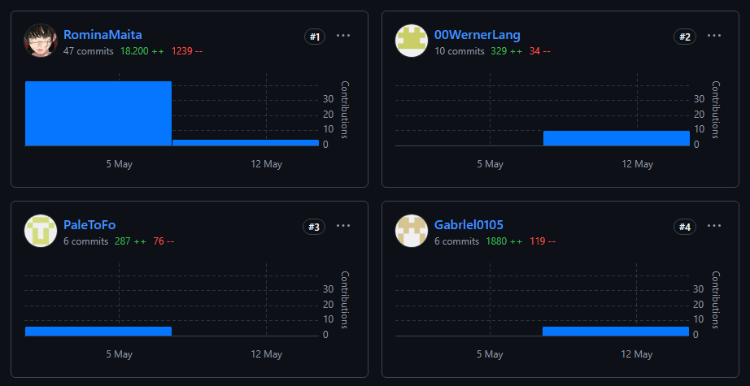

### 5.2.3. Sprint 3
Esta sección detalla el tercer sprint del proyecto KeepItFresh, donde se implementaron las funcionalidades de pedidos, reportes, inventario, manejo de perfiles y suscripciones, así como la integración con el frontend. Se utilizó JSON Server como una API falsa para simular el backend y permitir el desarrollo del frontend de manera independiente.

Para la planificación de este sprint utilizamos Trello como herramienta de gestión de tareas, permitiendo una mejor organización y seguimiento del progreso del equipo. Las tareas se dividieron en historias de usuario y se asignaron a los miembros del equipo según sus habilidades y disponibilidad.

#### 5.2.3.1. Sprint Planning 3.
A continuación se detalla el acta de planificación del tercer sprint, donde se definieron los objetivos y tareas a realizar.
<table>
<tr>
    <th colspan="5">Sprint 3</th>
    <th colspan="9">Sprint 3</th>
  </tr>
      <tr>
    <td colspan="13">Sprint Planning Background</td>
  </tr>
  <tr>
    <td colspan="5">Date</td>
    <td colspan="8">07/06/2025</td>
</tr>
  <tr>
    <td colspan="5">Time</td>
    <td colspan="8">8:00 pm</td>
  </tr>
  <tr>
    <td colspan="5">Location</td>
    <td colspan="8">Via Discord</td>
<tr>
    <td colspan="5">Prepared By</td>
    <td colspan="8">Ayrton Omar Briceño Llanos</td>
</tr>
<tr>
    <td colspan="5">Attendees (to planning meeting)</td>
    <td colspan="8">Ayrton Omar Briceño Llanos, Maita Falckenheiner Romina Guadalupe, Lang Nassi Werner Khalil, Torres Flores Paolo Alessandro, Mamani Marca Gabriel Cristian, Nakasone Gomes Marco Antonio.</td>
</tr>
<tr>
    <td colspan="5">Sprint  3 Review Summary</td>
    <td colspan="8">En esta reunión se planificaron las tareas a realizar para el desarrollo del backend así como también, se establecieron fechas límites para la entrega con la finalidad de reservar tiempo para las pruebas unitarias y el despliegue.</td>
</tr>
<tr>
    <td colspan="5">Sprint 3 Retrospective Summary</td>
    <td colspan="8">Los integrantes mencionaron sus habilidades y puntos de mejora con respecto a la programación y diseño del backend, además establecimos confianza para crear un entorno colaborativo y con comunicación activa..</td>
</tr>
<tr>
    <td colspan="13">Sprint Goal & User Stories</td>
</tr>
<tr>
    <td colspan="5">Sprint 3 Goal</td>
    <td colspan="8">Nos centramos en desarrollar un sistema funcional para la gestión de procesos en restaurantes.
Durante este sprint, nuestro enfoque está en implementar los módulos esenciales del sistema que permiten a los usuarios registrarse, gestionar suscripciones, realizar pagos, registrar pedidos, controlar inventario y generar reportes.
Creemos que esto nos permitirá establecer la base operativa del sistema, optimizando procesos internos y brindando una experiencia funcional inicial tanto para usuarios como para administradores.
El éxito de este sprint se confirmará cuando los usuarios puedan suscribirse y pagar, gestionar órdenes por mesa, registrar y consultar inventario, generar reportes, y autenticarse mediante una cuenta de usuario, validado mediante interacciones reales con el frontend y llamadas exitosas a los endpoints del backend.
 </td>
</tr>
</table>

#### 5.2.3.2. Aspect Leaders and Collaborators.
En esta sección se detalla los líderes de cada aspecto. Para este tercer sprint se crearon 3 aspectos relacionados a los entregables.

| Team member (LastName, First Name) | GitHub UserName | Aspect 1: Inventory (L) / Collaborator (C) | Aspect 2: Orders (L) / Collaborator (C) | Aspect 3: Reports (L) / Collaborator (C) | Aspect 4: Subscriptions (L) / Collaborator (C) | Aspect 5: User Management (L) / Collaborator (C) |
|------------------------------------|-----------------|--------------------------------------------|-----------------------------------------|------------------------------------------|------------------------------------------------|--------------------------------------------------|
| Maita Romina                       | RominaMaita     | C                                          | L                                       | C                                        | C                                              | C                                                |
| Torres Paolo                       | PaleToFo        | L                                          | C                                       | C                                        | C                                              | C                                                |
| Lang Werner                        | 00WernerLang    | C                                          | C                                       | L                                        | C                                              | C                                                |
| Briceño Ayrton                     | Ayrton          | C                                          | C                                       | L                                        | C                                              | C                                                |
| Mamani Gabriel                     | Gabriel0105     | C                                          | C                                       | C                                        | C                                              | L                                                |
| Nakasone Marco                     | marquinho04     | C                                          | C                                       | C                                        | L                                              | C                                                |

#### 5.2.3.3. Sprint Backlog 3.
Para el tercer sprint se definieron las siguientes historias de usuario y tareas relacionadas con el desarrollo del backend y la integración con el frontend. Se utilizaron los principios de DDD (Domain-Driven Design) para estructurar el código y mantener una separación clara de responsabilidades. Las tareas fueron agrupadas y detalladas gracias a la buena organizacion del equipo y el correcto uso de la herramienta Trello.

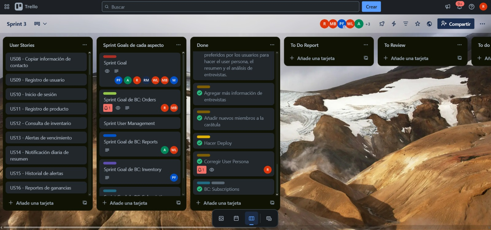

🔗 Enlace al tablero de Trello: https://trello.com/b/OFzWqryU/sprint-3 

| User Story |                                                                          | Work-item/task |                                                                                       |                                                                                                                                                                                                                                     |            |                |                |
|------------|--------------------------------------------------------------------------|----------------|---------------------------------------------------------------------------------------|-------------------------------------------------------------------------------------------------------------------------------------------------------------------------------------------------------------------------------------|------------|----------------|----------------|
| ID         | Title                                                                    | ID             | Title                                                                                 | Description                                                                                                                                                                                                                         | Estimation | Assigned to    | Status (To-do) |
| TS1        | Ingresar nuevo pedido para una mesa a través de un RESTful API           | TKS1           | Definir entidad dominio Order                                                         | Diseñar la entidad Order en el dominio con atributos: orderId, restaurantId, tableNumber, createdAt, total, y lista de platos con cantidades y subtotales.                                                                          | 3h         | Romina         | Done           |
|            |                                                                          | TSK2           | Definir repositorio para Orders                                                       | Crear interfaz y clase repositorio que permita consultar pedidos filtrados por restaurante y agruparlos por mesa.                                                                                                                   | 4h         | Romina         | Done           |
|            |                                                                          | TSK3           | Implementar servicio para obtener pedidos agrupados                                   | Crear la lógica en la capa de servicio para obtener pedidos con sus platos y agruparlos por número de mesa. Aplicar patrones DDD para mantener separación de responsabilidades.                                                     | 4h         | Romina         | Done           |
|            |                                                                          | TSK4           | Crear controlador REST para GET /api/v1/orders                                        | Implementar el endpoint que llame al servicio y devuelva respuesta con estado 200 y estructura JSON de pedidos agrupados por mesa.                                                                                                  | 2h         | Romina         | Done           |
|            |                                                                          | TSK5           | Validar respuesta vacía                                                               | Asegurar que el endpoint retorne lista vacía si no hay pedidos en la base.                                                                                                                                                          | 4h         | Romina         | Done           |
| TS2        | Visualizar los pedidos por mesa a través de un RESTful API               | TSK6           | Definir DTO para crear pedido                                                         | Crear un objeto de transferencia (DTO) que contenga los datos esperados en la petición: restaurantId, tableNumber, lista de platos con dishId y quantity.                                                                           | 4h         | Romina         | Done           |
|            |                                                                          | TSK7           | Implementar validación existencia restaurante                                         | En la capa de servicio, validar que el restaurantId existe en la base de datos antes de proceder con la creación del pedido.                                                                                                        | 3h         | Romina         | Done           |
|            |                                                                          | TSK8           | Validar cantidades de platos                                                          | Validar que las cantidades de platos sean mayores a cero y no nulas. Retornar error 400 en caso contrario.                                                                                                                          | 3h         | Romina         | Done           |
|            |                                                                          | TSK9           | Implementar lógica para cálculo de totales                                            | Calcular el subtotal de cada plato multiplicando cantidad por precio, sumar subtotales para obtener el total del pedido.                                                                                                            | 4h         | Romina         | Done           |
|            |                                                                          | TSK10          | Implementar repositorio para guardar pedido                                           | Crear lógica para guardar pedido en tabla orders y sus platos relacionados en orders_dishes. Asegurar manejo transaccional.                                                                                                         | 4h         | Romina         | Done           |
|            |                                                                          | TSK11          | Crear controlador REST para POST /api/v1/orders                                       | Implementar endpoint que reciba el DTO, valide y cree el pedido, retornando estado 201 y el recurso creado.                                                                                                                         | 4h         | Romina         | Done           |
| TS3        | Obtener los insumos del inventario a través de un RESTful API            | TSK12          | Implementar servicio para obtener la información de los insumos.                      | Crear la lógica en la capa de servicio para obtener información de los insumos del inventario y añadirlo a los gastos. Aplicar patrones DDD para mantener separación de responsabilidades.                                          | 2h         | Marco          | Done           |
|            |                                                                          | TSK13          | Crear controlador REST para GET /api/v1/inventory                                     | Implementar el endpoint que llame al servicio y devuelva respuesta con estado 200 y estructura JSON de insumos previamente agregados.                                                                                               | 3h         | Marco          | Done           |
|            |                                                                          | TSK14          | Validar respuesta vacía.                                                              | Asegurar que el endpoint retorne lista vacía si no hay insumos en el inventario.                                                                                                                                                    | 3h         | Marco          | Done           |
| TS4        | Añadir los insumos y su información a través de un RESTful API           | TSK15          | Definir DTO para agregar insumo.                                                      | Crear un objeto de transferencia (DTO) que contenga los datos esperados en la petición: product_Id, nombre del insumo, fecha de vencimiento y stock.                                                                                | 2h         | Paolo          | Done           |
|            |                                                                          | TSK16          | Validar cantidad de insumos.                                                          | Validar que las cantidades de los insumos ingresados sean mayores a cero y no nulas. Retornar error 400 en caso contrario.                                                                                                          | 3h         | Paolo          | Done           |
|            |                                                                          | TSK17          | Crear controlador REST para POST /api/v1/inventory                                    | Implementar endpoint que reciba el DTO, valide y cree el insumo, retornando estado 201 y el recurso creado                                                                                                                          | 3h         | Paolo          | Done           |
| TS5        | Inicio de sesión de usuarios a través de RESTful API                     | TSK18          | Definir DTO LoginRequest                                                              | Crear un DTO que reciba email y password como datos obligatorios para la autenticación.                                                                                                                                             | 4h         | Gabriel Mamani | Done           |
|            |                                                                          | TSK19          | Implementar lógica de validación                                                      | Validar que el email esté registrado y que la contraseña coincida, usando hash seguro                                                                                                                                               | 3h         | Gabriel Mamani | Done           |
|            |                                                                          | TSK20          | Crear controlador REST POST /api/v1/auth/login                                        | Implementar el endpoint que reciba el DTO, valide credenciales, y retorne estado 200 con el token generado                                                                                                                          | 1h         | Gabriel Mamani | Done           |
| TS6        |                                                                          | TSK21          | Manejar errores de autenticación                                                      | Retornar estado 401 con mensaje claro si las credenciales son inválidas.                                                                                                                                                            | 2h         | Gabriel Mamani | Done           |
|            | Registro de usuarios a través de RESTful API                             | TSK22          | Definir DTO RegisterRequest                                                           | Crear un DTO con los campos requeridos para registro: fullName, email, password, confirmPassword.                                                                                                                                   | 1h         | Gabriel Mamani | Done           |
|            |                                                                          | TSK23          | Validar formato y unicidad de email                                                   | Verificar que el email tenga formato válido y que no esté previamente registrado                                                                                                                                                    | 3h         | Gabriel Mamani | Done           |
| TS7        |                                                                          | TSK24          | Encriptar contraseña                                                                  | Utilizar algoritmo seguro (e.g., bcrypt) para almacenar la contraseña en forma de hash                                                                                                                                              | 4h         | Gabriel Mamani | Done           |
|            |                                                                          | TSK25          | Crear entidad User                                                                    | Diseñar la entidad User con campos necesarios y reglas de negocio del sistema                                                                                                                                                       | 1h         | Gabriel Mamani | Done           |
|            |                                                                          | TSK26          | Crear controlador REST POST /api/v1/auth/register                                     | Implementar endpoint que reciba el DTO, valide los datos y registre el usuario con estado 201.                                                                                                                                      | 2h         | Gabriel Mamani | Done           |
| TS8        | Obtener información y descripción de reportes a través de un RESTful API | TSK27          | Validar respuesta vacía para reportes                                                 | Asegurar que el endpoint retorne { “data”: [] } con status 200 cuando no hay reportes                                                                                                                                               | 2h         | Werner Lang    | Done           |
|            |                                                                          | TSK28          | Crear controlador REST para GET /api/v1/reports                                       | Implementar el endpoint que acepte el query param ?type=<value>. Llame al servicio y retorne respuesta con status y Cuerpo JSON                                                                                                     | 2h         | Werner Lang    | Done           |
|            |                                                                          | TSK29          | Implementar manejo de errores (500) en reportes                                       | Capturar errores de base de datos y retornar Status 500 y Cuerpo { “error”: “Servicio no disponible”}                                                                                                                               | 3h         | Werner Lang    | Done           |
| TS9        |                                                                          | TSK30          | Implementar servicio para listar reportes                                             | Crear lógica en la capa de servicio para consultar reportes (con/sin filtro por type).                                                                                                                                              | 4h         | Werner Lang    | Done           |
|            | Añadir nuevos reportes a través de un RESTful API                        | TSK31          | Definir DTO para crear reporte                                                        | Crear un DTO que contenga los datos requeridos en la petición POST: reportTitle description, category, createdBy, createdAt.                                                                                                        | 3h         | Ayrton Briceño | Done           |
|            |                                                                          | TSK32          | Validar campos requeridos                                                             | Validar que los campos title, description, category y createdBy estén presentes y no sean nulos. Retornar error 409 si falta alguno.                                                                                                | 2h         | Ayrton Briceño | Done           |
| TS10       |                                                                          | TSK33          | Validar formato y longitud del título                                                 | Antes de guardar el reporte, validar que el campo category corresponde a una categoría válida del sistema (por ejemplo: "ganancias", "gastos", "pérdidas".). Si no coincide, retornar error 409 con mensaje: "Categoría no válida." | 3h         | Ayrton Briceño | Done           |
|            |                                                                          | TSK34          | Registrar fecha automática si no se envía                                             | Si no se incluye createdAt en la petición, asignar la fecha y hora actual antes de guardar el reporte.                                                                                                                              | 2h         | Ayrton Briceño | Done           |
|            |                                                                          | TSK35          | Crear controlador REST para POST /api/v1/reports                                      | Implementar un endpoint que reciba el DTO, valide y cree el reporte, retornando estado 201 y lo pedido.                                                                                                                             | 2h         | Ayrton Briceño | Done           |
| US21       |                                                                          | TSK36          | Diseñar interfaz de visualización de planes (nombre, precio, beneficios)              | Crear pantalla que muestre nombre, precio y beneficios de cada plan.                                                                                                                                                                | 3h         | Marco Nakasone | Done           |
| US22       |                                                                          | TSK37          | Formulario de selección con validación                                                | Desarrollar formulario para elegir plan y validar correo electrónico.                                                                                                                                                               | 3h         | Marco Nakasone | Done           |
|            |                                                                          | TSK38          | Redirección a pago (Stripe)                                                           | Enviar datos Stripe al completar el formulario o bloquear si faltan datos.                                                                                                                                                          | 3h         | Marco Nakasone | Done           |
|            |                                                                          | TSK39          | Diseñar interfaz de visualización de planes (nombre, precio, beneficios)              | Crear pantalla que muestre nombre, precio y beneficios de cada plan.                                                                                                                                                                | 3h         | Marco Nakasone | Done           |
| TS11       |                                                                          | TSK40          | Configurar endpoint GET /api/subscriptions para retornar lista de suscripciones       | Crear API que retorne lista de suscripciones con ID, email, nombre y estado.                                                                                                                                                        | 3h         | Marco Nakasone | Done           |
|            |                                                                          | TSK41          | Implementar manejo de respuesta vacía cuando no hay datos                             | Asegurar que el endpoint responda correctamente si no hay suscripciones.                                                                                                                                                            | 2h         | Marco Nakasone | Done           |
| TS12       |                                                                          | TSK42          | Configurar webhook para eventos checkout.session.completed y actualizar suscripciones | Actualizar estado de suscripciones al recibir evento checkout.session.completed.                                                                                                                                                    | 4h         | Marco Nakasone | Done           |
|            |                                                                          | TSK43          | Implementar validación de firma y filtrado de eventos no soportados                   | RIgnorar eventos con firma inválida o tipos no soportados.                                                                                                                                                                          | 3h         | Marco Nakasone | Done           |
| TS13       |                                                                          | TSK44          | Crear endpoint DELETE /api/webhooks/stripe/delete-all para limpieza en desarrollo     | Crear función para eliminar todas las suscripciones de prueba.                                                                                                                                                                      | 2h         | Marco Nakasone | Done           |
|            |                                                                          | TSK45          | Manejar errores durante eliminación (respuesta 500)                                   | Retornar error 500 si falla el borrado masivo.                                                                                                                                                                                      | 2h         | Marco Nakasone | Done           |

#### 5.2.3.4. Development Evidence for Sprint Review.
En esta sección se demuestran los commits relacionados con los principales avances en la implementación.
Estos commits provienen del repositorio del backend de la organización de GitHub.

🔗 Enlace al repositorio del backend: https://github.com/Biblioteca-de-Software/KeepItFresh-platform  

| Repository                                    | Branch                 | Commit Id                                | commit Message                                    | Commit Message Body | Commited on (Date) |
|-----------------------------------------------|------------------------|------------------------------------------|---------------------------------------------------|---------------------|--------------------|
| Biblioteca-de-Software/KeepItFresh-platform   | feature/inventory      | 9a24545c69pra91e232fe6ef13f4a0e34mau820s | fear(inventory): add products controller.         |                     | 15/06/2025         |
| Biblioteca-de-Software/KeepItFresh-platform   | feature/reports        | 9b74bak7402ndla0q99237najd9219347197dns9 | feat(reports): add reports controller.            |                     | 18/06/2025         |
| Biblioteca-de-Software/KeepItFresh-platform   | feature/orders         | 9a38045c69eca91e232fe6ef13f4a0e2254c472c | feat(orders): add get mapping by id operation.    |                     | 17/06/2025         |
| Biblioteca-de-Software/KeepItFresh-platform   | feature/orders         | 93bbd7df7dfad5306755ec79b2df64ff9b7a5248 | feat(orders): add dishes controller.              |                     | 16/06/2025         |
| Biblioteca-de-Software/KeepItFresh-platform   | feature/subscriptions  | 9bnasl72736294dhakd827362hds80932jks982s | feat(subscription): add subscriptions controller. |                     | 17/06/2025         |
| Biblioteca-de-Software/KeepItFresh-platform   | feature/userManagement | 9a2jeek2nmcnwk29383028392dmwo93831dk193u | feat(userManagement): add users controller.       |                     | 17/06/2025         |

#### 5.2.3.5. Execution Evidence for Sprint Review.

Para este sprint se desarrolló una segunda versión del frontend con el framework Angular.
A continuación, se evidencian las imágenes del frontend.

 
 

**Repositorio:** https://github.com/Biblioteca-de-Software/frontend  
**URL desplegada:** http://keepitfresh.netlify.app

 
 

Para este sprint se desarrolló una primera versión del backend con Springboot.
A continuación, se evidencian las imágenes del backend configurado en Azure.

 
 

**Repositorio:** https://github.com/Biblioteca-de-Software/KeepItFresh-platform  
**URL desplegada:** https://keepitfresh-platform-yrav.onrender.com  

#### 5.2.3.6. Services Documentation Evidence for Sprint Review.

Durante el desarrollo del backend de la aplicación, se generaron los siguientes servicios RESTful para las funcionalidades del sistema. Estos servicios permiten la interacción con el frontend y la gestión de datos en la base de datos.

| Service Name          | HTTP Method | Endpoint                               | Description                                                            |
|-----------------------|-------------|----------------------------------------|------------------------------------------------------------------------|
| Orders Service        | GET         | /api/v1/orders                         | Obtiene los pedidos agrupados por mesa.                                |
|                       | POST        | /api/v1/orders                         | Crea un nuevo pedido para una mesa.                                    |
| Inventory Service     | GET         | /api/v1/products                       | Obtiene la información de los insumos del inventario.                  |
|                       | POST        | /api/v1/products                       | Añade un nuevo insumo al inventario.                                   |
| User Management       | POST        | /api/v1/auth/login                     | Inicia sesión de usuario y devuelve un token de autenticación.         |
|                       | POST        | /api/v1/auth/register                  | Registra un nuevo usuario en el sistema.                               |
| Reports Service       | GET         | /api/v1/reports                        | Obtiene los reportes del sistema, filtrados por tipo si se especifica. |
|                       | POST        | /api/v1/reports                        | Crea un nuevo reporte en el sistema.                                   |
| Subscriptions Service | POST        | /api/v1/subscriptions                  | Crea una nueva suscripción para un usuario.                            |
|                       | GET         | /api/v1/subscriptions/{userId}         | Obtiene las suscripciones activas de un usuario específico.            |
|                       | DELETE      | /api/v1/subscriptions/{subscriptionId} | Cancela una suscripción específica.                                    |

#### 5.2.3.7. Software Deployment Evidence for Sprint Review.

#### Frontend Web Application
El frontend se desplegó utilizando la herramienta Netlify.

**Pasos de despliegue:**
1. Build del proyecto: Generar los archivos estáticos de producción (ng build --configuration=production)
2. Verificar que el proyecto esté completado en la rama develop.
3. Creación de cuenta en Netlify
4. Click en "Add new site" → "Import an existing project" y elegir el repositorio y rama (develop)
5. Configurar build:
- Build command: ng build --configuration=production
- Publish directory: dist/nombre-de-tu-app

**Repositorio:** https://github.com/Biblioteca-de-Software/frontend  
**URL desplegada:** http://keepitfresh.netlify.app

#### Restful API

Los servicios backend serán desarrollados en **Java (Spring Boot)** más adelante.

##### Backend Web Service
El backend se desplegó utilizando la plataforma Azure App Service.

**Pasos de despliegue:**

1. Build del proyecto: Generar el archivo ejecutable .jar usando el comando ./mvnw clean package.
2. Verificar que el proyecto esté completado en la rama develop.
3. Crear una cuenta en Azure e iniciar sesión mediante Azure CLI (az login).
4. Crear un grupo de recursos en Azure desde el portal o CLI.
5. Crear un App Service Plan con sistema operativo Windows y runtime Java 21.
6. Crear una instancia de Web App con soporte para Java (por ejemplo: JAVA|21-java21).
7. Realizar el despliegue del archivo .jar mediante la opción ZIP Deploy usando el portal o CLI.
8. Configurar variables de entorno necesarias para perfiles de Spring, conexión a base de datos, etc.
9. Probar el servicio en la URL pública proporcionada por Azure App Service.

**Repositorio:** https://github.com/Biblioteca-de-Software/KeepItFresh-platform  
**URL desplegada:** https://keepitfresh-platform-yrav.onrender.com  

#### 5.2.3.8. Team Collaboration Insights during Sprint.

A continuación se evidencia la colaboración de cada integrante en el repositorio del frontend y backend.

- Frontend:

A continuación se evidencia la colaboración de cada integrante en el repositorio del frontend.

- **Paolo Torres**: Implementación de inventario en el frontend.
- **Ayrton Briceño**: Implementación de reportes en el frontend.
- **Gabriel Mamani**: Implementación de profile en el frontend.
- **Werner Lang**: Implementación de notificaciones en el frontend.
- **Romina Maita**: Implementación de órdenes en el frontend.
- **Marco Nakasone**: Implementación de suscripciones en el frontend.

**URL desplegada:** http://keepitfresh.netlify.app  
🔗 Repositorio del Frontend: https://github.com/Biblioteca-de-Software/frontend  

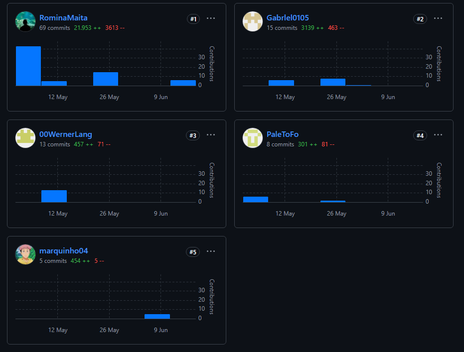

- Backend:

A continuación se evidencia la colaboración de cada integrante en el repositorio del backend.
- **Paolo Torres**: Implementación de backend de inventario en el backend. 
- **Ayrton Briceño**: Implementación de backend de reportes en el backend. 
- **Gabriel Mamani**: Implementación de backend de usuarios en el backend. 
- **Werner Lang**: Implementación de backend de reportes en el backend.  
- **Romina Maita**: Implementación de backend de órdenes en el backend. 
- **Marco Nakasone**: Implementación de backend de suscripciones en el backend. 

 

**URL desplegada**: https://keepitfresh-platform-yrav.onrender.com   

🔗 Repositorio del Backend: https://github.com/Biblioteca-de-Software/KeepItFresh-platform  
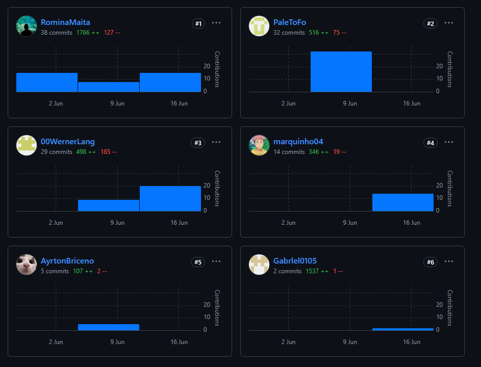

### 5.2.4. Sprint 4
Esta sección detalla el cuarto sprint del proyecto KeepItFresh, donde se reestructuraron las funcionalidades de pedidos, reportes, inventario, manejo de perfiles y suscripciones, así como la integración con el frontend con backend mediante el despliegue del mismo.

Para la planificación de este sprint utilizamos Trello como herramienta de gestión de tareas, permitiendo una mejor organización y seguimiento del progreso del equipo. Las tareas se dividieron en historias de usuario y se asignaron a los miembros del equipo según sus habilidades y disponibilidad.

#### 5.2.4.1. Sprint Planning 4.
A continuación se detalla el acta de planificación del cuarto sprint, donde se definieron los objetivos y tareas a realizar.
<table>
<tr>
    <th colspan="5">Sprint 4</th>
    <th colspan="9">Sprint 4</th>
  </tr>
      <tr>
    <td colspan="13">Sprint Planning Background</td>
  </tr>
  <tr>
    <td colspan="5">Date</td>
    <td colspan="8">03/07/2025</td>
</tr>
  <tr>
    <td colspan="5">Time</td>
    <td colspan="8">8:00 pm</td>
  </tr>
  <tr>
    <td colspan="5">Location</td>
    <td colspan="8">Via Discord</td>
<tr>
    <td colspan="5">Prepared By</td>
    <td colspan="8">Ayrton Omar Briceño Llanos</td>
</tr>
<tr>
    <td colspan="5">Attendees (to planning meeting)</td>
    <td colspan="8">Ayrton Omar Briceño Llanos, Maita Falckenheiner Romina Guadalupe, Lang Nassi Werner Khalil, Torres Flores Paolo Alessandro, Mamani Marca Gabriel Cristian, Nakasone Gomes Marco Antonio.</td>
</tr>
<tr>
    <td colspan="5">Sprint  4 Review Summary</td>
    <td colspan="8">En esta reunión se planificaron las tareas a realizar para la conexión del backend con frontend así como también, se establecieron las fechas límites para la entrega con la finalidad de reservar tiempo para las pruebas unitarias y el despliegue.</td>
</tr>
<tr>
    <td colspan="5">Sprint 4 Retrospective Summary</td>
    <td colspan="8">Los integrantes mencionaron sus habilidades y puntos de mejora con respecto a la programación y diseño del backend, además establecimos confianza para crear un entorno colaborativo y con comunicación activa.</td>
</tr>
<tr>
    <td colspan="13">Sprint Goal & User Stories</td>
</tr>
<tr>
    <td colspan="5">Sprint 4 Goal</td>
    <td colspan="8">Nuestro enfoque está en integrar los servicios del backend con la interfaz del frontend en los módulos clave como autenticación de usuarios, suscripciones, órdenes, inventario y reportes.
Creemos que esto permitirá establecer una base funcional que facilite a los dueños y trabajadores del restaurante interactuar con el sistema de forma significativa, asegurando su operatividad inicial.
Esto se confirmará cuando los usuarios puedan registrarse e iniciar sesión, seleccionar y pagar un plan de suscripción, registrar y visualizar órdenes, gestionar el inventario y generar reportes desde el frontend, con respuestas exitosas del backend.
 </td>
</tr>
</table>

#### 5.2.4.2. Aspect Leaders and Collaborators.
En esta sección se detalla los líderes de cada aspecto. Para este cuarto sprint se crearon 5 aspectos relacionados a los entregables.

| Team member (LastName, First Name) | GitHub UserName | Aspect 1: Inventory (L) / Collaborator (C) | Aspect 2: Orders (L) / Collaborator (C) | Aspect 3: Reports (L) / Collaborator (C) | Aspect 4: Subscriptions (L) / Collaborator (C) | Aspect 5: User Management (L) / Collaborator (C) |
|------------------------------------|-----------------|--------------------------------------------|-----------------------------------------|------------------------------------------|------------------------------------------------|--------------------------------------------------|
| Maita Romina                       | RominaMaita     | C                                          | L                                       | C                                        | C                                              | C                                                |
| Torres Paolo                       | PaleToFo        | L                                          | C                                       | C                                        | C                                              | C                                                |
| Lang Werner                        | 00WernerLang    | C                                          | C                                       | L                                        | C                                              | C                                                |
| Briceño Ayrton                     | Ayrton          | C                                          | C                                       | L                                        | C                                              | C                                                |
| Mamani Gabriel                     | Gabriel0105     | C                                          | C                                       | C                                        | C                                              | L                                                |
| Nakasone Marco                     | marquinho04     | C                                          | C                                       | C                                        | L                                              | C                                                |

#### 5.2.4.3. Sprint Backlog 4.
Para el cuarto sprint se definieron las siguientes historias de usuario y tareas relacionadas con el desarrollo del backend y la integración con el frontend. Se utilizaron los principios de DDD (Domain-Driven Design) para estructurar el código y mantener una separación clara de responsabilidades. Las tareas fueron agrupadas y detalladas gracias a la buena organizacion del equipo y el correcto uso de la herramienta Trello.

🔗 Enlace al tablero de Trello: 

| User Story |                                                                          | Work-item/task |                                                                                       |                                                                                                                                                                                                                                     |            |                |                |
|------------|--------------------------------------------------------------------------|----------------|---------------------------------------------------------------------------------------|-------------------------------------------------------------------------------------------------------------------------------------------------------------------------------------------------------------------------------------|------------|----------------|----------------|
| ID         | Title                                                                    | ID             | Title                                                                                 | Description                                                                                                                                                                                                                         | Estimation | Assigned to    | Status (To-do) |
| TS1        | Ingresar nuevo pedido para una mesa a través de un RESTful API           | TKS1           | Definir entidad dominio Order                                                         | Diseñar la entidad Order en el dominio con atributos: orderId, restaurantId, tableNumber, createdAt, total, y lista de platos con cantidades y subtotales.                                                                          | 3h         | Romina         | Done           |
|            |                                                                          | TSK2           | Definir repositorio para Orders                                                       | Crear interfaz y clase repositorio que permita consultar pedidos filtrados por restaurante y agruparlos por mesa.                                                                                                                   | 4h         | Romina         | Done           |
|            |                                                                          | TSK3           | Implementar servicio para obtener pedidos agrupados                                   | Crear la lógica en la capa de servicio para obtener pedidos con sus platos y agruparlos por número de mesa. Aplicar patrones DDD para mantener separación de responsabilidades.                                                     | 4h         | Romina         | Done           |
|            |                                                                          | TSK4           | Crear controlador REST para GET /api/v1/orders                                        | Implementar el endpoint que llame al servicio y devuelva respuesta con estado 200 y estructura JSON de pedidos agrupados por mesa.                                                                                                  | 2h         | Romina         | Done           |
|            |                                                                          | TSK5           | Validar respuesta vacía                                                               | Asegurar que el endpoint retorne lista vacía si no hay pedidos en la base.                                                                                                                                                          | 4h         | Romina         | Done           |
| TS2        | Visualizar los pedidos por mesa a través de un RESTful API               | TSK6           | Definir DTO para crear pedido                                                         | Crear un objeto de transferencia (DTO) que contenga los datos esperados en la petición: restaurantId, tableNumber, lista de platos con dishId y quantity.                                                                           | 4h         | Romina         | Done           |
|            |                                                                          | TSK7           | Implementar validación existencia restaurante                                         | En la capa de servicio, validar que el restaurantId existe en la base de datos antes de proceder con la creación del pedido.                                                                                                        | 3h         | Romina         | Done           |
|            |                                                                          | TSK8           | Validar cantidades de platos                                                          | Validar que las cantidades de platos sean mayores a cero y no nulas. Retornar error 400 en caso contrario.                                                                                                                          | 3h         | Romina         | Done           |
|            |                                                                          | TSK9           | Implementar lógica para cálculo de totales                                            | Calcular el subtotal de cada plato multiplicando cantidad por precio, sumar subtotales para obtener el total del pedido.                                                                                                            | 4h         | Romina         | Done           |
|            |                                                                          | TSK10          | Implementar repositorio para guardar pedido                                           | Crear lógica para guardar pedido en tabla orders y sus platos relacionados en orders_dishes. Asegurar manejo transaccional.                                                                                                         | 4h         | Romina         | Done           |
|            |                                                                          | TSK11          | Crear controlador REST para POST /api/v1/orders                                       | Implementar endpoint que reciba el DTO, valide y cree el pedido, retornando estado 201 y el recurso creado.                                                                                                                         | 4h         | Romina         | Done           |
| TS3        | Obtener los insumos del inventario a través de un RESTful API            | TSK12          | Implementar servicio para obtener la información de los insumos.                      | Crear la lógica en la capa de servicio para obtener información de los insumos del inventario y añadirlo a los gastos. Aplicar patrones DDD para mantener separación de responsabilidades.                                          | 2h         | Marco          | Done           |
|            |                                                                          | TSK13          | Crear controlador REST para GET /api/v1/inventory                                     | Implementar el endpoint que llame al servicio y devuelva respuesta con estado 200 y estructura JSON de insumos previamente agregados.                                                                                               | 3h         | Marco          | Done           |
|            |                                                                          | TSK14          | Validar respuesta vacía.                                                              | Asegurar que el endpoint retorne lista vacía si no hay insumos en el inventario.                                                                                                                                                    | 3h         | Marco          | Done           |
| TS4        | Añadir los insumos y su información a través de un RESTful API           | TSK15          | Definir DTO para agregar insumo.                                                      | Crear un objeto de transferencia (DTO) que contenga los datos esperados en la petición: product_Id, nombre del insumo, fecha de vencimiento y stock.                                                                                | 2h         | Paolo          | Done           |
|            |                                                                          | TSK16          | Validar cantidad de insumos.                                                          | Validar que las cantidades de los insumos ingresados sean mayores a cero y no nulas. Retornar error 400 en caso contrario.                                                                                                          | 3h         | Paolo          | Done           |
|            |                                                                          | TSK17          | Crear controlador REST para POST /api/v1/inventory                                    | Implementar endpoint que reciba el DTO, valide y cree el insumo, retornando estado 201 y el recurso creado                                                                                                                          | 3h         | Paolo          | Done           |
| TS5        | Inicio de sesión de usuarios a través de RESTful API                     | TSK18          | Definir DTO LoginRequest                                                              | Crear un DTO que reciba email y password como datos obligatorios para la autenticación.                                                                                                                                             | 4h         | Gabriel Mamani | Done           |
|            |                                                                          | TSK19          | Implementar lógica de validación                                                      | Validar que el email esté registrado y que la contraseña coincida, usando hash seguro                                                                                                                                               | 3h         | Gabriel Mamani | Done           |
|            |                                                                          | TSK20          | Crear controlador REST POST /api/v1/auth/login                                        | Implementar el endpoint que reciba el DTO, valide credenciales, y retorne estado 200 con el token generado                                                                                                                          | 1h         | Gabriel Mamani | Done           |
| TS6        |                                                                          | TSK21          | Manejar errores de autenticación                                                      | Retornar estado 401 con mensaje claro si las credenciales son inválidas.                                                                                                                                                            | 2h         | Gabriel Mamani | Done           |
|            | Registro de usuarios a través de RESTful API                             | TSK22          | Definir DTO RegisterRequest                                                           | Crear un DTO con los campos requeridos para registro: fullName, email, password, confirmPassword.                                                                                                                                   | 1h         | Gabriel Mamani | Done           |
|            |                                                                          | TSK23          | Validar formato y unicidad de email                                                   | Verificar que el email tenga formato válido y que no esté previamente registrado                                                                                                                                                    | 3h         | Gabriel Mamani | Done           |
| TS7        |                                                                          | TSK24          | Encriptar contraseña                                                                  | Utilizar algoritmo seguro (e.g., bcrypt) para almacenar la contraseña en forma de hash                                                                                                                                              | 4h         | Gabriel Mamani | Done           |
|            |                                                                          | TSK25          | Crear entidad User                                                                    | Diseñar la entidad User con campos necesarios y reglas de negocio del sistema                                                                                                                                                       | 1h         | Gabriel Mamani | Done           |
|            |                                                                          | TSK26          | Crear controlador REST POST /api/v1/auth/register                                     | Implementar endpoint que reciba el DTO, valide los datos y registre el usuario con estado 201.                                                                                                                                      | 2h         | Gabriel Mamani | Done           |
| TS8        | Obtener información y descripción de reportes a través de un RESTful API | TSK27          | Validar respuesta vacía para reportes                                                 | Asegurar que el endpoint retorne { “data”: [] } con status 200 cuando no hay reportes                                                                                                                                               | 2h         | Werner Lang    | Done           |
|            |                                                                          | TSK28          | Crear controlador REST para GET /api/v1/reports                                       | Implementar el endpoint que acepte el query param ?type=<value>. Llame al servicio y retorne respuesta con status y Cuerpo JSON                                                                                                     | 2h         | Werner Lang    | Done           |
|            |                                                                          | TSK29          | Implementar manejo de errores (500) en reportes                                       | Capturar errores de base de datos y retornar Status 500 y Cuerpo { “error”: “Servicio no disponible”}                                                                                                                               | 3h         | Werner Lang    | Done           |
| TS9        |                                                                          | TSK30          | Implementar servicio para listar reportes                                             | Crear lógica en la capa de servicio para consultar reportes (con/sin filtro por type).                                                                                                                                              | 4h         | Werner Lang    | Done           |
|            | Añadir nuevos reportes a través de un RESTful API                        | TSK31          | Definir DTO para crear reporte                                                        | Crear un DTO que contenga los datos requeridos en la petición POST: reportTitle description, category, createdBy, createdAt.                                                                                                        | 3h         | Ayrton Briceño | Done           |
|            |                                                                          | TSK32          | Validar campos requeridos                                                             | Validar que los campos title, description, category y createdBy estén presentes y no sean nulos. Retornar error 409 si falta alguno.                                                                                                | 2h         | Ayrton Briceño | Done           |
| TS10       |                                                                          | TSK33          | Validar formato y longitud del título                                                 | Antes de guardar el reporte, validar que el campo category corresponde a una categoría válida del sistema (por ejemplo: "ganancias", "gastos", "pérdidas".). Si no coincide, retornar error 409 con mensaje: "Categoría no válida." | 3h         | Ayrton Briceño | Done           |
|            |                                                                          | TSK34          | Registrar fecha automática si no se envía                                             | Si no se incluye createdAt en la petición, asignar la fecha y hora actual antes de guardar el reporte.                                                                                                                              | 2h         | Ayrton Briceño | Done           |
|            |                                                                          | TSK35          | Crear controlador REST para POST /api/v1/reports                                      | Implementar un endpoint que reciba el DTO, valide y cree el reporte, retornando estado 201 y lo pedido.                                                                                                                             | 2h         | Ayrton Briceño | Done           |
| US21       |                                                                          | TSK36          | Diseñar interfaz de visualización de planes (nombre, precio, beneficios)              | Crear pantalla que muestre nombre, precio y beneficios de cada plan.                                                                                                                                                                | 3h         | Marco Nakasone | Done           |
| US22       |                                                                          | TSK37          | Formulario de selección con validación                                                | Desarrollar formulario para elegir plan y validar correo electrónico.                                                                                                                                                               | 3h         | Marco Nakasone | Done           |
|            |                                                                          | TSK38          | Redirección a pago (Stripe)                                                           | Enviar datos Stripe al completar el formulario o bloquear si faltan datos.                                                                                                                                                          | 3h         | Marco Nakasone | Done           |
|            |                                                                          | TSK39          | Diseñar interfaz de visualización de planes (nombre, precio, beneficios)              | Crear pantalla que muestre nombre, precio y beneficios de cada plan.                                                                                                                                                                | 3h         | Marco Nakasone | Done           |
| TS11       |                                                                          | TSK40          | Configurar endpoint GET /api/subscriptions para retornar lista de suscripciones       | Crear API que retorne lista de suscripciones con ID, email, nombre y estado.                                                                                                                                                        | 3h         | Marco Nakasone | Done           |
|            |                                                                          | TSK41          | Implementar manejo de respuesta vacía cuando no hay datos                             | Asegurar que el endpoint responda correctamente si no hay suscripciones.                                                                                                                                                            | 2h         | Marco Nakasone | Done           |
| TS12       |                                                                          | TSK42          | Configurar webhook para eventos checkout.session.completed y actualizar suscripciones | Actualizar estado de suscripciones al recibir evento checkout.session.completed.                                                                                                                                                    | 4h         | Marco Nakasone | Done           |
|            |                                                                          | TSK43          | Implementar validación de firma y filtrado de eventos no soportados                   | RIgnorar eventos con firma inválida o tipos no soportados.                                                                                                                                                                          | 3h         | Marco Nakasone | Done           |
| TS13       |                                                                          | TSK44          | Crear endpoint DELETE /api/webhooks/stripe/delete-all para limpieza en desarrollo     | Crear función para eliminar todas las suscripciones de prueba.                                                                                                                                                                      | 2h         | Marco Nakasone | Done           |
|            |                                                                          | TSK45          | Manejar errores durante eliminación (respuesta 500)                                   | Retornar error 500 si falla el borrado masivo.                                                                                                                                                                                      | 2h         | Marco Nakasone | Done           |
| US13       | Registro de Producto                                                     | T01            | Crear formulario de registro                                                          | Crear formulario en el frontend para registrar productos con nombre, categoría, cantidad y fecha de vencimiento.                                                                                                                    | 3h         | Paolo          | Done           |
|            |                                                                          | T02            | Configurar servicio HTTP                                                              | Implementar servicio Angular para enviar los datos del producto al backend (JSON Server).                                                                                                                                           | 2h         | Paolo          | Done           |
| US14       | Consulta de inventario                                                   | T03            | Crear vista de inventario                                                             | Desarrollar una página que muestre todos los productos registrados usando PrimeVue o Angular Material.                                                                                                                              | 3h         | Paolo          | Done           |
| US15       | Alertas de vencimiento                                                   | T06            | Mostrar alerta visual                                                                 | Mostrar alertas visuales (badge o toast) para productos próximos a vencer.                                                                                                                                                          | 2h         | Paolo          | Done           |
| US16       | Ingresar nuevo pedido para una mesa                                      | T07            | Creación de formulario                                                                | Crear un formulario donde el trabajador del restaurante puede ingresar los pedidos de acuerdo al menú del día.                                                                                                                      | 3h         | Paolo          | Done           |
|            |                                                                          | T08            | Validación y guardado                                                                 | Validar campos y guardar pedidos en el JSON Server.                                                                                                                                                                                 | 2h         | Romina         | Done           |
| US19       | Visualizar los pedidos por mesa                                          | T09            | Creación de cards de cada mesa                                                        | Crear cards que muestren las órdenes por mesa obtenidas desde el db.json.                                                                                                                                                           | 3h         | Romina         | Done           |
|            |                                                                          | T12            | Enviar notificación                                                                   | Mostrar resumen al usuario mediante toast o modal al iniciar sesión cada día.                                                                                                                                                       | 2h         | Werner         | Done           |
|            | Historial de alertas                                                     | T13            | Guardar alertas en el backend                                                         | Modificar backend (db.json) para almacenar historial de alertas de vencimiento.                                                                                                                                                     | 2h         | Werner         | Done           |
|            |                                                                          | T14            | Mostrar historial al usuario                                                          | Crear vista donde se pueda ver el historial de alertas con fecha y producto relacionado.                                                                                                                                            | 2.5h       | Werner         | Done           |
| US24       | Reportes de ventas                                                       | T15            | Calcular totales de ventas                                                            | Calcular ventas por día, semana o mes a partir de los pedidos registrados.                                                                                                                                                          | 3h         | Ayrton         | Done           |
|            |                                                                          | T16            | Crear gráficos de reportes                                                            | Mostrar resultados en gráficos usando alguna librería como Chart.js o ngx-charts.                                                                                                                                                   | 2.5h       | Ayrton         | Done           |
| US13       | Registro de usuario                                                      | T17            | Crear formulario de registro                                                          | Crear formulario con campos como nombre, email, rol y contraseña.                                                                                                                                                                   | 2.5h       | Gabriel        | Done           |
|            |                                                                          | T18            | Guardar datos en backend                                                              | Usar servicio HTTP para registrar usuario en el backend simulado.                                                                                                                                                                   | 2h         | Gabriel        | Done           |
| US15       | Inicio de sesión                                                         | T19            | Crear formulario de login                                                             | Crear formulario de inicio de sesión con validación.                                                                                                                                                                                | 2h         | Gabriel        | Done           |
|            |                                                                          | T20            | Verificar credenciales                                                                | Comparar email y contraseña con lo almacenado en JSON Server y redirigir si es correcto.                                                                                                                                            | 2h         | Gabriel        | Done           |

#### 5.2.4.4. Development Evidence for Sprint Review.
En esta sección se demuestran los commits relacionados con los principales avances en la implementación.
Estos commits provienen del repositorio del backend de la organización de GitHub.

🔗 Enlace al repositorio del backend: https://github.com/Biblioteca-de-Software/KeepItFresh-platform

| Repository                                    | Branch                 | Commit Id                                | commit Message                                    | Commit Message Body | Commited on (Date) |
|-----------------------------------------------|------------------------|------------------------------------------|---------------------------------------------------|---------------------|--------------------|
| Biblioteca-de-Software/KeepItFresh-platform   | feature/inventory      | 9a24545c69pra91e232fe6ef13f4a0e34mau820s | fear(inventory): add products controller.         |                     | 15/06/2025         |
| Biblioteca-de-Software/KeepItFresh-platform   | feature/reports        | 9b74bak7402ndla0q99237najd9219347197dns9 | feat(reports): add reports controller.            |                     | 18/06/2025         |
| Biblioteca-de-Software/KeepItFresh-platform   | feature/orders         | 9a38045c69eca91e232fe6ef13f4a0e2254c472c | feat(orders): add get mapping by id operation.    |                     | 17/06/2025         |
| Biblioteca-de-Software/KeepItFresh-platform   | feature/orders         | 93bbd7df7dfad5306755ec79b2df64ff9b7a5248 | feat(orders): add dishes controller.              |                     | 16/06/2025         |
| Biblioteca-de-Software/KeepItFresh-platform   | feature/subscriptions  | 9bnasl72736294dhakd827362hds80932jks982s | feat(subscription): add subscriptions controller. |                     | 17/06/2025         |
| Biblioteca-de-Software/KeepItFresh-platform   | feature/userManagement | 9a2jeek2nmcnwk29383028392dmwo93831dk193u | feat(userManagement): add users controller.       |                     | 17/06/2025         |

Enlace al repositorio del frontend: https://github.com/Biblioteca-de-Software/frontend

| Repository                       | Branch                 | Commit Id                                | commit Message                                                         | Commit Message Body | Commited on (Date) |
|----------------------------------|------------------------|------------------------------------------|------------------------------------------------------------------------|---------------------|--------------------|
| Biblioteca-de-Software/frontend  | feature/inventory      | 511a28fc33a708a84805bdb0b51526931a4acd77 | feat(inventory): add inventory entities.                               |                     |                    |
| Biblioteca-de-Software/frontend  | feature/inventory      | 7d9aee295dedaea2622e7e68466a5ee36be04dcc | feat(inventory): add inventory services.                               |                     |                    |
| Biblioteca-de-Software/frontend  | feature/inventory      | 3f49d70cbc19da5d44b5ed65bb4159d94be42f51 | feat(inventory): add inventory components.                             |                     |                    |
| Biblioteca-de-Software/frontend  | feature/orders         | 19e93de97fde7839a4f5c8c3bac2f5117eb9cca9 | feat(order): add order form component.                                 |                     | 09/05/2025         |
| Biblioteca-de-Software/frontend  | feature/orders         | d050f5b9c193e3c64e936f4b868b04dc640f7f43 | feat(order): add order page component.                                 |                     | 09/05/2025         |
| Biblioteca-de-Software/frontend  | feature/orders         | 1afe4f2d4c61966ed03286e5b2dabef5e78b8720 | feat(order): add order list component.                                 |                     | 09/05/2025         |
| Biblioteca-de-Software/frontend  | feature/orders         | 2913232089867f2da8fc86bb9f2c21e64637b48c | feat(order): add order response and assembler.                         |                     | 09/05/2025         |
| Biblioteca-de-Software/frontend  | feature/notifications  | 7e2b469de1cfe2d9eeb15b16dcea0a6029579b6b | feat(notification): add clickable notification.                        |                     | 12/05/2025         |
| Biblioteca-de-Software/frontend  | feature/notifications  | 0b0266c554c3a1c88d5c7425f6ff34f335403d8f | feat(notification): add notification filter for workers and inventory. |                     | 12/05/2025         |
| Biblioteca-de-Software/frontend  | feature/notifications  | 645fe146147833215d3470f41ac565c78cf89764 | feat(notification): add notification database example and route.       |                     | 12/05/2025         |

#### 5.2.4.5. Execution Evidence for Sprint Review.

Para este sprint se desarrolló una tercera versión del frontend con el framework Angular.
A continuación, se evidencian las imágenes del frontend.

 
 

**Repositorio:** https://github.com/Biblioteca-de-Software/frontend  
**URL desplegada:** http://keepitfresh.netlify.app

 
 

Para este sprint se desarrolló una segunda versión del backend con Springboot.
A continuación, se evidencian las imágenes del backend configurado en Azure.

 
 

**Repositorio:** https://github.com/Biblioteca-de-Software/KeepItFresh-platform  
**URL desplegada:** https://keepitfresh-platform-yrav.onrender.com  

#### 5.2.4.6. Services Documentation Evidence for Sprint Review.

Durante el desarrollo del backend de la aplicación, se generaron los siguientes servicios RESTful para las funcionalidades del sistema. Estos servicios permiten la interacción con el frontend y la gestión de datos en la base de datos.

| Service Name          | HTTP Method | Endpoint                               | Description                                                            |
|-----------------------|-------------|----------------------------------------|------------------------------------------------------------------------|
| Orders Service        | GET         | /api/v1/orders                         | Obtiene los pedidos agrupados por mesa.                                |
|                       | POST        | /api/v1/orders                         | Crea un nuevo pedido para una mesa.                                    |
| Inventory Service     | GET         | /api/v1/products                       | Obtiene la información de los insumos del inventario.                  |
|                       | POST        | /api/v1/products                       | Añade un nuevo insumo al inventario.                                   |
| User Management       | POST        | /api/v1/auth/login                     | Inicia sesión de usuario y devuelve un token de autenticación.         |
|                       | POST        | /api/v1/auth/register                  | Registra un nuevo usuario en el sistema.                               |
| Reports Service       | GET         | /api/v1/reports                        | Obtiene los reportes del sistema, filtrados por tipo si se especifica. |
|                       | POST        | /api/v1/reports                        | Crea un nuevo reporte en el sistema.                                   |
| Subscriptions Service | POST        | /api/v1/subscriptions                  | Crea una nueva suscripción para un usuario.                            |
|                       | GET         | /api/v1/subscriptions/{userId}         | Obtiene las suscripciones activas de un usuario específico.            |
|                       | DELETE      | /api/v1/subscriptions/{subscriptionId} | Cancela una suscripción específica.                                    |

#### 5.2.4.7. Software Deployment Evidence for Sprint Review.

#### Frontend Web Application
El frontend se desplegó utilizando la herramienta Netlify.

**Pasos de despliegue:**
1. Build del proyecto: Generar los archivos estáticos de producción (ng build --configuration=production)
2. Verificar que el proyecto esté completado en la rama develop.
3. Creación de cuenta en Netlify
4. Click en "Add new site" → "Import an existing project" y elegir el repositorio y rama (develop)
5. Configurar build:
- Build command: ng build --configuration=production
- Publish directory: dist/nombre-de-tu-app

**Repositorio:** https://github.com/Biblioteca-de-Software/frontend  
**URL desplegada:** http://keepitfresh.netlify.app

#### Restful API

Los servicios backend serán desarrollados en **Java (Spring Boot)** más adelante.

##### Backend Web Service
El backend se desplegó utilizando la plataforma Azure App Service.

**Pasos de despliegue:**

1. Build del proyecto: Generar el archivo ejecutable .jar usando el comando ./mvnw clean package.
2. Verificar que el proyecto esté completado en la rama develop.
3. Crear una cuenta en Azure e iniciar sesión mediante Azure CLI (az login).
4. Crear un grupo de recursos en Azure desde el portal o CLI.
5. Crear un App Service Plan con sistema operativo Windows y runtime Java 21.
6. Crear una instancia de Web App con soporte para Java (por ejemplo: JAVA|21-java21).
7. Realizar el despliegue del archivo .jar mediante la opción ZIP Deploy usando el portal o CLI.
8. Configurar variables de entorno necesarias para perfiles de Spring, conexión a base de datos, etc.
9. Probar el servicio en la URL pública proporcionada por Azure App Service.

**Repositorio:** https://github.com/Biblioteca-de-Software/KeepItFresh-platform  
**URL desplegada:** https://keepitfresh-platform-yrav.onrender.com  

#### 5.2.4.8. Team Collaboration Insights during Sprint.

A continuación se evidencia la colaboración de cada integrante en el repositorio del frontend y backend.

- Frontend:

A continuación se evidencia la colaboración de cada integrante en el repositorio del frontend.

- **Paolo Torres**: Implementación de inventario en el frontend.
- **Ayrton Briceño**: Implementación de reportes en el frontend.
- **Gabriel Mamani**: Implementación de profile en el frontend.
- **Werner Lang**: Implementación de notificaciones en el frontend.
- **Romina Maita**: Implementación de órdenes en el frontend.
- **Marco Nakasone**: Implementación de suscripciones en el frontend.

**URL desplegada:** http://keepitfresh.netlify.app  
🔗 Repositorio del Frontend: https://github.com/Biblioteca-de-Software/frontend  

- Backend:

A continuación se evidencia la colaboración de cada integrante en el repositorio del backend.
- **Paolo Torres**: Implementación de backend de inventario en el backend. 
- **Ayrton Briceño**: Implementación de backend de reportes en el backend. 
- **Gabriel Mamani**: Implementación de backend de usuarios en el backend. 
- **Werner Lang**: Implementación de backend de reportes en el backend.  
- **Romina Maita**: Implementación de backend de órdenes en el backend. 
- **Marco Nakasone**: Implementación de backend de suscripciones en el backend. 

 

**URL desplegada**: https://keepitfresh-platform-yrav.onrender.com   

🔗 Repositorio del Backend: https://github.com/Biblioteca-de-Software/KeepItFresh-platform  

## 5.3. Validation Interviews
Esta sección está enfocada a registrar y explicar las acciones realizadas para las entrevistas de validación de cada segmento objetivo.

### 5.3.1. Diseño de Entrevistas

#### Segmento 1: Dueños de restaurantes

Para el segmento objetivo Trabajadores de Restaurante, se diseñó una sesión de validación centrada en evaluar la utilidad, claridad y funcionalidad de la solución propuesta. La entrevista incluyó una interacción guiada con la Landing Page y con la aplicación web funcional desplegada. A continuación, se detallan los elementos incluidos y los flujos validados durante la sesión:

##### Elementos incluidos en la sesión:
- Landing Page: El entrevistado navegó por todas las secciones informativas, incluyendo descripciones de beneficios y funcionalidades de la solución. Se resaltaron elementos visuales, testimonios y comparaciones con métodos tradicionales.

- Aplicación Web: Se presentó una versión desplegada de la app, permitiendo al entrevistado explorar cada uno de los módulos principales.

##### User Flows validados:

- Dashboard:

Visualización de gráficos de ganancias y pérdidas.
Revisión de los platos más vendidos en el periodo.

- Órdenes:

Acceso al módulo lateral donde se presenta un formulario para ingresar nuevas órdenes.
Visualización de órdenes agrupadas por mesa mediante tarjetas resumen.

- Inventario:

Acceso al módulo de gestión de productos, donde se pudo revisar el registro completo del inventario.
Validación de la organización de productos y claridad de la información mostrada.

- Notificaciones

Revisión de alertas del sistema relacionadas con el inventario, como productos por vencer o stock mínimo.

La entrevista permitió observar la interacción real del usuario con los distintos módulos, validar la coherencia del flujo general de uso, y recoger impresiones cualitativas sobre la experiencia ofrecida por la solución.

Durante la sesión, se realizaron preguntas clave para explorar la percepción del usuario y validar hipótesis del producto:
- ¿Qué características de la aplicación web usaría en su día a día?
- ¿Qué características le parecen más relevantes o útiles?
- ¿Considera que es importante la pantalla de gráficos? ¿Por qué?
- ¿Implementaría este sistema en su trabajo actual?

Estas preguntas fueron diseñadas para detectar qué funcionalidades generan más valor, cuáles podrían mejorarse, y si el sistema realmente resuelve problemas del día a día en la gestión operativa del restaurante.

##### Segmento 2: Trabajadores de restaurantes

### 5.3.2. Registro de Entrevistas

#### Segmento 1: Dueños de restaurantes

###### Información del entrevistado

| Nombre | Apellido  | Edad | Distrito |
|--------|-----------|------|----------|
| Italo  | Velazquez | 47   | Surco    | 

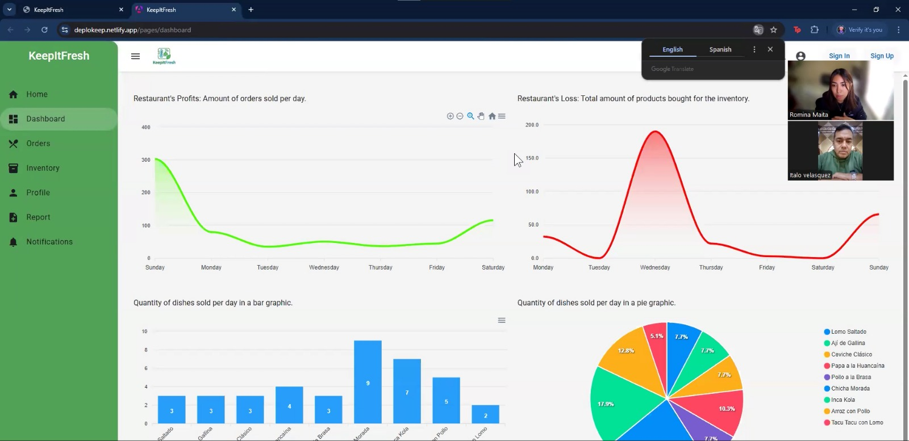

🔗 Enlace al video de la entrevista: https://acortar.link/xa6zRQ 
- Duración Total: 8:13 minutos
- Inicio: 00:03

###### Resumen de entrevista
Durante la sesión de validación, el entrevistado destacó varios aspectos clave del sistema que considera relevantes para su trabajo diario en el restaurante. Subrayó que el módulo de notificaciones es especialmente importante, ya que le permite estar al tanto del estado del negocio y anticipar problemas, lo que resulta útil para tomar decisiones estratégicas, como el lanzamiento de promociones.

En cuanto al dashboard con gráficos, valoró positivamente su inclusión, ya que ofrece una visión general de las ventas e ingresos. Esta información le permite identificar patrones y decidir en qué áreas conviene invertir o reforzar.

También sugirió que sería útil incluir una funcionalidad adicional: la visualización del aforo de comensales por horas. Esta capacidad permitiría analizar los momentos de mayor demanda, planificar mejor los recursos del local (como cantidad de mesas disponibles) y definir estrategias promocionales más efectivas.

Respecto al módulo de inventario, resaltó su utilidad práctica para el registro diario de productos. Indicó que el sistema facilita el control operativo y valoró especialmente las alertas automáticas sobre productos por vencer o con stock bajo, lo que contribuye directamente a una mejor gestión del abastecimiento.

###### Información del entrevistado
| Nombre | Apellido | Edad | Distrito |
|--------|----------|------|----------|
| Darío  | Lopez    | 25   | Quito    | 

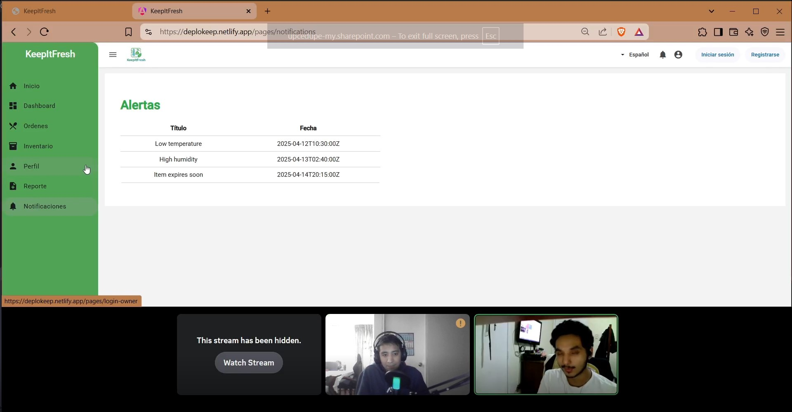

🔗 Enlace al video de la entrevista: https://acortar.link/hivj0q
- Duración Total: 7:54 minutos
- Inicio: 00:01

###### Resumen de entrevista
Durante la sesión de validación, el entrevistado resaltó la utilidad general del sistema para optimizar la operatividad del restaurante. Mencionó que el módulo de órdenes le permite registrar los pedidos de forma rápida y organizada, lo que reduce los errores al momento de atender a los comensales y mejora el flujo de trabajo entre el salón y la cocina.

En relación con el módulo de inventario, valoró positivamente la posibilidad de registrar productos con su fecha de expiración, tipo de medida y precio, ya que esto le permite mantener un mejor control del stock y evitar desperdicios. Destacó especialmente la función de alertas automáticas, la cual considera fundamental para anticipar problemas con productos vencidos o mal almacenados, algo que solía pasar con frecuencia en su negocio antes de implementar este tipo de tecnología.

El entrevistado también expresó que el dashboard de estadísticas es una herramienta valiosa para la toma de decisiones. Mencionó que al ver claramente los platos más consumidos y el balance de ganancias y pérdidas, puede evaluar la rentabilidad de ciertos productos y ajustar el menú o los precios de manera informada.

Finalmente, sugirió que una funcionalidad adicional que podría mejorar el sistema sería la posibilidad de generar reportes automáticos semanales que se envíen por correo, para mantener a la gerencia informada sin necesidad de acceder manualmente a la plataforma.

###### Información del entrevistado
| Nombre | Apellido  | Edad | Distrito   |
|--------|-----------|------|------------|
| Luis   | Rodriguez | 23   | Miraflores | 

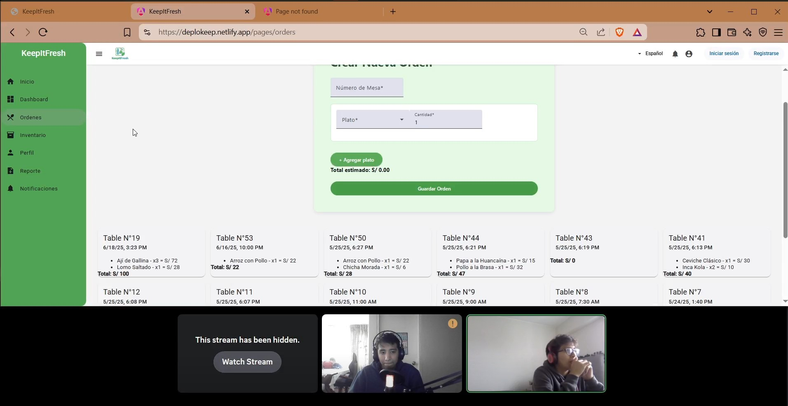

🔗 Enlace al video de la entrevista: https://acortar.link/n5C754
- Duración Total: 5:47
- Inicio: 00:01

###### Resumen de entrevista
Durante la entrevista de validación, el entrevistado propietario de un restaurante de tamaño mediano comentó que la aplicación cubre varias de las necesidades clave que enfrenta en la gestión diaria de su negocio. Destacó que el módulo de dashboard le permite tener una visión clara y actualizada del desempeño del restaurante, lo que considera fundamental para tomar decisiones rápidas y basadas en datos. Subrayó que las métricas sobre ganancias y pérdidas le han ayudado a detectar platos poco rentables y ajustar su menú en función de esa información.

En cuanto al módulo de pedidos, valoró que se puedan ingresar manualmente las mesas y platos, ya que su restaurante no usa sistemas de comandos digitales. Consideró que esta flexibilidad permite adaptar el sistema a su flujo de trabajo sin necesidad de hacer grandes cambios en el proceso operativo.

También elogió el módulo de alerts, especialmente por su capacidad de detectar productos cerca del vencimiento o almacenados en condiciones inadecuadas. Según su experiencia, este tipo de notificaciones reduce pérdidas por deterioro de productos y mejora los estándares de higiene y control.

Respecto al módulo de inventory, mencionó que ahora puede llevar un mejor control de los productos en stock y planificar compras con mayor precisión. Además, resaltó que registrar el tipo de unidad (litros, kilos, unidades, etc.) facilita una mejor organización de los insumos.

#### Segmento 1: Dueños de restaurantes

| Nombre | Apellido | Edad | Distrito               |
|--------|----------|------|------------------------|
| Diego  | Espinoza | 25   | San Juan de Lurigancho | 

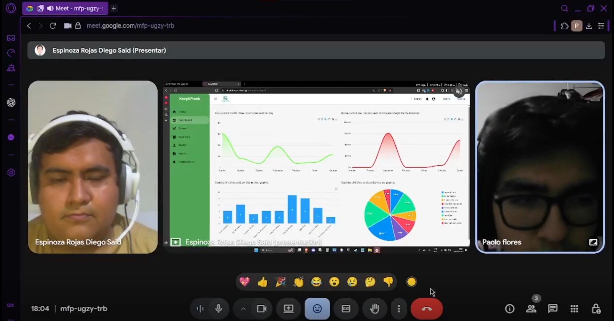

🔗 Enlace al video de la entrevista: https://acortar.link/IjIsiM
- Duración Total: 8;12
- Inicio: 00:01

###### Resumen de entrevista
Durante la entrevista de validación, el entrevistado destacó que la aplicación le ha facilitado varias tareas que antes realizaba de forma manual o con anotaciones físicas. En particular, mencionó que el módulo de orders le permite ingresar pedidos de forma rápida, eligiendo la mesa, el plato y la cantidad sin confusión. Comentó que esta funcionalidad ha ayudado a reducir errores al pasar los pedidos a cocina y ha mejorado el tiempo de atención a los comensales.

También resaltó que el módulo de inventory le resulta útil para registrar productos nuevos cuando llegan los pedidos de insumos. Afirmó que antes debía llevar este control en una libreta, lo cual se prestaba a errores u omisiones, mientras que ahora el sistema le permite guardar toda la información como fecha de vencimiento, cantidad y unidad de medida de manera ordenada y clara.

Otro punto que valoró fue la presencia del módulo de alerts, ya que ahora recibe notificaciones cuando un producto está a punto de vencer o presenta condiciones de almacenamiento inadecuadas. Dijo que esto le da más confianza al momento de organizar las cámaras de refrigeración y seleccionar los ingredientes durante el día.

Por último, comentó que al usar el sistema como trabajador, pudo loguearse fácilmente en su perfil sin necesidad de permisos especiales, y que la aplicación es intuitiva, incluso para quienes no tienen experiencia con tecnología. Como sugerencia, propuso incluir una opción para marcar productos como “usados” o “retirados”, de modo que el inventario refleje aún mejor la rotación diaria.

###### Información del entrevistado

| Nombre   | Apellido | Edad | Distrito    |
|----------|----------|------|-------------|
| Stephano | Moscoso  | 20   | La Libertad | 

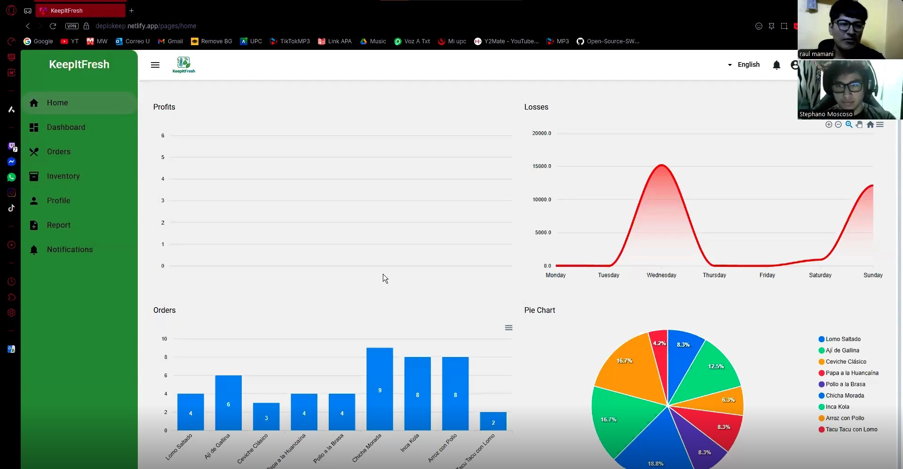

🔗 Enlace al video de la entrevista: https://acortar.link/RRf0rO
- Duración Total: 3:56
- Inicio: 00:01

###### Resumen de entrevista
Durante la sesión de validación, el entrevistado —encargado del control de insumos en el almacén del restaurante— señaló que la aplicación representa una mejora significativa en el registro y seguimiento de los productos. Comentó que antes llevaba un control manual con hojas impresas, lo cual era lento y propenso a errores. Con la app, ahora puede registrar fácilmente la cantidad exacta, tipo de medida y fecha de expiración de cada producto al momento de recibirlo.

Valoró especialmente la capacidad del módulo de inventory para manejar distintos tipos de unidades, lo que le permite trabajar con precisión tanto con productos en unidades como en litros o kilos. Mencionó que esto facilita la verificación del stock disponible sin necesidad de hacer conteos físicos constantes.

Respecto al sistema de alertas, afirmó que ha sido clave para anticiparse a problemas logísticos. Comentó que ha recibido notificaciones a tiempo sobre productos a punto de vencer o almacenados en condiciones inadecuadas, lo que le ha permitido tomar medidas correctivas antes de que se generen pérdidas.

También se refirió positivamente al módulo de reports, ya que le permite documentar incidencias, registrar observaciones del estado de los insumos, y compartir esa información con el resto del equipo de forma organizada. Destacó que esto mejora la comunicación entre áreas y evita malentendidos entre turnos.

Como sugerencia, propuso que el sistema pudiera incluir una vista resumida de los productos más utilizados por semana, para ayudar en la planificación de compras futuras y evitar el sobreabastecimiento.

### 5.3.3. Evaluaciones según heurísticas.

Site o App a evaluar: KeepItFresh

Tareas a evaluar: | No incluidas en esta versión              
Incluidas en esta evaluación
1. Registro de un trabajador/dueño (Profile, LogIn & SignUp)
2. Ingreso de un nuevo producto en Inventory
3. Registro de un pedido en Orders
4. Consulta rápida de métricas en el Dashboard
5. Generación y guardado de un Report
6. Respuesta a una Alert de producto por vencer

No están incluidas en esta versión de la evaluación las siguientes tareas:
1. Edición o eliminación de usuarios registrados.
2. Visualización de estadísticas comparativas mensuales o anuales en el Dashboard.
3. Historial completo de Alertas gestionadas o ignoradas.
4. Accesibilidad extendida (lectores de pantalla, navegación por teclado, modo alto contraste).

Escala de severidad:

| Nivel | Descripción                                                                                                                                                                                       |
|-------|---------------------------------------------------------------------------------------------------------------------------------------------------------------------------------------------------|
| 1     | Problema superficial: puede ser fácilmente superador por el usuario ó ocurre con muy poca frecuencia. No necesita ser arreglado a no ser que exista disponibilidad de tiempo.                     |
| 2     | Problema menor: puede ocurrir un poco más frecuentemente o es un poco más difícil de superar para el usuario. Se le debería asignar una prioridad baja resolverlo de cara al siguiente    reléase |
| 3     | Problema mayor: ocurre frecuentemente o los usuarios no son capaces de resolverlos. Es importante que sean corregidos y se les debe asignar una prioridad alta.                                   |
| 4     | Problema muy grave: un error de gran impacto que impide al usuario continuar con el uso de la herramienta. Es imperativo que sea corregido antes del lanzamiento.                                 |

Tabla Resumen:

|  #   |                               Problema detectado                               |  Severidad  |              Heurística/Principio violado               |
|:----:|:------------------------------------------------------------------------------:|:-----------:|:-------------------------------------------------------:|
|  1   |   Al guardar un Order no aparece mensaje de confirmación ni feedback visual.   |      3      |     Usabilidad: Visibilidad del estado del sistema      |
|  2   | Gráficos del Dashboard no tienen texto alternativo para lectores de pantalla.  |      3      | Inclusive Design: Proporciona experiencias comparables  |
|  3   |    No existe opción para deshacer la creación de un Report recién añadido.     |      2      |       Usabilidad: Control y libertad del usuario        |

No aparece mensaje de confirmación al guardar un pedido en Orders

Problema #1
Severidad: 3 (Problema mayor)

Heurística violada: Usabilidad – Visibilidad del estado del sistema

Observación
Al registrar un nuevo pedido desde el módulo Orders, no se muestra ningún mensaje, alerta ni animación visual que indique que el pedido fue guardado correctamente. Esto genera incertidumbre en el usuario, 
quien puede dudar si la acción fue exitosa o si debe repetirla.

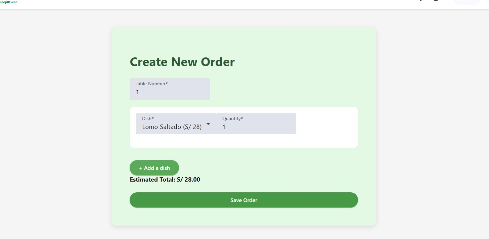

Recomendación
Incluir un mensaje de confirmación visual como: “Pedido guardado con éxito”, que desaparezca tras unos segundos. También podría añadirse una breve animación o cambio de estado en la card del pedido para reforzar el feedback.

PROBLEMA #2
Los gráficos del Dashboard no incluyen texto alternativo accesible

Severidad: 3 (Problema mayor)

Heurística violada: Inclusive Design – Proporciona experiencias comparables

Observación
Los gráficos del Dashboard no ofrecen texto alternativo ni descripciones para tecnologías de asistencia como lectores de pantalla. Esto limita el acceso a la información visual para personas con discapacidad visual o usuarios que navegan sin ver la pantalla.

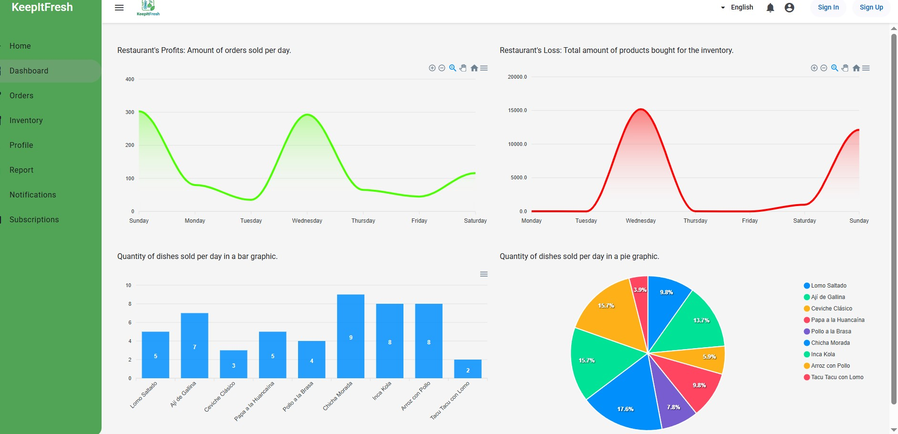

Recomendación
Incluir aria-label, alt o descripciones visibles/resumidas del contenido de cada gráfico. También se puede añadir una tabla textual con los mismos datos que se muestran visualmente.

PROBLEMA #3
No se puede deshacer la creación de un Report

Severidad: 2 (Problema menor)

Heurística violada: Usabilidad – Control y libertad del usuario

Observación
Al crear un nuevo Report con título, fecha y descripción, no existe una opción para cancelar la acción ni para eliminar el reporte justo después de creado.
Si el usuario se equivoca, debe navegar a otra sección y regresar manualmente para borrarlo, lo que genera fricción innecesaria.

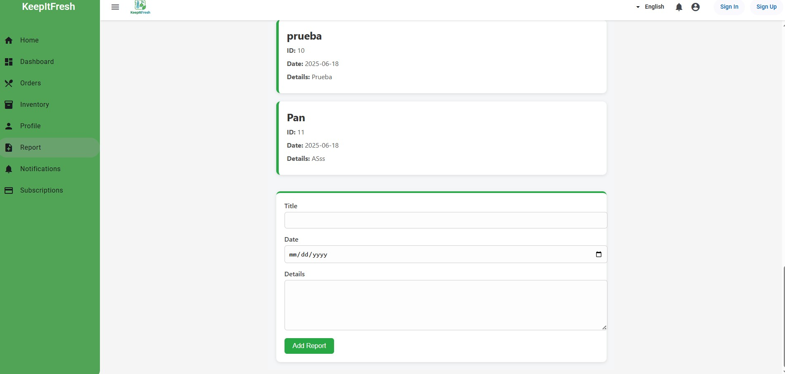

Recomendación
Incluir un botón “Deshacer” o “Cancelar” visible después de crear un reporte. También se podría agregar una notificación con la opción “Eliminar este reporte” dentro de los primeros 10 segundos.

5.4. Video About-the-Product

Este video está dirigido a los visitantes de nuestra landing page y a los usuarios de la aplicación. Presenta una visión general del modelo de negocio, las funcionalidades clave del software y los beneficios principales de nuestra solución de gestión de inventario para restaurantes.

Nuestro objetivo es mostrar cómo nuestra aplicación ayuda a los dueños y trabajadores de restaurantes a optimizar su gestión de pedidos, productos e inventario, con herramientas prácticas y automatizadas para mejorar la eficiencia operativa.

El video presenta:  
- Introducción al problema de gestión de inventario en restaurantes.
- Principales funcionalidades de la aplicación:
- Dashboard: Visualización de estadísticas de consumo y rendimiento económico.
- Orders: Registro manual de pedidos por mesa, plato y cantidad.
- Inventory: Gestión de productos con fechas de expiración, medidas y precios.
- Profile: Ingreso diferenciado como trabajador o dueño de restaurante.
- Reports: Generación y almacenamiento de reportes.
- Alerts: Notificaciones sobre vencimientos, condiciones de almacenamiento y temperatura.
- Testimonio validado de un usuario que participó en las entrevistas de validación.
- Cierre con llamado a la acción para visitar la landing page y conocer más.

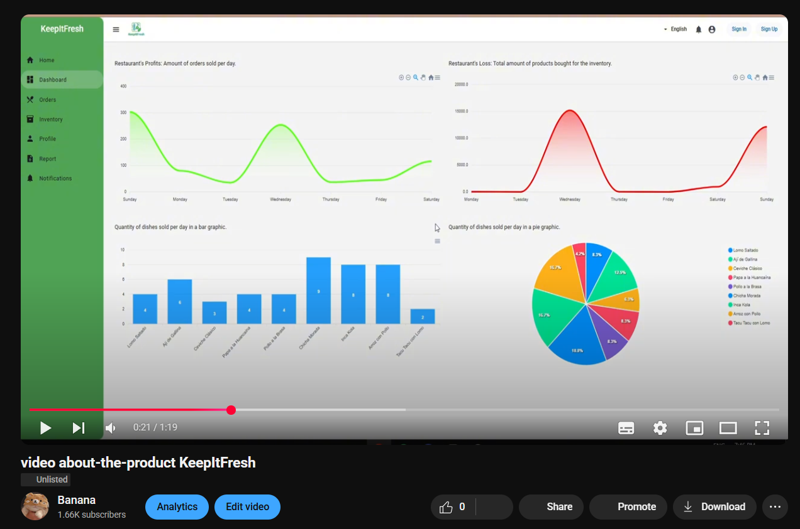

Enlace de video a Microsoft Stream: https://acortar.link/NvzSlz  
Enlace de video a YouTube: https://www.youtube.com/watch?v=UA0Mvyjgsr4  

- [0:00 – 0:17] | Intro impactante
- [0:17 – 1:05] | Funcionalidades clave
- [1:05 – 1:10] | Testimonio positivo
- [1:10 – 1:19] | Llamado a la acción y cierre

# Conclusiones
Durante el proceso de creación y desarrollo de este trabajo pudimos llegar a las siguientes conclusiones:

### 1. Trabajo en equipo y colaboración
El éxito de este proyecto demuestra la importancia del trabajo en equipo y la colaboración efectiva entre los miembros del grupo. La sinergia, comunicación constante y distribución de roles permitieron integrar diferentes perspectivas y habilidades, logrando un desarrollo más robusto y eficiente.

### 2. Planificación y organización en el desarrollo de software
Una adecuada planificación y organización fueron clave para el cumplimiento de los objetivos del proyecto. La metodología empleada (como Agile o SCRUM) facilitó la gestión de tareas, la priorización de funcionalidades y la entrega de resultados en los tiempos establecidos, asegurando un producto de calidad.

### 3. Tecnología y herramientas aplicadas a las realidad
El uso de tecnologías modernas y herramientas innovadoras permitió desarrollar una solución alineada con las necesidades reales del sector. La integración de frameworks ágiles, bases de datos eficientes y sistemas en la nube garantizó un producto escalable, seguro y adaptable al contexto peruano.

### 4. Solución rentable y sostenible contra el desperdicio alimentario
Este proyecto se consolida como una solución rentable y sostenible para reducir el desperdicio de alimentos en Perú, especialmente en el sector restaurantero. Al conectar a establecimientos con consumidores, se optimiza el uso de excedentes, generando un impacto económico, social y ambiental positivo.

### 5. TIC para ampliar el alcance y el impacto
Mediante el uso estratégico de Tecnologías de la Información y Comunicación (TIC), la aplicación logra llegar a un público más amplio, facilitando la concientización y participación activa de la sociedad en la reducción del desperdicio alimentario.

### 6. Usabilidad y experiencia del usuario
Los testeos y feedback recibido confirman que la aplicación es intuitiva y ofrece una alta usabilidad, permitiendo una interacción fluida y satisfactoria para los usuarios. Su diseño centrado en el usuario (UX/UI) asegura una experiencia accesible y eficiente.

### 7. Escalabilidad y adaptabilidad
La aplicación está diseñada con una arquitectura escalable, lo que permite su adaptación a futuras demandas, integraciones con otros sistemas o expansión a nuevos mercados. Esto garantiza su sostenibilidad a largo plazo y su capacidad de evolucionar según las necesidades de los usuarios.

### 8. Importancia del feedback continuo
La retroalimentación de usuarios y restaurantes durante la fase de pruebas fue clave para refinar funcionalidades. Esto resalta la necesidad de mantener ciclos iterativos de mejora incluso después del lanzamiento.

### 9. Adaptabilidad a otros contextos
Si bien la solución fue diseñada para Perú, su arquitectura modular y enfoque flexible permitiría replicarla en otros países de Latinoamérica con problemáticas similares, previos ajustes culturales y normativos.

# Video About-the-Team.

Este video muestra el proceso de trabajo del equipo que desarrolló KeepItFresh. Incluye escenas reales de nuestras sesiones de planificación, codificación y validación con usuarios, complementadas con una narración en
off que explica cada fase. Cada integrante aparece ante cámara para describir su rol, los principales outcomes logrados y las competencias que fortaleció durante el proyecto.

| # | Sección                       | Inicio (`hh:mm:ss`) | Contenido resumido                       |
|---|-------------------------------|---------------------|------------------------------------------|
| 1 | **Intro del equipo**          | 00:00:00            | Logo, nombre del proyecto y foto grupal. |
| 2 | **Metodología de trabajo**    | 00:00:10            | Clips de reuniones (Miro, Trello, etc).  |
| 3 | **Testimonio – Integrante 1** | 00:00:30            | Rol, logros (Reports)                    |
| 4 | **Testimonio – Integrante 2** | 00:01:12            | Rol, logros (Reports)                    |
| 5 | **Testimonio – Integrante 3** | 00:02:18            | Rol, logros (Subscriptions)              |
| 6 | **Testimonio – Integrante 4** | 00:03:12            | Rol, logros (Orders)                     |
| 7 | **Testimonio – Integrante 5** | 00:04:00            | Rol, logros (Profile)                    |
| 7 | **Testimonio – Integrante 6** | 00:04:00            | Rol, logros (Inventory)                  |
| 9 | **Final**                     | 00:07:19            | Cierre del video                         |

- **Microsoft Stream (versión institucional):**
https://acortar.link/RbY7vX
- **YouTube (para incrustar en la landing):**
https://youtu.be/gj1rPo6-jh8

# Bibliografía

- Conne, M(2024). _The Markdown Guide_. MarkdownGuide. Recuperado de: https://www.markdownguide.org/

- Conventional Commits. (n.d.). *Conventional commits v1.0.0.* Retrieved from https://www.conventionalcommits.org/en/v1.0.0/

- Angular. (n.d.). *Angular Material components.* Retrieved from https://material.angular.io/components/categories

- AngularJS. (n.d.). *AngularJS Material.* Retrieved from https://material.angularjs.org/latest/

- BrowserStack. (n.d.). Responsive Web Design: A Complete Guide. Recuperado de https://www.browserstack.com/guide/responsive-web-design

- Spring Boot. (n.d.). Spring Boot Documentation. Retrieved from https://docs.spring.io/spring-boot/documentation.html#documentation.web

- Modyo. (n.d.). Domain-Driven Design (DDD) - Patrones de arquitectura. Retrieved from https://docs.modyo.com/es/architecture/patterns/ddd.html

- INEI (2024). Encuesta Permanente de Empleo Nacional (EPEN) – IV Trimestre 2023. https://www.gob.pe/institucion/inei/campañas/8528-encuesta-permanente-de-empleo-nacional-epen-2025

- INEI (2023). Condiciones del Mercado Laboral en el Perú 2023. https://cdn.www.gob.pe/uploads/document/file/5543656/4930047-ite-2023-t2%282%29.pdf?v=1703860060

- Ministerio de la Producción (2023). Estudio sobre transformación digital en MYPE del sector gastronómico. https://www.gob.pe/produce

- Pivotal Software (2024). Spring Boot Reference Documentation (v3.2.4). https://docs.spring.io/spring-boot/docs/current/reference/html/

- Project Lombok (2024). Lombok - The boilerplate code remover. https://projectlombok.org/features/all

- Oracle Corporation (2024). MySQL 8.0 Reference Manual. https://dev.mysql.com/doc/refman/8.0/en/

- Eclipse Foundation (2023). Jakarta Persistence API (JPA) Specification. https://jakarta.ee/specifications/persistence/3.1/

- Postman (2024). Postman Learning Center: Using Postman. https://learning.postman.com/docs/getting-started/introduction/

- Baeldung (2023). A Guide to JPA with Spring Boot. https://www.baeldung.com/the-persistence-layer-with-spring-data-jpa

- DigitalOcean (2023). How To Use MySQL with Spring Boot. https://www.digitalocean.com/community/tutorials/spring-boot-mysql-jpa-hibernate

- Evans, E. (2004). Domain-Driven Design: Tackling Complexity in the Heart of Software. Addison-Wesley. https://www.domainlanguage.com/ddd/

- REST API Tutorial (2023). REST API Design Tutorial. https://restfulapi.net/

# Anexos

### VIDEOS:

| Título                  | Descripción                                        | Enlace                          |
|-------------------------|----------------------------------------------------|---------------------------------|
| Video de exposición TB1 | Video explicativo de los avances de la entrega TB1 | https://acortar.link/Vr5XIl     |
| Video de entrevistas    | Video recopilatorio de todas las entrevistas       | https://acortar.link/9818Zn     |
| Video de exposición TP  | Video explicativo de los avances de la entrega TP  | https://acortar.link/5cdNWo     |
| Video de exposición TB2 | Video explicativo de los avances de la entrega TB2 | https://acortar.link/9lLNcz     |

### UX/UI
| Título | Descripción                                                                                                | Enlace                       |
|--------|------------------------------------------------------------------------------------------------------------|------------------------------|
| Figma  | Enlace hacia el documento de Figma con todos los diseños planteados para tanto Frontend como Landing Page. | https://acortar.link/4Ym8OK  | 

### GITHUB

| Título       | Descripción                            | Enlace                                                         |
|--------------|----------------------------------------|----------------------------------------------------------------|
| Reporte      | Enlace al repositorio del reporte      | https://github.com/Biblioteca-de-Software/final-report         |
| Landing Page | Enlace al repositorio del Landing Page | https://github.com/Biblioteca-de-Software/landing-page         |
| Frontend     | Enlace al repositorio del frontend     | https://github.com/Biblioteca-de-Software/frontend             |
| Backend      | Enlace al repositorio del backend      | https://github.com/Biblioteca-de-Software/KeepItFresh-platform |

